# JAVA

## Que se necesita para programar en Java

- Un editor de texto(IDE)
- Un JRE (Java Runtime Environment). Esto ya viene incluido en el JDK
- Un JDK (Java Development Kit): Es el kit de desarrollo de Java. Incluye el compilador, el JRE y otras herramientas necesarias para desarrollar aplicaciones en Java.
  - JDK oficial de Oracle
  - OpenJDK: Es una implementación de código abierto del JDK oficial de Oracle. Es la versión recomendada para la mayoría de los desarrolladores.

---

## Versiones de Java

- Java SE (Standard Edition): Es la versión estándar de Java. Es la más utilizada y es adecuada para la mayoría de las aplicaciones.
- Java EE (Enterprise Edition): Es una versión de Java diseñada para aplicaciones empresariales. Incluye bibliotecas y herramientas adicionales para desarrollar aplicaciones web y empresariales.

---

## Ciclo de ejecución de un proyecto en Java

1. **Escribir el código fuente**: Se escribe el código en archivos con extensión `.java`, utilizando el lenguaje de programación Java.
2. **Compilar el código fuente**: Se usa el compilador `javac` para convertir el `código fuente` en `bytecode` con extensión `.class`. El `bytecode` es un código intermedio independiente de la plataforma que puede ser ejecutado por la `JVM`(Java Virtual Machine).
3. **Ejecutar el bytecode**: Se usa la `JVM` para que interprete el `bytecode` a `código máquina`(binario) y lo ejecute en el sistema operativo.
4. **Salida del programa**: El programa muestra el resultado de su ejecución, ya sea en la consola, en una interfaz gráfica o mediante otras salidas (como archivos o red).
   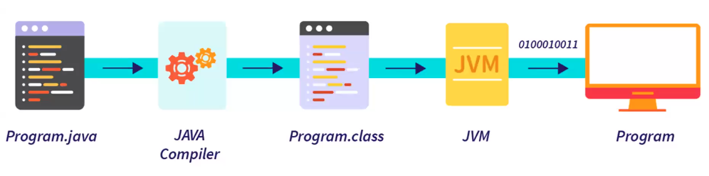{width=60%}

---

## Estructura básica de un proyecto en Java

- Al crear un proyecto en Java, se crea una `carpeta` con el nombre del proyecto. Dentro de esta carpeta, se crean `subcarpetas` para organizar el código fuente, los recursos y otros archivos relacionados con el proyecto.
- La carpeta principal del proyecto se llama `src` (source) y dentro de ella se crearán subcarpetas para cada paquete del proyecto y la clase principal del proyecto que contendrá el método `main`.
- El método `main` es el punto de entrada de la aplicación. Es donde comienza la ejecución del programa.
  poner una imagen de la estructura de carpetas

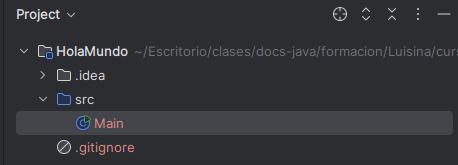{width=60%}

```java
public class Main {
  public static void main(String[] args) {
    System.out.println("Hello, World!");
  }
}
```

---

## Sintaxis de Java

- **`Fuertemente tipado`**: Significa que cada variable debe tener un tipo de dato específico y no se puede cambiar su tipo de dato una vez que se ha declarado.
- **`Orientado a objetos`**: Significa que todo en Java es un objeto, incluyendo las clases, los métodos y las variables.
- **`Basado en clases`**: Significa que todo en Java se organiza en clases, que son plantillas para crear objetos.
- **`Palabras clave`**: Usa palabras en inglés como: `class`, `public`, `static`, `void`, `int`, `String`, etc.
- **`Identificadores`**: Se usan para nombrar variables, clases, métodos, etc. Los identificadores deben seguir ciertas reglas:
  - Deben comenzar con una letra (mayúscula o minúscula), un guion bajo `_` o un signo de dólar `$`. Nunca pueden comenzar con un número.
  - Pueden contener letras, números, guiones bajos y signos de dólar.
  - No pueden contener espacios ni caracteres especiales como @, #, %, &, etc.
  - No pueden ser palabras clave reservadas del lenguaje (como `class`, `public`, `static`, etc.).
  - Los identificadores son sensibles a mayúsculas y minúsculas, `myVariable` y `myvariable` son dos identificadores diferentes.
  - No tienen límite de longitud, pero se recomienda usar nombres descriptivos y legibles.
- **`Líneas de código`**: terminan con un punto y coma `;`
- **`Estructura y Bloques`**: El principio y fin de cada estructura y los bloques de código se delimitan con llaves `{}`.
- Los comentarios de una sola línea se hacen con `//` y los de varias líneas con `/* */`. Son importantes para documentar el código y explicar su funcionamiento. No afectan la ejecución del programa.

---

## Tipos de datos

Los tipos de datos en Java se dividen en dos categorías: **primitivos** y **no primitivos**.

- **`Primitivos`**:

  | Tipo        | Tamaño  | Descripción                                                           |
  | ----------- | ------- | --------------------------------------------------------------------- |
  | **byte**    | 8 bits  | Entero pequeño (-128 a 127)                                           |
  | **short**   | 16 bits | Entero corto (-32.768 a 32.767)                                       |
  | **int**     | 32 bits | Entero estándar (-2.147.483.648 a 2.147.483.647)                      |
  | **long**    | 64 bits | Entero largo (-9.223.372.036.854.775.808 a 9.223.372.036.854.775.807) |
  | **float**   | 32 bits | Número decimal de precisión simple                                    |
  | **double**  | 64 bits | Número decimal de doble precisión                                     |
  | **char**    | 16 bits | Carácter Unicode                                                      |
  | **boolean** | 1 bit\* | true o false                                                          |

  > \*El tamaño de boolean depende de la implementación de la JVM, pero conceptualmente es 1 bit.

- **`No Primitivos`**:

  | Tipo                             | Ejemplo                              | Descripción                                  |
  | -------------------------------- | ------------------------------------ | -------------------------------------------- |
  | **String**                       | `"Hola"`                             | Cadena de texto (objeto inmutable)           |
  | **Clases**                       | `MiClase obj = new MiClase();`       | Definidas por el usuario                     |
  | **Interfaces**                   | `Runnable`, `Comparable`             | Contratos que deben implementar las clases   |
  | **Arrays**                       | `int[] numeros = {1, 2, 3};`         | Conjunto de elementos del mismo tipo         |
  | **Collections**                  | `List`, `Set`, `Map`                 | Estructuras de datos del paquete `java.util` |
  | **Enumeraciones**                | `enum Dia { LUNES, MARTES, ... }`    | Conjunto de constantes predefinidas          |
  | **Wrappers de tipos primitivos** | `Integer`, `Double`, `Boolean`, etc. | Clases que envuelven tipos primitivos        |

  > Todos los tipos no primitivos heredan de la clase Object, la clase base de Java.
  >
  > Aunque los arrays (int[], String[], etc.) y las colecciones (List, Set, Map, etc.) permiten almacenar múltiples valores, los arrays son estructuras de datos nativas de Java, mientras que las colecciones pertenecen al framework de colecciones y están definidas dentro del paquete java.util.
  >
  > La clase java.util.Arrays es una utilidad para manipular arrays, pero no convierte a los arrays en parte del framework de colecciones.

- **`Ejemplos`**

  ```java
  /// Primitivos
  byte numeroPequeno = 100; // Entero pequeño
  short numeroCorto = 10000; // Entero corto
  int edad = 30; // Entero
  long numeroLargo = 10000000000L; // Entero largo, se usa 'L' al final para indicar que es un long
  float temperatura = 36.5f; // Decimal, se usa 'f' al final para indicar que es un float
  double altura = 1.75; // Decimal
  char inicial = 'A'; // Carácter
  boolean esEstudiante = true; // Booleano

  /// No Primitivos
  // String
  String saludo = "Hola, mundo!";
  // Clase
  class Persona {
      String nombre;
      int edad;

      Persona(String nombre, int edad) {
          this.nombre = nombre;
          this.edad = edad;
      }
  }
  // Interfaz
  interface Animal {
      void hacerSonido();
  }
  // Array
  int[] numeros = {1, 2, 3, 4, 5}; // Array de enteros

  // Colecciones
  import java.util.*;


  List<String> listaNombres = new ArrayList<>(); // Lista de nombres
  Set<Integer> conjuntoNumeros = new HashSet<>(); // Conjunto de números
  Map<String, Integer> mapaEdades = new HashMap<>(); // Mapa de nombres a edades

  // Enumeración
  enum Dia { LUNES, MARTES, MIERCOLES, JUEVES, VIERNES, SABADO, DOMINGO } // Enumeración de días
  ```

---

## Variables

- Las variables son espacios de memoria que se utilizan para almacenar datos(valores) que pueden cambiar durante la ejecución del programa.
- Las variables se declaran antes de usarlas, especificando su tipo de dato y su identificador(nombre).
- El tipo de dato define el tipo de valor que puede almacenar. Ya no se puede cambiar una vez que se ha declarado la variable, a no ser que se use una variable de tipo `Object` o se haga un casting.
- Se pueden declarar variables **con** `valor inicial` o **sin** `valor inicial`. Se pueden inicializar al momento de declararlas o en una línea separada. Para asignar un valor a una variable, se usa el operador de asignación `=`.
- A las variables se se les puede reasignar un nuevo valor en cualquier momento, excepto si son constantes.
  - Una constante se declara con la palabra clave `final` y su valor no puede cambiar una vez asignado.
- Las variables se pueden declarar en el ámbito de una `clase` (variables de instancia, atributos) o en el ámbito de un `método` (variables locales).
  - **`Variables de Instancia`**: Se declaran dentro de una `clase` pero fuera de cualquier `método`. Se pueden acceder desde cualquier `método` de la clase.
  - **`Variables Locales`**: Se declaran dentro de un `método` y solo se pueden acceder dentro de ese `método`.
- Se pueden declarar varias variables del mismo tipo en una sola línea, separándolas por comas.

```java
tipo_de_dato nombre_de_variable = valor_inicial;

int edad = 25;
double altura = 1.75;
char inicial = 'A';
boolean esEstudiante = true;
String nombre = "Juan";
final int MAX_INTENTOS = 5; // Constante
```

---

## Operadores

Los operadores en Java son símbolos que se utilizan para realizar operaciones sobre variables y valores. Se dividen en varias categorías:

- **Aritméticos**: Realizan operaciones matemáticas básicas.

  | Operador | Descripción    | Ejemplo |
  | -------- | -------------- | ------- |
  | `+`      | Suma           | `a + b` |
  | `-`      | Resta          | `a - b` |
  | `*`      | Multiplicación | `a * b` |
  | `/`      | División       | `a / b` |
  | `%`      | Módulo (resto) | `a % b` |

- **De Asignación**: Asignan un valor a una variable.

  | Operador | Ejemplo  | Equivalente a |
  | -------- | -------- | ------------- |
  | `=`      | `a = b`  | Asignación    |
  | `+=`     | `a += b` | `a = a + b`   |
  | `-=`     | `a -= b` | `a = a - b`   |
  | `*=`     | `a *= b` | `a = a * b`   |
  | `/=`     | `a /= b` | `a = a / b`   |
  | `%=`     | `a %= b` | `a = a % b`   |

- **De Comparación**: Comparan dos valores y devuelven un booleano.

  | Operador | Descripción       | Ejemplo  |
  | -------- | ----------------- | -------- |
  | `==`     | Igual a           | `a == b` |
  | `!=`     | Distinto de       | `a != b` |
  | `>`      | Mayor que         | `a > b`  |
  | `<`      | Menor que         | `a < b`  |
  | `>=`     | Mayor o igual que | `a >= b` |
  | `<=`     | Menor o igual que | `a <= b` |

- **Lógicos**: Realizan operaciones lógicas.

  | Operador | Descripción     | Ejemplo            |
  | -------- | --------------- | ------------------ |
  | `&&`     | Y lógico (AND)  | `cond1 && cond2`   |
  | `\|\|`   | O lógico (OR)   | `cond1 \|\| cond2` |
  | `!`      | Negación lógica | `!condición`       |

- **Unarios**: Operan sobre un solo operando.

  | Operador | Descripción                               | Ejemplo       |
  | -------- | ----------------------------------------- | ------------- |
  | `+`      | **Identidad unaria** (no cambia el valor) | `+a`          |
  | `-`      | **Negación unaria** (cambia el signo)     | `-a`          |
  | `++`     | **Incremento** (suma 1)                   | `a++` o `++a` |
  | `--`     | **Decremento** (resta 1)                  | `a--` o `--a` |

- **Ternario**: Es un operador condicional que evalúa una expresión y devuelve uno de dos valores.

  | Operador | Descripción                          | Ejemplo                                       |
  | -------- | ------------------------------------ | --------------------------------------------- |
  | `? :`    | Simplifica una expresión condicional | `condición ? valorSiVerdadero : valorSiFalso` |

- **Instanceof**: Verifica si un objeto es una instancia de una clase o interfaz específica.

  | Operador     | Descripción                                     | Ejemplo                  |
  | ------------ | ----------------------------------------------- | ------------------------ |
  | `instanceof` | Verifica si un objeto es instancia de una clase | `obj instanceof MiClase` |

---

## Recibir datos del usuario

Para recibir datos del usuario en Java, se utiliza la clase `Scanner`, que permite leer la entrada desde diferentes fuentes, como el teclado. Aquí hay un ejemplo básico de cómo usar `Scanner` para recibir datos del usuario:

```java
import java.util.Scanner;

public class Main {
    public static void main(String[] args) {
        // Crear un objeto Scanner para leer la entrada del usuario
        Scanner scanner = new Scanner(System.in);

        // Solicitar al usuario que ingrese su nombre
        System.out.print("Ingrese su nombre: ");
        String nombre = scanner.nextLine(); // La siguiente Linea de Consola la va a almacenar en la variable nombre

        // Solicitar al usuario que ingrese su edad
        System.out.print("Ingrese su edad: ");
        int edad = scanner.nextInt(); // La siguiente entrada de Consola la va a almacenar en la variable edad
        // Nota: Si se usa nextInt() y luego nextLine(), puede haber un problema de salto de línea.
        // Para evitar este problema, se puede agregar un nextLine() adicional después de nextInt()
        scanner.nextLine(); // Consumir el salto de línea pendiente

        // Mostrar los datos ingresados
        System.out.println("Hola " + nombre + ", tienes " + edad + " años.");

        // Cerrar el scanner
        scanner.close();
    }
}
```

| Método          | Tipo de dato que lee      | Ejemplo de uso           | Notas importantes                                                   |
| --------------- | ------------------------- | ------------------------ | ------------------------------------------------------------------- |
| `next()`        | `String` (una palabra)    | `scanner.next();`        | Lee **una sola palabra**, se detiene en espacios o saltos de línea. |
| `nextLine()`    | `String` (línea completa) | `scanner.nextLine();`    | Lee toda una línea hasta que se pulsa Enter.                        |
| `nextInt()`     | `int`                     | `scanner.nextInt();`     | Lee un número entero.                                               |
| `nextDouble()`  | `double`                  | `scanner.nextDouble();`  | Lee un número decimal con punto (no coma).                          |
| `nextFloat()`   | `float`                   | `scanner.nextFloat();`   | Similar a `nextDouble()`, pero menor precisión.                     |
| `nextLong()`    | `long`                    | `scanner.nextLong();`    | Lee un entero largo.                                                |
| `nextBoolean()` | `boolean`                 | `scanner.nextBoolean();` | Lee `true` o `false` (literalmente).                                |
| `nextShort()`   | `short`                   | `scanner.nextShort();`   | Lee un número corto (16 bits).                                      |
| `nextByte()`    | `byte`                    | `scanner.nextByte();`    | Lee un número pequeño (8 bits).                                     |

---

## Funciones en Java

Las funciones en Java se definen dentro de una clase y se llaman **métodos**.
Cuando hablamos de metodos nos referimos a aquellas acciones que se pueden realizar sobre un objeto o una clase.
Un método es un bloque de código que realiza una tarea específica y puede ser reutilizado en diferentes partes del programa.

### 🎯 Algunos Principios Clave

- **Responsabilidad Única**: Cada método debe tener una única responsabilidad o tarea. Evita métodos largos y complejos que hagan demasiadas cosas a la vez.

  ```java
  // Bien. Solo calcula el área de un círculo
  public double calcularAreaCirculo(double radio) {
    return Math.PI * radio * radio; // Calcula el área de un círculo
  }

  // Mal. Hace varias cosas a la vez
  public void procesarDatos(double radio) {
    double area = Math.PI * radio * radio; // Calcula el área
    System.out.println("Área: " + area); // Imprime el área
    // Otras operaciones...
  }
  ```

- **Nombres descriptivos**: Los nombres de los métodos deben ser claros y descriptivos, indicando qué hacen. Usa verbos o frases verbales.

  ```java
  // Bien. Nombre claro y descriptivo
  public void enviarCorreo(String destinatario, String asunto, String mensaje) {
    // Lógica para enviar un correo
  }

  // Mal. Nombre confuso
  public void hacerCosas(String a, String b, String c) {
    // No queda claro qué hace este método
  }
  ```

- **Evitar duplicación de código**: Si encuentras que estás repitiendo el mismo código en varios lugares, considera extraerlo a un método separado. Esto mejora la legibilidad y facilita el mantenimiento.

  ```java
  // Bien. Código reutilizable
  public void imprimirSaludo(String nombre) {
    System.out.println("Hola, " + nombre + "!");
  }

  // Mal. Código duplicado
  public void saludarJuan() {
    System.out.println("Hola, Juan!");
  }

  public void saludarMaria() {
    System.out.println("Hola, María!");
  }
  ```

- **Parámetros claros**: Si un método necesita datos de entrada, usa parámetros claros y bien definidos. Evita el uso de variables globales o estáticas innecesarias.

  ```java
  // Bien. Parámetros claros y bien definidos
  public void registrarUsuario(String nombre, String email) {
    // Lógica para registrar un usuario
  }

  // Mal. Usa una variable global innecesaria
  public String usuarioGlobal; // Variable global innecesaria
  public void registrarUsuario() {
    // Lógica para registrar un usuario usando una variable global
    System.out.println("Registrando usuario: " + usuarioGlobal);
  }
  ```

- **Retorno claro**: Si un método devuelve un valor, asegúrate de que el **`tipo de retorno`** sea claro y coincida con lo que se espera. Si no devuelve nada, usa `void`.

```java
  // Bien. Retorna un valor claro
  public int calcularSuma(int a, int b) {
    return a + b; // Retorna la suma de dos números
  }

  // Mal. No queda claro qué retorna
  public void procesarDatos() {
    // No retorna nada, pero no queda claro qué hace
  }
```

- **Principio de Menor Sorpresa**: Un método debe hacer lo que su nombre indica y no sorprender al usuario con comportamientos inesperados. Si un método tiene efectos secundarios, deben ser los esperados.

  ```java
  // Bien. Retorna un valor claro
  public int sumar(int a, int b) {
    return a + b; // Retorna la suma de dos números
  }

  // Mal. Hace algo inesperado
  public int suma(int a, int b) {
    // 1. Suma los números... pero solo si 'a' es positivo.
    if (a > 0) {
      return a + b;
    } else {
      // 2. Si 'a' no es positivo, retorna 0.
      return b - a; // Comportamiento inesperado
    }
  }
  ```

### 🔄 Tipos de métodos

- **Función**: Si el método devuelve un valor.
- **Procedimiento**: Si no devuelve un valor (tipo `void`).

### Beneficios de usar métodos

{width=60%}

### Sintaxis de un método

```java
modificador_de_acceso tipo_de_retorno nombre_del_metodo(parámetros) {
    // Cuerpo del método. Contiene la instrucción o instrucciones que se ejecutan cuando se llama al método
    return valor; // Opcional, solo si el tipo de retorno no es void
}
```

### Partes de un método

#### 1. **Modificadores** (pueden combinarse)

- **Modificadores de acceso** (obligatorio elegir uno):
  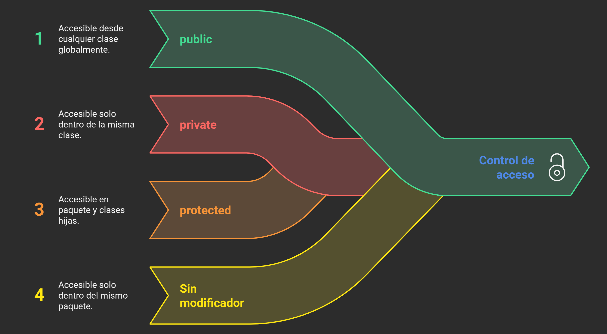{width=60%}
  - **public**🌐 (opcional):
    - El método es accesible desde cualquier parte del programa.
  - **private**🔒 (opcional):
    - El método solo es accesible dentro de la misma clase.
  - **protected**🔐 (opcional):
    - El método es accesible dentro de la misma clase, en subclases y en el mismo paquete.
  - **default** (opcional):
    - Si no se especifica ningún modificador, el método es accesible solo dentro del mismo paquete.
  - `Posición`: Va antes del tipo de retorno.
- **static** ⚡ (opcional):
  - Indica que el método pertenece a la clase en lugar de a instancias.
  - Se aplica directamente a la clase, no a los objetos de la clase.
  - `Posición`: Va después del modificador de acceso (si existe)
- **Otros** (opcionales):
  - **final**⛔ - No puede ser sobrescrito
  - **abstract**🧩 - No tiene implementación (en clases abstractas)
  - **synchronized**🔄 - Para control de hilos
  - `Posición`: Va después del modificador de acceso (si existe) y antes del tipo de retorno.

#### 2. **Tipo de retorno** 📦 (obligatorio)

- Indica el tipo de valor que devuelve el método.
- **void**: Si no devuelve nada.
- Puede ser cualquier tipo primitivo (int, double, etc.) o un objeto.

#### 3. **Nombre del método** 🏷️ (obligatorio)

- Sigue convención camelCase.
- Debe ser un verbo o frase verbal descriptiva.

#### 4. **Parámetros** 📥(opcional)

- Lista de variables de entrada entre paréntesis.
- Formato: (Tipo1 param1, Tipo2 param2).
- Puede estar vacío ().

#### 5. **Cuerpo del método**

- Delimitado por llaves `{}`. Si pertenece a una clase abstracta, termina con `;` sin cuerpo.
- Contiene el bloque de código que ejecuta las instrucciones del método.
- Puede incluir:
  - 📝 Declaraciones de variables locales
  - 🔄 Estructuras de control (`if`, `for`, `while`)
  - 📞 Llamadas a otros métodos
  - ⚙️ Operaciones y cálculos
  - 🔙 Sentencia `return` (si aplica)

#### 6. **Sentencia return** 🔙

- Devuelve un valor y termina la ejecución del método.
- ✅ **Obligatoria** si el tipo de retorno NO es `void`
- 🔧 **Opcional** en métodos `void`
- 🎯 El tipo devuelto debe coincidir con el tipo declarado
- 🔀 Puede haber múltiples `return` en diferentes ramas

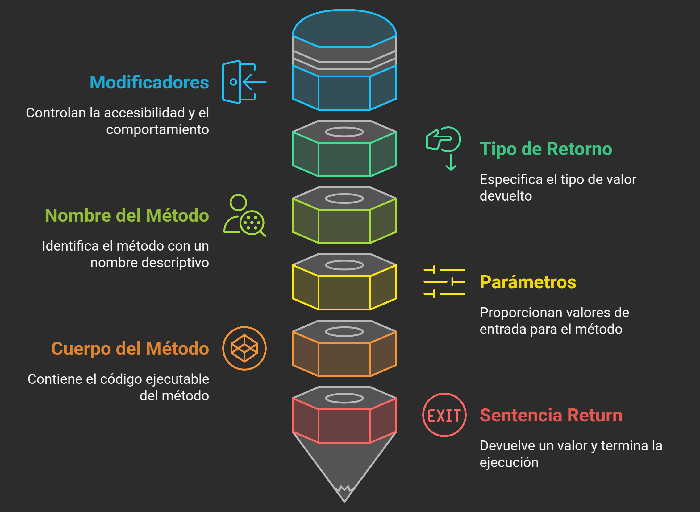{width=60%}

### 🎯 Resumen visual

```text
🔒 Acceso → ⚡ Static → 📤 Retorno → 🏷️ Nombre → 📥 (Parámetros) → { 📄 Cuerpo }
   ↓           ↓          ↓          ↓              ↓                    ↓
public    +  static   +  int    +  sumar     +   (int a, int b)  +  { return a+b; }
```

### Flujo de ejecución

```java
public class Main {

    // Método main - punto de entrada
    public static void main(String[] args) {
        System.out.println("1. Inicio del programa");

        metodo1();          // ← Pausa main, ejecuta metodo1
        System.out.println("5. Regresé de método1");

        int resultado = metodo2(10);  // ← Pausa main, ejecuta metodo2
        System.out.println("8. Resultado: " + resultado);

        metodo3();          // ← Pausa main, ejecuta metodo3
        System.out.println("11. Regresé de método3");

        System.out.println("12. Fin del programa");
    }

    public static void metodo1() {
        System.out.println("2. Estoy en método1");
        System.out.println("3. Haciendo algo en método1");
        System.out.println("4. Saliendo de método1");
        // Regresa automáticamente a main
    }

    public static int metodo2(int numero) {
        System.out.println("6. Estoy en método2 con: " + numero);
        int calculo = numero * 2;
        System.out.println("7. Saliendo de método2");
        return calculo;  // Regresa el valor a main
    }

    public static void metodo3() {
        System.out.println("9. Estoy en método3");
        System.out.println("10. Saliendo de método3");
    }
}
```

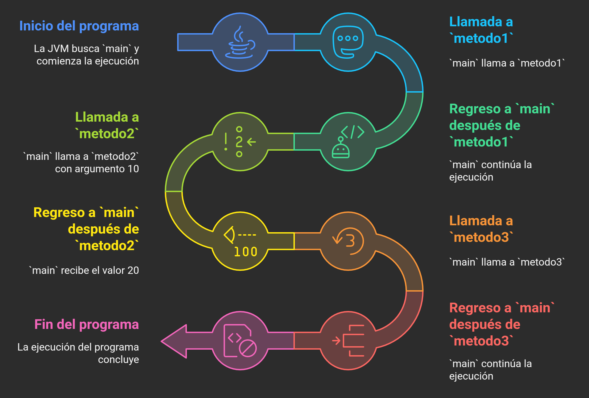{width=60%}

### Sobrecarga de métodos

Es una característica de **`Java`** que permite definir **`múltiples métodos`** con el mismo **`nombre`** pero con diferentes **`parámetros`** (tipo, número o ambos). Esto permite que un método realice diferentes tareas según los argumentos que se le pasen.

```java
public class Calculadora {
  public static void main(String[] args) {
    System.out.println("Suma de 2 enteros: " + sumar(5, 10)); // Llama al primer método
    System.out.println("Suma de 3 enteros: " + sumar(5, 10, 15)); // Llama al segundo método
    System.out.println("Suma de 2 decimales: " + sumar(5.5, 10.2)); // Llama al tercer método
  }

  // Método sumar con dos enteros
  public static int sumar(int a, int b) {
    return a + b;
  }

  // Sobrecarga: Método sumar con tres enteros
  public static int sumar(int a, int b, int c) {
    return a + b + c;
  }

  // Sobrecarga: Método sumar con dos decimales
  public static double sumar(double a, double b) {
    return a + b;
  }
}
```

## Scope de variables y métodos

El **scope** (ámbito) de una variable o método en Java se refiere a la parte del código donde se puede acceder a esa variable o método. El scope determina la visibilidad de las variables y métodos y su duración en la memoria.
El scope es importante para evitar conflictos de nombres y para gestionar la memoria de manera eficiente. En Java, el scope se define por la ubicación donde se declaran las variables y métodos.

### Tipos de scope

- **Scope statico**
  - Se declaran con la palabra clave `static`
  - Existen mientras la **clase esté cargada**
  - Accesibles sin necesidad de crear una instancia de la clase
  - Compartidos por todas las instancias de la clase
  - Útiles para constantes o contadores globales
- **Scope de clase**
  - Se declaran **dentro de la clase** pero **fuera de cualquier método**
  - Existen mientras el **objeto exista**
  - Accesibles desde **todos los métodos** de la clase
  - Cada objeto tiene su **propia copia**
- **Scope de método**
  - Se declaran **dentro de un método**
  - Solo existen **durante la ejecución** del método
  - **Desaparecen** cuando el método termina
  - No accesibles desde otros métodos
- **Scope de bloque**
  - Se declaran dentro de **bloques de código** `{}`
  - Solo existen **dentro de ese bloque**
  - Incluye: `if`, `for`, `while`, `try-catch`, etc.
- **Scope de parametros**

  - Solo existen **durante la ejecución** del método
  - Actúan como **variables locales**

  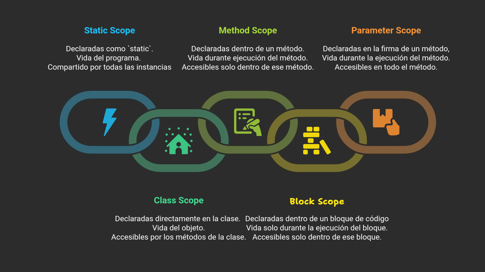{width=60%}

---

## Estructuras de Control

Las estructuras de control en Java permiten modificar el flujo de ejecución del programa según ciertas condiciones o repeticiones. Se dividen en dos categorías principales: **condicionales** y **Repetitivas**.

### Estructuras Condicionales

Son utilizadas para tomar decisiones en el código, permitiendo que ciertas partes del programa se ejecuten solo si se cumplen ciertas condiciones. Las estructuras condicionales más comunes son `if`, `if-else`, `if-else anidada`, `if-else if-else` y `switch`.

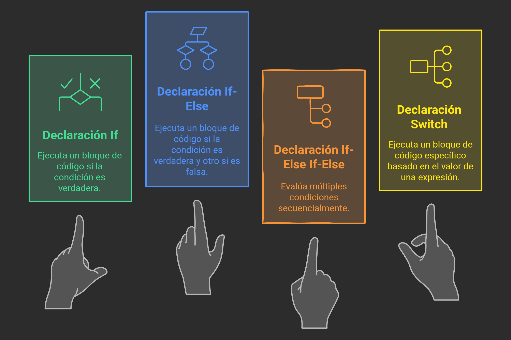{width=60%}

#### Sintaxis de las estructuras condicionales

- **if**

  ```java
    if (condición) {
      // Código a ejecutar si la condición es verdadera
    }

    // Ejemplo
    int edad = 20;
    if (edad >= 18) {
      System.out.println("Eres mayor de edad.");
    }
  ```

- **if-else**

  ```java
    if (condición) {
      // Código a ejecutar si la condición es verdadera
    } else {
      // Código a ejecutar si la condición es falsa
    }

    // Ejemplo
    int edad = 16;
    if (edad >= 18) {
      System.out.println("Eres mayor de edad.");
    } else {
      System.out.println("Eres menor de edad.");
    }
  ```

- **if-else anidada**

  ```java
    if (condición1) {
      if (condición2) {
        // Código a ejecutar si condición1 y condición2 son verdaderas
      } else {
        // Código a ejecutar si condición1 es verdadera y condición2 es falsa
      }
    } else {
      if (condición3) {
        // Código a ejecutar si condición1 es falsa y condición3 es verdadera
      } else {
        // Código a ejecutar si todas las condiciones anteriores son falsas
      }
    }

    // Ejemplo
    int numero = 10;
    if (numero > 0) {
      if (numero % 2 == 0) {
        System.out.println("El número es positivo y par.");
      } else {
        System.out.println("El número es positivo e impar.");
      }
    } else {
      if (numero % 2 == 0) {
        System.out.println("El número es negativo y par.");
      } else {
        System.out.println("El número es negativo e impar.");
      }
    }
  ```

- **if-else if-else**

  ```java
    if (condición1) {
      // Código a ejecutar si condición1 es verdadera
    } else if (condición2) {
      // Código a ejecutar si condición1 es falsa y condición2 es verdadera
    } else {
      // Código a ejecutar si todas las condiciones anteriores son falsas
    }

    // Ejemplo
    int numero = 0;
    if (numero > 0) {
      System.out.println("El número es positivo.");
    } else if (numero < 0) {
      System.out.println("El número es negativo.");
    } else {
      System.out.println("El número es cero.");
    }
  ```

- **switch**

  ```java
    switch (expresión) {
      case valor1:
        // Código a ejecutar si expresión es igual a valor1
        break; // Rompe
      case valor2:
        // Código a ejecutar si expresión es igual a valor2
        break;
      // Puedes agregar más casos según sea necesario
      default:
        // Código a ejecutar si ningún caso coincide
    }

    // Ejemplo
    int dia = 3;
    switch (dia) {
      case 1:
        System.out.println("Lunes");
        break;
      case 2:
        System.out.println("Martes");
        break;
      case 3:
        System.out.println("Miércoles");
        break;
      case 4:
        System.out.println("Jueves");
        break;
      case 5:
        System.out.println("Viernes");
        break;
      case 6:
        System.out.println("Sábado");
        break;
      case 7:
        System.out.println("Domingo");
        break;
      default:
        System.out.println("Día inválido");
    }
  ```

### Estructuras Repetitivas

- **Bucles**: Son estructuras que permiten repetir un bloque de código mientras se cumpla una condición.
- **Contador**: Variable que se utiliza para llevar un registro de cuántas veces se ha ejecutado el bucle. Se inicializa antes del bucle y se actualiza dentro del bucle.
- **Condición de parada**: Es la condición que se evalúa en cada iteración del bucle para determinar si se debe continuar o salir del bucle. Si la condición es falsa, el bucle termina.
- **Sentencias de control de flujo**: Son instrucciones que permiten modificar el flujo de ejecución del programa dentro de los bucles.
  - **break**: Se utiliza para salir del bucle o estructura de control inmediatamente.
  - **continue**: Se utiliza para saltar a la siguiente iteración del bucle, omitiendo el resto del código en la iteración actual.
  - **return**: Se utiliza para salir de un método y devolver un valor (si aplica).
  - **Centinela**: Es una técnica de programación donde se usa un valor específico para indicar el final de un bucle o una condición de parada.
- **Bucle infinito**: Es un bucle que nunca termina porque la condición siempre es verdadera. Puede ocurrir si no se actualiza la variable de control del bucle o si la condición nunca se vuelve falsa.
- **Bucle anidado**: Es un bucle dentro de otro bucle. Se utiliza para iterar sobre estructuras de datos multidimensionales, como matrices o listas de listas.

Las estructuras repetitivas más comunes son `while`, `do-while`, `for` y `for-each`.

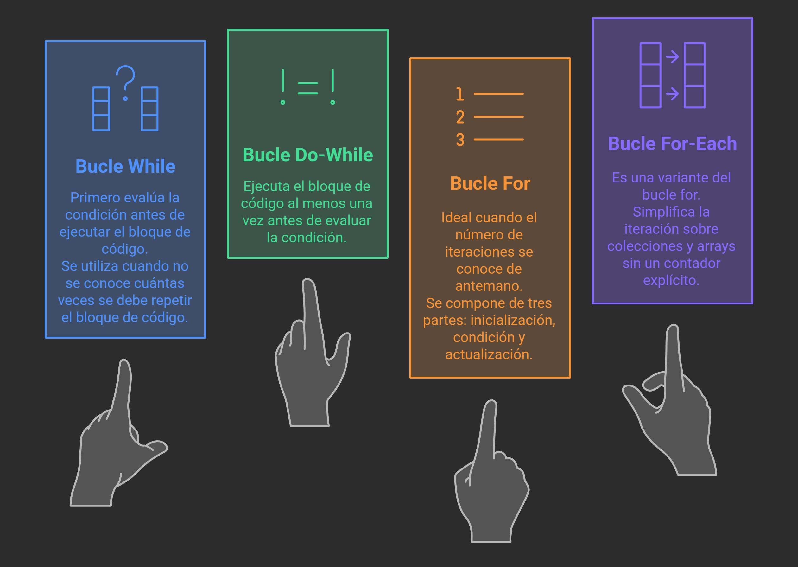{width=60%}

#### Sintaxis de las estructuras repetitivas

- **while**

  ```java
    while (condición) {
      // Código a ejecutar mientras la condición sea verdadera
    }

    // Ejemplo
    int contador = 0;
    while (contador < 5) {
      System.out.println("Contador: " + contador);
      contador++;
    }

    // Con centinela
    int numero;
    System.out.println("Ingrese un número (0 para salir): ");
    Scanner scanner = new Scanner(System.in);
    numero = scanner.nextInt();
    while (numero != 0) {
      System.out.println("Número ingresado: " + numero);
      System.out.println("Ingrese otro número (0 para salir): ");
      numero = scanner.nextInt();
    }
    System.out.println("Programa terminado.");
  ```

- **do-while**

  ```java
    do {
      // Código a ejecutar al menos una vez
    } while (condición);

    // Ejemplo
    int contador = 0;
    do {
      System.out.println("Contador: " + contador);
      contador++;
    } while (contador < 5);
  ```

- **for**

  ```java
    for (inicialización; condición; actualización) {
      // Código a ejecutar mientras la condición sea verdadera
    }

    // Ejemplo
    for (int contador = 0; contador < 5; contador++) {
      System.out.println("Contador: " + contador);
    }

    // break y continue
    for (int i = 0; i < 10; i++) {
      if (i == 5) {
        break; // Sale del bucle cuando i es 5
      }
      System.out.println("i: " + i);
    }
    for (int i = 0; i < 10; i++) {
      if (i % 2 == 0) {
        continue; // Salta la iteración cuando i es par
      }
      System.out.println("i impar: " + i);
    }
  ```

- **for-each**

  ```java
    for (tipo elemento : colección) {
      // Código a ejecutar para cada elemento de la colección
    }

    // Ejemplo
    String[] nombres = {"Juan", "María", "Pedro"};
    for (String nombre : nombres) {
      System.out.println("Nombre: " + nombre);
    }
  ```

---

## Arrays

Un **array** (o arreglo) en Java es una estructura de datos que permite almacenar múltiples valores del mismo tipo en una sola variable. Los arrays son útiles para manejar colecciones de datos de manera eficiente y organizada. En Java son Objetos y tienen un tamaño fijo que se define al momento de su creación. Los arrays pueden ser unidimensionales (vectores) o multidimensionales (matrices).

### Tipos de Arrays

- **Vectores**: Arrays unidimensionales, que son la forma más común de arrays en Java. En un vector, los elementos se almacenan en una sola fila.
- **Matrices**: Arrays multidimensionales, que se pueden considerar como una tabla de filas y columnas.

### Características importantes

- **Declaración y creación**: Se declara el tipo de datos seguido de tantos pares de corchetes `[]` como dimensiones tendrá y se inicializa con la palabra clave `new` seguida del tipo de datos y los mismos corchetes `[n]` con el tamaño de cada dimensión.
- **Tamaño fijo**: Una vez creado, el tamaño de un array no se puede cambiar. El tamaño se puede medir con la propiedad `length`. Si se necesita un tamaño dinámico, se pueden usar colecciones como `ArrayList`, `LinkedList`, ...
- **Acceso por índice**: A los elementos de un array se accede mediante un índice, que comienza en 0. Por ejemplo, al primer elemento se accede con `array[0]`.

### Sintaxis de Arrays

- **Array unidimensional**

```java
tipo[] nombreArray = new tipo[tamaño];
// Ejemplo
int[] numeros = new int[5]; // Array de enteros con 5 elementos
```

- **Array multidimensional**

```java
tipo[][] nombreArray = new tipo[filas][columnas];
// Ejemplo
int[][] matriz = new int[3][4]; // Matriz de enteros con 3 filas y 4 columnas
```

- **Array con inicialización directa**

```java
tipo[] nombreArray = {valor1, valor2, valor3, ...};
// Ejemplo
int[] numeros = {1, 2, 3, 4, 5}; // Array de enteros con valores iniciales
```

### Recorrer Arrays

Para recorrer un array, se pueden utilizar bucles `for`, `while` o `for-each`. El bucle `for` es el más común para arrays unidimensionales, mientras que el bucle `for-each` es más conveniente para recorrer todos los elementos de un array sin necesidad de manejar índices.

- **Array unidimensional**(vector)

```java
int[] numeros = {1, 2, 3, 4, 5};

// Recorrer un array unidimensional con for
for (int i = 0; i < numeros.length; i++) {
    System.out.println("Elemento en índice " + i + ": " + numeros[i]);
}

// Recorrer un array unidimensional con for-each
for (int numero : numeros) {
    System.out.println("Número: " + numero);
}

// Recorrer un array unidimensional con while
int i = 0;
while (i < numeros.length) {
    System.out.println("Elemento en índice " + i + ": " + numeros[i]);
    i++;
}
// Recorrer un array unidimensional con do-while
i = 0;
```

- **Array multidimensional**(matriz)

```java
int[][] matriz = {
    {1, 2, 3},
    {4, 5, 6},
    {7, 8, 9}
};
// Recorrer un array multidimensional con for
for (int i = 0; i < matriz.length; i++) {
    for (int j = 0; j < matriz[i].length; j++) {
        System.out.println("Elemento en posición [" + i + "][" + j + "]: " + matriz[i][j]);
    }
}
// Recorrer un array multidimensional con for-each
for (int[] fila : matriz) {
    for (int elemento : fila) {
        System.out.println("Elemento: " + elemento);
    }
}
// Recorrer un array multidimensional con while
int i = 0;
while (i < matriz.length) {
    int j = 0;
    while (j < matriz[i].length) {
        System.out.println("Elemento en posición [" + i + "][" + j + "]: " + matriz[i][j]);
        j++;
    }
    i++;
}

```

---

## Ejemplos de Casteo. Conversión de tipos

### **`Automáticos`** (autoboxing)

```java
Object obj1;
Integer numEntero = 10;       // int → Integer
Double numDecimal = 3.14;     // double → Double
Boolean valorLogico = true;   // boolean → Boolean
Character letra = 'A';        // char → Character
String texto = "Hola";          // String → Object (String es una clase que hereda de Object)

obj1 = numEntero;      // Integer → Object
System.out.println("Casteo automático Integer → Object: " + obj1);
obj1 = numDecimal;     // Double → Object
System.out.println("Casteo automático Double → Object: " + obj1);
obj1 = valorLogico;    // Boolean → Object
System.out.println("Casteo automático Boolean → Object: " + obj1);
obj1 = letra;          // Character → Object
System.out.println("Casteo automático Character → Object: " + obj1);
obj1 = texto;          // String → Object
System.out.println("Casteo automático String → Object: " + obj1);
```

### **`Implícitos`** (Widening, sin pérdida de datos)

```java
byte b = 10;
short s = b;       // byte → short
// short s = (short) b; // También se puede hacer explícito, pero no es necesario
System.out.println("Casteo implícito byte → short: " + s);
int i = s;         // short → int
// int i = (int) s; // También se puede hacer explícito, pero no es necesario
System.out.println("Casteo implícito short → int: " + i);
long l = i;        // int → long
// long l = (long) i; // También se puede hacer explícito, pero no es necesario
System.out.println("Casteo implícito int → long: " + l);
float f = l;       // long → float
// float f = (float) l; // También se puede hacer explícito, pero no es necesario
System.out.println("Casteo implícito long → float: " + f);
double d = f;      // float → double
// double d = (double) f; // También se puede hacer explícito, pero no es necesario
System.out.println("Casteo implícito float → double: " + d);

char letra2 = 65; // Representa la letra 'A' en ASCII
int numero = letra2;
System.out.println("Letra: " + letra2); // Imprime un char por lo que busca la equivalencia en ASCII
System.out.println("Letra: " + numero); // Imprime un int, por lo que muestra el valor numérico que hay en la variable 'letra'
```

### **`Explícitos`** (Narrowing, puede haber pérdida de datos)

```java
double d2 = 9.9999999; // Valor con más precisión que float
float f2 = (float) d2;    // double → float
System.out.println("Casteo explícito double → float: " + f2);
long l2 = (long) f2;      // float → long
System.out.println("Casteo explícito float → long: " + l2);
int i3 = (int) l2;        // long → int
System.out.println("Casteo explícito long → int: " + i3);
short s2 = (short) i3;    // int → short
System.out.println("Casteo explícito int → short: " + s2);
byte b2 = (byte) s2;      // short → byte
System.out.println("Casteo explícito short → byte: " + b2);

int i4 = 66;
char c2 = (char) i4;      // int → char (66 → 'B')

// Desde Object → tipo específico (requiere cast explícito)
Object obj3 = 42;
int valor = (int) obj3;   // Object → Integer → int

// Desde String a Object (automático)
Object obj4 = "Texto";
String texto = (String) obj4; // Object → String (explícito)

// Desde clase padre a clase hija (cast entre objetos)
Number numero = Integer.valueOf(5);
Integer enteroCast = (Integer) numero;
```

### Otros tipos de Casteo

- **Casteo desde String**

```java
// Casteo de String a int
String numeroStr = "123";
int numeroInt = Integer.parseInt(numeroStr); // Uso la clase Integer y su método estático parseInt para convertir el String a int. Si el String no es un número válido, lanzará una excepción NumberFormatException
System.out.println("¿numeroInt es del tipo int? " + ((Object)numeroInt instanceof Integer)); // Verifica si numeroInt es una instancia de Integer. Como numeroInt es un primitivo, lo convierto a Object para poder usar instanceof. Si hubiera declarado numeroInt como Integer, no sería necesario el cast a Object.
System.out.println("Casteo de String a int: " + numeroInt);

// Casteo de String a double
String decimalStr = "3.14"; // Podria ser un int, float, double, etc.
double numeroDouble = Double.parseDouble(decimalStr); // Uso la clase Double y su método estático parseDouble para convertir el String a double.
System.out.println("¿numeroDouble es del tipo double? " + ((Object)numeroDouble instanceof Double)); // Verifica si numeroDouble es una instancia de Double
System.out.println("Casteo de String a double: " + numeroDouble);
```

- **Casteo desde int**

```java
// Casteo de int a String
int numero = 456;

String numeroS = Integer.toString(numero); // Uso el método estático toString de la clase Integer para convertir el int a String
System.out.println("¿numeroS es del tipo String? " + (numeroS instanceof String)); // Verifica si numeroS es una instancia de String
String numeroStr = String.valueOf(numero); // Uso el método estático valueOf de la clase String para convertir el int a String
System.out.println("¿numeroStr es del tipo String? " + (numeroStr instanceof String)); // Verifica si numeroStr es una instancia de String

System.out.println("Casteo de int a String: " + numeroS + ", " + numeroStr);
```

---

## Programación Orientada a Objetos (POO)

La **Programación Orientada a Objetos (POO)** es un paradigma de programación que organiza el mundo real en objetos, que son instancias de clases. La POO se basa en conceptos clave como **clases**, **objetos**, **atributos**, **métodos**, **herencia**, **polimorfismo**, **encapsulamiento** y **abstracción**. Estos conceptos permiten crear software más modular, reutilizable y fácil de mantener.

### Conceptos Clave de la POO

| Concepto            | Descripción                                                                                                                                                              | Ejemplo                                                                                           |
| ------------------- | ------------------------------------------------------------------------------------------------------------------------------------------------------------------------ | ------------------------------------------------------------------------------------------------- |
| **Clase**           | Plantilla o molde que define las propiedades y comportamientos de los objetos.                                                                                           | `class Persona { String nombre; int edad; }`                                                      |
| **Objeto**          | Instancia de una clase, que tiene sus propios valores para las propiedades definidas en la clase.                                                                        | `Persona persona1 = new Persona();`                                                               |
| **Instanciar**      | Proceso de crear un objeto a partir de una clase, asignando memoria para sus atributos y métodos.                                                                        | `Persona persona1 = new Persona();`                                                               |
| **Atributos**       | Propiedades o características de una clase, representadas por variables.                                                                                                 | `String nombre; int edad;`                                                                        |
| **Constructor**     | Método especial que se llama al crear un objeto, utilizado para inicializar los atributos. Se pueden sobrecargar.                                                        | `public Persona(String nombre, int edad) { this.nombre = nombre; this.edad = edad; }`             |
| **Getters**         | Métodos que permiten acceder a los valores de los atributos de un objeto.                                                                                                | `public String getNombre() { return nombre; }`                                                    |
| **Setters**         | Métodos que permiten modificar los valores de los atributos de un objeto.                                                                                                | `public void setNombre(String nombre) { this.nombre = nombre; }`                                  |
| **Abstracción**     | Proceso de simplificar un sistema al enfocarse en los aspectos más relevantes y ocultar los detalles innecesarios.                                                       | Definir una clase abstracta con métodos abstractos que deben ser implementados por las subclases. |
| **Encapsulamiento** | Práctica de ocultar los detalles internos de una clase y exponer solo lo necesario a través de métodos públicos.                                                         | Usar `private` para atributos y `public` para métodos.                                            |
| **Herencia**        | Mecanismo que permite crear una nueva clase basada en una clase existente, heredando sus atributos y métodos. Solo se puede heredar de una sola clase (herencia simple). | `class Estudiante extends Persona { String curso; }`                                              |
| **Polimorfismo**    | Capacidad de un objeto para tomar muchas formas, permitiendo que una misma operación se realice de diferentes maneras.                                                   | `void saludar() { System.out.println("Hola!"); }` en diferentes clases.                           |
| **Interfaz**        | Contrato que define un conjunto de métodos que una clase debe implementar, sin proporcionar una implementación.                                                          | `interface Animal { void hacerSonido(); }`                                                        |

### Beneficios de la POO

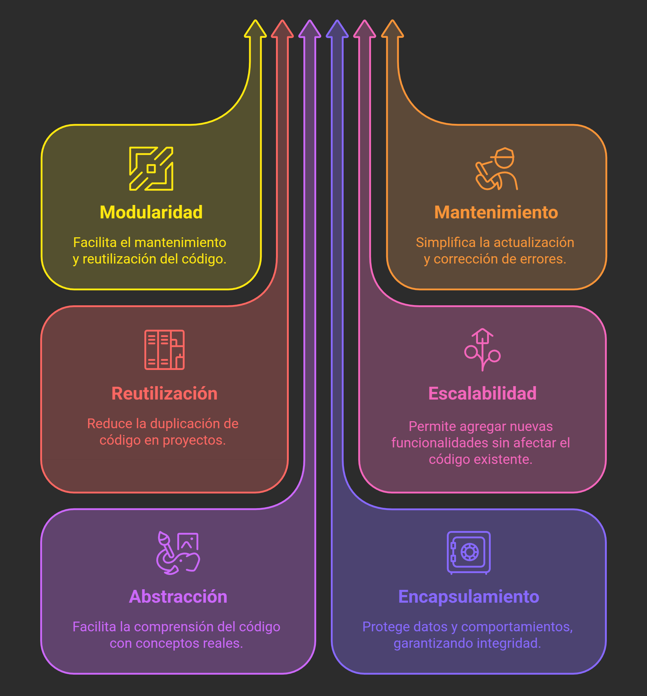{width=60%}

### Principios Fundamentales de la POO

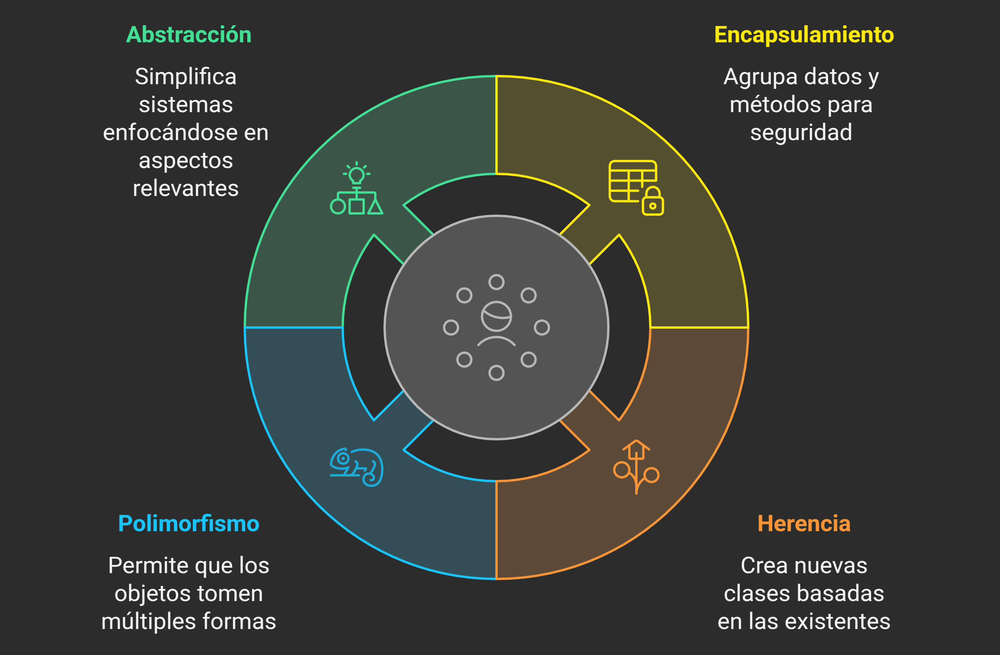{width=60%}

#### Abstracción

Su objetivo es **reducir** la complejidad de un sistema mediante la **identificación** de sus elementos más importantes, **ocultando** los detalles innecesarios. El objetivo es trabajar con una representación simplificada que capture lo esencial para resolver un problema específico.

Cuando desarrollamos software, nos enfrentamos a problemas complejos del mundo real. La abstracción permite centrarse en lo relevante para el contexto del sistema, ignorando todo aquello que no aporta valor al modelo. Esto facilita el **diseño**, la **implementación** y el **mantenimiento** del código.

- **Analizar**: Identificar los `conceptos clave` que intervienen en el problema que se van a convertir en `clases` y `objetos`. Preguntarse qué entidades son relevantes para el sistema y cuáles son sus relaciones.
- **Simplificar**: Eliminar detalles que **NO** son relevantes para el problema actual, manteniendo solo lo esencial. Elegir los `atributos` y `métodos` que realmente aportan valor al modelo.
- **Modelar**: Definir `clases` que representen los `conceptos clave`, con los `atributos` que definen las **características importantes** y los `métodos` que representan los **comportamientos relevantes**.
- **Usar**: Utilizar las `clases` creadas para resolver el problema, `instanciando` objetos que representan los **conceptos clave** y utilizando sus `métodos` para realizar las **operaciones necesarias**.
- **Implementar**: En Java, se utiliza la palabra clave `abstract` para definir una `clase abstracta` que puede contener métodos abstractos (sin implementación) y métodos concretos (con implementación). Las `clases concretas` que heredan de una `clase abstracta` deben implementar los métodos abstractos.
- **Ejemplo**: Imagina una clinica veterinaria. Podrías abstraer los conceptos clave como `Animal`, `Veterinario` y `Cita`. Cada uno de estos conceptos se convierte en una `clase` con sus propios `atributos` y `métodos` relevantes:

  - `Animal`: Con `atributos` como **nombre**, **edad**, **raza**, y `métodos` como **hacerSonido()** o **alimentar()**.
  - `Veterinario`: Con `atributos` como **nombre**, **especialidad**, y `métodos` como **examinarAnimal()** o **recetarMedicamento()**.
  - `Cita`: Con `atributos` como **fecha**, **hora**, y `métodos` como **agendarCita()** o **cancelarCita()**.
  - `Perro`: Podría ser una `clase` que hereda de `Animal`, con un `atributo` adicional como **raza** y una implementación específica del método **hacerSonido()**.

  En este caso, la abstracción permite centrarse en los aspectos más importantes del sistema de gestión de una clínica veterinaria, como los animales y los veterinarios, sin preocuparse por detalles irrelevantes como el color de ojos o la altura de los profesionales.

```java
public class Veterinario {
  // Atributos específicos del veterinario
  private String nombre;
  private String especialidad;

  // Constructor
  public Veterinario(String nombre, String especialidad) {
    this.nombre = nombre;
    this.especialidad = especialidad;
  }

  // Getters
  public String getNombre() {
    return nombre;
  }
  public String getEspecialidad() {
    return especialidad;
  }

  // Método para examinar un animal
  public void examinarAnimal(Animal animal) {
    System.out.println("Examinando a " + animal.getNombre() + " de " + animal.getEdad() + " años.");
    animal.hacerSonido(); // Llama al método hacerSonido del animal examinado
  }
  // Método para recetar medicamento
  public void recetarMedicamento(Animal animal, String medicamento) {
    System.out.println("Recetando " + medicamento + " a " + animal.getNombre());
  }
}
public class Cita {
  // Atributos de la cita
  private String fecha;
  private String hora;
  private Animal animal;
  private Veterinario veterinario;

  // Constructor
  public Cita(String fecha, String hora, Animal animal, Veterinario veterinario) {
    this.fecha = fecha;
    this.hora = hora;
    this.animal = animal;
    this.veterinario = veterinario;
  }

  // Método para agendar la cita
  public void agendarCita() {
    System.out.println("Cita agendada para " + animal.getNombre() + " con el veterinario " + veterinario.getNombre() + " el " + fecha + " a las " + hora);
  }
  public void cancelarCita() {
    System.out.println("Cita cancelada para " + animal.getNombre());
  }
}
public abstract class Animal {
  // Atributos comunes a todos los animales
  private String nombre;
  private int edad;

  // Constructor
  public Animal(String nombre, int edad) {
    this.nombre = nombre;
    this.edad = edad;
  }

  // Getters
  public String getNombre() {
    return nombre;
  }
  public int getEdad() {
    return edad;
  }

  // Método abstracto que debe ser implementado por las subclases
  public abstract void hacerSonido();
}
public class Perro extends Animal {
  // Atributo específico de la clase Perro
  private String raza;

  // Constructor
  public Perro(String nombre, int edad, String raza) {
    super(nombre, edad); // Llama al constructor de la clase base Animal
    this.raza = raza;
  }

  // Getter para el atributo raza
  public String getRaza() {
    return raza;
  }

  // Implementación del método abstracto
  @Override
  public void hacerSonido() {
    System.out.println("Guau Guau");
  }
}
```

#### Encapsulamiento

Consiste en **restringir** el acceso directo a los **datos internos** de un `objeto`, de manera que solo se pueda interactuar con ellos a través de `métodos` definidos por la propia `clase`. Esto permite proteger los datos y a mantener la integridad del objeto, mejorando tambien la **seguridad**, **modularidad** y la **mantenibilidad** del código.

Sin `encapsulamiento`, cualquier parte del programa podría **acceder** y **modificar** directamente los `atributos` de un `objeto`, lo que aumentaría el riesgo de **errores**, **inconsistencias de datos** o un **comportamiento no deseado**. El encapsulamiento resuelve este problema ocultando los `atributos` y exponiendo solo lo necesario a través de una interfaz pública.

- **Atributos privados**: Los campos de la `clase` se declaran con el [**modificador**](#1-modificadores-pueden-combinarse) `private` para evitar el acceso directo desde fuera de la `clase`.
- **Métodos de acceso** (getters y setters): Se definen `métodos` como `public` para **leer**(get) o **modificar**(set) el valor de los `atributos`, lo que permite validar los datos antes de aplicarlos.
- [**Modificadores de acceso**](#1-modificadores-pueden-combinarse): Se utilizan `private`, `protected` y `public` para controlar qué partes del código pueden acceder a cada miembro de la `clase`.
- **Ejemplo**: Imagina una `clase` **CuentaBancaria** que encapsula los detalles de una cuenta bancaria. Los `atributos` como **numeroCuenta** y **saldo** se declaran como `private`, y se proporcionan `métodos` declarados como `public` para **depositar**, **retirar** y **consultar** el saldo. Esto asegura que el **saldo** no pueda ser modificado directamente desde fuera de la `clase`, evitando errores o fraudes.

```java
public class CuentaBancaria {
  // Atributos
  private String numeroCuenta; // Atributo privado
  private double saldo; // Atributo privado

  // Constructores
  public CuentaBancaria(String numeroCuenta) {
    this.numeroCuenta = numeroCuenta;
    this.saldo = 0.0; // Inicializa el saldo a 0
  }
  public CuentaBancaria(String numeroCuenta, double saldoInicial) {
    this.numeroCuenta = numeroCuenta;
    this.saldo = saldoInicial; // Inicializa el saldo con un valor específico
  }

  // Getters
  public String getNumeroCuenta() {
    return numeroCuenta; // Método público para acceder al número de cuenta
  }
  public double getSaldo() {
    return saldo; // Método público para acceder al saldo
  }

  // Setters
  public void setNumeroCuenta(String numeroCuenta) {
    this.numeroCuenta = numeroCuenta; // Método público para modificar el número de cuenta
  }
  public void setSaldo(double saldo) {
    if (saldo >= 0) {
      this.saldo = saldo; // Método público para modificar el saldo, solo si es positivo
    } else {
      System.out.println("El saldo no puede ser negativo.");
    }
  }

  public void depositar(double cantidad) {
    if (cantidad > 0) {
      saldo += cantidad; // Modifica el saldo solo si la cantidad es positiva
    } else {
      System.out.println("Cantidad inválida para depositar.");
    }
  }

  public void retirar(double cantidad) {
    if (cantidad > 0 && cantidad <= saldo) {
      saldo -= cantidad; // Modifica el saldo solo si la cantidad es válida
    } else {
      System.out.println("Cantidad inválida para retirar.");
    }
  }
}
```

#### Herencia

Permite crear una nueva `clase` basada en una `clase existente`, heredando sus `atributos` y `métodos`. Esto promueve la **reutilización** del código y la creación de **jerarquías** entre `clases`, donde las `clases derivadas` pueden especializar o extender el comportamiento de la `clase base`.
La herencia en Java se implementa utilizando la palabra clave `extends`. Una `clase` puede heredar de otra `clase`, y una `clase` puede tener solo una superclase (herencia simple). Esto significa que Java no admite la herencia múltiple, pero se pueden implementar múltiples interfaces.
La herencia se basa en los siguientes conceptos:

- **Clase base (superclase, padre)**: Contiene los `atributos` y `métodos` que serán heredados.
- **Clase derivada (subclase, hija)**: Es la clase que **hereda** de la `clase base` y puede **agregar** nuevos `atributos` y `métodos` o **sobrescribir** los existentes. Solo puede heredar de una sola `clase base` (herencia simple).
- **`extends`**: Se utiliza para indicar que una clase hereda de otra.
- **`super`**: Se utiliza para llamar al constructor de la `clase base` desde la `clase derivada`, permitiendo inicializar los `atributos` heredados.
- **Ejemplo**: Imagina una `clase` **Animal** que define un método **hacerSonido()**. Puedes crear `clases derivadas` como **Perro** y **Gato**, que heredan de **Animal** sus `atributos` y `métodos`, por lo que pueden hacer uso del método **hacerSonido()**.

```java
public class Main {
  public static void main(String[] args) {
    Perro perro = new Perro("Firulais");
    Gato gato = new Gato("Michi");

    perro.hacerSonido(); // Firulais hace un sonido
    gato.hacerSonido();  // Michi hace un sonido
  }
}

public class Animal {
  private String nombre; // Atributo privado,

  public Animal(String nombre) {
    this.nombre = nombre;
  }

  public void hacerSonido() {
    System.out.println(nombre + " hace un sonido");
  }
}
public class Perro extends Animal {
  public Perro(String nombre) {
    super(nombre); // Llama al constructor de la clase base
  }
}
public class Gato extends Animal {
  public Gato(String nombre) {
    super(nombre); // Llama al constructor de la clase base
  }
}
```

#### Polimorfismo

Permite que un mismo `método` se comporte de diferentes maneras según el `objeto` que lo invoque. En **Java**, esto se logra principalmente mediante la **sobrescritura** de `métodos` (@Override) que se definen en una `clase padre` y se **implementa** de manera diferente en las `clases hijo`.

- **Sobrescritura de métodos**(@Override): Permite que una `subclase` implemente su propia versión de un `método` definido en la `superclase`. Esto permite que el mismo método se comporte de manera diferente según el tipo de objeto que lo invoque.
- **Llamadas a métodos**: Cuando se llama a un `método` de un `objeto`, `Java` determina en **tiempo de ejecución**(Dynamic Dispatch) qué versión del `método` se debe ejecutar, según el tipo real del objeto, no el tipo de referencia.

```java
public class Animal {
  private String nombre; // Atributo privado,

  public Animal(String nombre) {
    this.nombre = nombre;
  }

  public void hacerSonido() {
    System.out.println(nombre + " hace un sonido");
  }
}
public class Perro extends Animal {
  public Perro(String nombre) {
    super(nombre); // Llama al constructor de la clase base
  }

  @Override
  public void hacerSonido() {
    System.out.println(nombre + " dice: ¡Guau!");
  }
}
public class Gato extends Animal {
  public Gato(String nombre) {
    super(nombre); // Llama al constructor de la clase base
  }

  @Override
  public void hacerSonido() {
    System.out.println(nombre + " dice: ¡Miau!");
  }
}
```

---

## Clases

Una **clase** es una plantilla o molde que define las propiedades (atributos) y comportamientos (métodos) de un tipo de objeto. En Java, las clases son fundamentales para la Programación Orientada a Objetos (POO) y permiten crear objetos que representan entidades del mundo real.
Las clases encapsulan datos y comportamientos relacionados, lo que facilita la organización y reutilización del código. Una clase puede contener:

- **Atributos**: Variables que representan las propiedades del objeto. Se definen dentro de la clase y pueden tener diferentes [**modificadores de acceso**](#1-modificadores-pueden-combinarse)(público, privado, protegido).
- **Métodos**: Funciones que definen el comportamiento del objeto. Los métodos pueden realizar acciones, manipular los atributos y devolver valores.
  - **Constructores**: Métodos especiales que se llaman al crear un objeto de la clase. Se utilizan para inicializar los atributos del objeto. Pueden tener parámetros para establecer valores iniciales.
  - **Getters y Setters**: Métodos que permiten acceder y modificar los atributos de la clase de manera controlada. Los getters devuelven el valor de un atributo, mientras que los setters permiten establecer un nuevo valor.
  - **Otros métodos**: Métodos adicionales que definen el comportamiento del objeto, como realizar cálculos, procesar datos o interactuar con otros objetos.
  - **Sobrecarga de métodos**: Permite definir múltiples métodos con el mismo nombre pero diferentes parámetros. Esto permite que un método realice diferentes acciones según los argumentos que reciba.
- **Clases anidadas**: Clases definidas dentro de otra clase. Pueden ser estáticas o no estáticas y se utilizan para agrupar lógicamente clases relacionadas.

```java
public class Persona {
    // Atributos (propiedades)

    // Constructores

    // Getters y Setters

    // Métodos (comportamientos)

}
```

### Principales Tipos de Clases

Las clases en Java se pueden clasificar en diferentes tipos según su propósito y características:

| Tipo de Clase               | Definición                                                                                                                         | Instanciable                  | Heredable | Métodos abstractos | Uso típico                                                 | Ejemplo                                                                                                                                                                                   |
| --------------------------- | ---------------------------------------------------------------------------------------------------------------------------------- | ----------------------------- | --------- | ------------------ | ---------------------------------------------------------- | ----------------------------------------------------------------------------------------------------------------------------------------------------------------------------------------- |
| **Clase Normal**            | Implementación completa de un objeto                                                                                               | ✅ Sí (`new Clase()`)         | ✅ Sí     | ❌ No              | Modelar entidades completas                                | `class Producto { ... }`                                                                                                                                                                  |
| **Clase Abstracta**         | Define estructura parcial para subclases (puede mezclar métodos implementados y abstractos)                                        | ❌ No                         | ✅ Sí     | ✅ Sí              | Bases para jerarquías de clases                            | `abstract class Vehículo { ... }`                                                                                                                                                         |
| **Clase Final**             | Bloquea la herencia (no puede tener subclases)                                                                                     | ✅ Sí                         | ❌ No     | ❌ No              | Prevenir modificaciones en clases críticas                 | `final class Configuracion { ... }`                                                                                                                                                       |
| **Clase Anidada**           | Ayudan a la organización del código y a mantener la lógica encapsulada dentro de otra clase.                                       |                               |           |                    |                                                            |                                                                                                                                                                                           |
| ↳ **No estática** (Interna) | Requiere instancia de la clase contenedora (accede a todos sus miembros <small>**(1)**</small>, incluso privados)                  | ✅ Solo con instancia externa | ✅ Sí     | ❌ No              | Componentes íntimamente ligados al contenedor              | `class Carrito { class Item { ... } }`                                                                                                                                                    |
| ↳ **Estática**              | Existe independientemente de la instancia externa (acceso solo a miembros <small>**(1)**</small> `static` de la clase contenedora) | ✅ Sí                         | ✅ Sí     | ❌ No              | Utilidades asociadas                                       | `class Matemáticas { static class Calculadora { ... } }`                                                                                                                                  |
| ↳ **Clase Local**           | Definida dentro de un método, solo accesible dentro de ese método.                                                                 | ❌ No                         | ❌ No     | ❌ No              | Lógica específica de un método                             | `void metodo() { class Local { ... } }`                                                                                                                                                   |
| ↳ **Clase Anónima**         | Clase anónima para crear un objeto de una interfaz o clase abstracta sin necesidad de definir una clase por separado.              | ❌ No                         | ❌ No     | ❌ No              | Implementaciones rápidas de interfaces o clases abstractas | `new Interfaz() { ... }`                                                                                                                                                                  |
| **Enumeración**             | Clase especial que define un conjunto de constantes relacionadas.                                                                  | ✅ Sí                         | ❌ No     | ❌ No              | Representar un conjunto fijo de valores                    | `public enum DiaSemana { LUNES, MARTES, MIERCOLES, ... }`<br>DiaSemana dia = DiaSemana.LUNES;                                                                                             |
| **Clases Utilitarias**      | Clases que contienen métodos estáticos y no tienen estado (no se instancian).                                                      | ❌ No                         | ❌ No     | ❌ No              | Agrupar funciones relacionadas sin necesidad de instanciar | - **Math**: abs(), pow(), round(),...<br>- **Arrays**: sort(), binarySearch(),...<br>- **Collections**: sort(), shuffle(),...<br>- **MisUtilidades**: crearUsuario(), borrarUsuario(),... |

**(1)** Miembros: Todos lo elementos definidos dentro de una clase; atributos, métodos, constructores, etc.

---

## Interfaz

Es un tipo especial de `clase` que define un contrato que las clases deben cumplir

Las interfaces en Java se definen utilizando la palabra clave `interface` y las clases usan la palabra clave `implements` para indicar que implementan una interfaz.

Las interfaces son especialmente útiles para definir comportamientos comunes entre clases que no están relacionadas jerárquicamente, lo que permite una mayor flexibilidad y reutilización del código.

### Elementos de una interfaz

| Elemento           | Características                                                               | Ejemplo                                |
| ------------------ | ----------------------------------------------------------------------------- | -------------------------------------- |
| Métodos abstractos | Sin implementación. Firma obligatoria para clases implementadoras.            | `void metodo();`                       |
| Constantes         | Variables estáticas y finales implícitas. No se pueden modificar.             | `int MAX = 100;`                       |
| Métodos default    | Implementación opcional (Java 8+). Permite añadir métodos con implementación. | `default void metodoDefault() { ... }` |
| Métodos estáticos  | Implementados en la interfaz (Java 8+). No requieren instancia.               | `static void metodoEstatico() { ... }` |

### Beneficios clave

✔ **Abstracción**: Separa el **qué** debe hacerse del **cómo**.  
✔ **Polimorfismo**: Cada clase que implementa la interfaz puede proporcionar su propia implementación de los métodos definidos. Un objeto puede ser tratado como su tipo interfaz.  
✔ **Herencia múltiple**: Una clase puede implementar varias interfaces.  
✔ **Bajo acoplamiento**: Las clases no están ligadas jerárquicamente.
✔ **Flexibilidad**: Permite poder crear clases nuevas que implementen la misma interfaz sin necesidad de modificar el código existente.

Imagina una interfaz **Volador** que define un método **volar()**. Las clases **Ave** y **Avión** pueden implementar esta interfaz, proporcionando su propia implementación del método **volar()**.

```java
public interface Volador {
  // Método abstracto que debe ser implementado por las clases que implementan la interfaz
  void volar();
}
public class Ave implements Volador {
  @Override
  public void volar() {
    System.out.println("El ave vuela con sus alas");
  }
}
public class Avion implements Volador {
  @Override
  public void volar() {
    System.out.println("El avión vuela con sus motores");
  }
}
```

---

## Clases Abstractas VS Interfaces

Las **clases abstractas** y las **interfaces** son dos conceptos clave en la Programación Orientada a Objetos (POO) que permiten definir contratos y estructuras para las clases, pero tienen diferencias importantes en su uso y características.

| Característica     | Clase Abstracta                                             | Interfaz                                                                                                                               |
| ------------------ | ----------------------------------------------------------- | -------------------------------------------------------------------------------------------------------------------------------------- |
| **Definición**     | `abstract class`                                            | `interface`                                                                                                                            |
| **Implementación** | Usa `extends` (solo puede extender de una clase)            | Usa `implements` (se pueden implementar múltiples interfaces)                                                                          |
| **Instanciación**  | ❌ No se puede instanciar directamente                      | ❌ No se puede instanciar directamente                                                                                                 |
| **Métodos**        | Puede tener métodos abstractos y métodos con implementación | **Hasta Java 8**: Solo métodos abstractos<br> **Desde Java 8**: Métodos por defecto y estáticos<br> **Desde Java 9**: Métodos privados |
| **Atributos**      | ✅ Sí (cualquier modificador)                               | ❌ Solo constantes (`public static final`)                                                                                             |
| **Constructores**  | ✅ Sí                                                       | ❌ No                                                                                                                                  |
| **Uso principal**  | Compartir código entre clases relacionadas                  | Definir contratos para clases no relacionadas                                                                                          |

### ¿Cuándo usar cada una?

**Clase Abstracta**:
✔ Cuando clases comparten estado y comportamiento común.
✔ Para construir una jerarquía de clases fuertemente relacionadas.
✔ Cuando se necesiten atributos comunes y métodos con implementación.

**Interfaz**:
✔ Para definir capacidades (ej: Serializable, Comparable).
✔ Cuando clases no relacionadas necesitan un comportamiento común.
✔ Necesitas herencia múltiple (una clase puede implementar N interfaces).

---

## Estructuras de datos

Las **estructuras de datos** son formas de organizar y almacenar datos en un programa para que puedan ser utilizados de manera eficiente. En Java, existen varias estructuras de datos que se pueden utilizar para almacenar y manipular datos, cada una con sus propias características y usos.

### Tipos de Estructuras de Datos más comunes

| **Estructura**  | **Descripción**                                                                                                                                                                                              | **Tamaño**                                    | **Acceso**                                          | **Inserción/Eliminación**                          | **Uso típico**                                       |
| --------------- | ------------------------------------------------------------------------------------------------------------------------------------------------------------------------------------------------------------ | --------------------------------------------- | --------------------------------------------------- | -------------------------------------------------- | ---------------------------------------------------- |
| **Array**       | Estructura básica de datos, puede ser unidimensional (vector) o multidimensional (matriz)                                                                                                                    | ⚠️ Estatico(fijo) - No cambia una vez creado  | ⚡ Muy rápida - Acceso directo por posición         | 🐌 Muy lenta - Hay que recrear todo el array       | Cuando sabes exactamente cuántos elementos necesitas |
| **List**        | - Interfaz que representa una lista ordenada<br >- Puede contener elementos duplicados<br>- Insertar, Eliminar, ... <br>Acceder a un elemento por su indice `get(int index)`                                 |                                               |                                                     |                                                    |                                                      |
| ↳**ArrayList**  | Implementación de `List` basada en arrays dinámicos                                                                                                                                                          | ✅ Dinámico - Crece según necesites           | ⚡ Muy rápida - Como un array normal                | 🐌 Lenta - Especialmente en el medio de la lista   | Listas con acceso rápido por índice                  |
| ↳**LinkedList** | Implementación de `List` doblemente enlazada basada en nodos encadenados                                                                                                                                     | ✅ Dinámico - Crece según necesites           | 🐌 Lenta - Tiene que recorrer elemento por elemento | ⚡ Muy rápida - Especialmente al principio y final | Insertar o eliminar frecuentemente                   |
| **Map**         | - Interfaz que asocia claves únicas con valores (pares clave-valor)<br>- No permite claves duplicadas, pero sí valores duplicados<br>- Operaciones: put(key, value), get(key), remove(key), containsKey(key) |                                               |                                                     |                                                    |                                                      |
| ↳**HashMap**    | - Implementación de `Map` basada en **tablas hash**<br>- No mantiene **orden** de inserción<br>- Permite una `clave` null y múltiples `valores` null<br>- No es thread-safe                                  | ✅ Dinámico - Se redimensiona automáticamente | ⚡ Muy rápido - Acceso directo por clave (hash)     | ⚡ Rápida - Inserción/eliminación directa por hash | Almacenar datos clave-valor con acceso rápido        |

### Ejemplo de uso

- **Array**: Utilizar un array para almacenar una lista de números enteros.

  ```java
  // Crear un array de enteros con tamaño fijo
  int[] numeros = new int[5];
  numeros[0] = 10;
  numeros[1] = 20;
  numeros[2] = 30;

  // O crear e inicializar directamente
  String[] frutas = {"manzana", "banana", "naranja"};

  // Acceder a elementos
  System.out.println("Primera fruta: " + frutas[0]);
  System.out.println("Tamaño del array: " + frutas.length);

  // Recorrer el array
  for (String fruta : frutas) {
      System.out.println("Fruta: " + fruta);
  }
  ```

- **ArrayList**: Utilizar un `ArrayList` para almacenar una lista de colores.

  ```java
  // Crear ArrayList (tamaño dinámico)
  ArrayList<String> colores = new ArrayList<>();

  // Agregar elementos
  colores.add("rojo");
  colores.add("azul");
  colores.add("verde");

  // Acceso rápido por índice
  System.out.println("Color en posición 1: " + colores.get(1));
  System.out.println("Tamaño: " + colores.size());

  // Insertar al final (operación rápida)
  colores.add("naranja");

  // Insertar en una posición específica(operación lenta)
  colores.add(1, "amarillo");

  // Recorrer
  for (String color : colores) {
    System.out.println("Color: " + color);
  }
  ```

- **LinkedList**: Utilizar un `LinkedList` para almacenar una lista de tareas.

  ```java
  // Crear LinkedList (tamaño dinámico)
  List<String> tareas = new LinkedList<>();

  // Agregar al final
  tareas.add("estudiar");
  tareas.add("trabajar");

  // Agregar al principio (muy rápido)
  tareas.addFirst("desayunar");

  // Agregar al final (muy rápido)
  tareas.addLast("dormir");

  System.out.println("Primera tarea: " + tareas.getFirst());
  System.out.println("Última tarea: " + tareas.getLast());

  // Eliminar del principio (muy rápido)
  String primeratarea = tareas.removeFirst();
  System.out.println("Tarea completada: " + primeratarea);

  // Recorrer
  for (String tarea : tareas) {
      System.out.println("Pendiente: " + tarea);
  }
  ```

- **HashMap**: Utilizar un `HashMap` para almacenar nombres de usuarios y sus edades.

  ```java
  // Crear HashMap (clave-valor)
  HashMap<String, Integer> edades = new HashMap<>();

  // Agregar pares clave-valor
  edades.put("Ana", 25);
  edades.put("Luis", 30);
  edades.put("María", 28);

  // Acceso rápido por clave
  System.out.println("Edad de Ana: " + edades.get("Ana"));

  // Verificar si existe una clave
  if (edades.containsKey("Luis")) {
    System.out.println("Luis está en la lista");
  }

  // Recorrer todas las entradas
  for (String nombre : edades.keySet()) {
    System.out.println(nombre + " tiene " + edades.get(nombre) + " años");
  }
  ```

- Contar la cantidad de veces que aparece un elemento en una lista.

  ```java
  // Array de palabras
  String[] palabras = {"hola", "mundo", "hola", "java", "mundo", "hola"};
  // Crear un HashMap para contar las palabras
  HashMap<String, Integer> contador = new HashMap<>();

  // Recorrer el array, incluir cada palabra en el contador
  // Si la palabra ya existe, incrementar su contador, si no, inicializarlo a 1
  for (String palabra : palabras) {
    if (contador.containsKey(palabra)) {
      contador.put(palabra, contador.get(palabra) + 1);
    } else {
      contador.put(palabra, 1);
    }
  }

  // Recorrer el contador y mostrar las palabras y cuantas veces aparecen
  System.out.println("\nContador de palabras:");

  for (String palabra : contador.keySet()) {
    // keySet() devuelve un conjunto de todas las claves del map. palabra coge el valor de la clave en cada vuelta del bucle
    System.out.println(palabra + ": " + contador.get(palabra) + " veces");
  }
  ```

---

## Conexión a DDBB

### ORM

**Object-Relational Mapping**(Mapeo Objeto-Relacional). Es una técnica de programación que actua como traductor de dos mundos diferentes:

| 🏗️ Mundo Java (Orientado a Objetos) | 🗃️ Mundo Base de Datos (Relacional) |
| ----------------------------------- | ----------------------------------- |
| Clases                              | Tablas                              |
| Objetos                             | Filas                               |
| Atributos                           | Columnas                            |
| Métodos                             | Operaciones SQL                     |

#### 🔄 ¿Qué problema resuelve?

El ORM resuelve el problema de la **incompatibilidad** entre los modelos de datos orientados a objetos y los modelos relacionales de bases de datos. Permite trabajar con objetos en el código Java y que estos se sincronicen automáticamente con las tablas de la base de datos, evitando la necesidad de escribir consultas SQL manualmente.

❌ Sin ORM - Código tedioso y propenso a errores:

```java
// Mucho código SQL manual
String sql = "INSERT INTO usuarios (nombre, email) VALUES (?, ?)";
PreparedStatement stmt = connection.prepareStatement(sql);
stmt.setString(1, usuario.getNombre());
stmt.setString(2, usuario.getEmail());
stmt.executeUpdate();
```

✅ Con ORM - Simple y natural:

```java
// Una sola línea
usuarioRepository.save(usuario);
```

#### 🛠️ ¿Qué hace ORM por ti?

🗺️ **Mapeo automático**: Convierte clases Java → tablas de base de datos
🔗 **Relaciones**: Maneja automáticamente las conexiones entre entidades
⚡ **CRUD sencillo**: Crear, leer, actualizar y eliminar sin escribir SQL
🤖 **Generación SQL**: Crea las consultas automáticamente
🔄 **Sincronización**: Mantiene los objetos y la base de datos siempre actualizados

### JPA

**Java Persistence API**. Es una especificación de **Java** que define las reglas para trabajar con bases de datos de forma orientada a objetos.
`JPA` es un manual de instrucciones que dice cómo debe funcionar el ORM en **Java**.

#### ¿Qué define JPA?

- Cómo **mapear** `clases` **Java** a `tablas` de base de datos
- Cómo realizar operaciones `CRUD` (Create, Read, Update, Delete)
- Cómo manejar `relaciones` entre entidades(uno a muchos, muchos a muchos, etc.)
- Cómo escribir `consultas` de forma orientada a objetos

#### Implementaciones populares de JPA

- Hibernate (la más popular)
- EclipseLink
- OpenJPA

#### Conceptos clave de JPA

- **Maven**: Es una herramienta de gestión de proyectos en Java que facilita la construcción, gestión de dependencias y configuración de proyectos.
- **Dependencia**: Una biblioteca externa que nuestro proyecto necesita para funcionar. En proyectos **Maven**, estas dependencias se declaran en un archivo llamado `pom.xml`, y **Maven** se encarga de descargarlas automáticamente.
- **.xml**: Un archivo .xml (eXtensible Markup Language) es un formato de texto usado para almacenar datos estructurados. En Java, se usa frecuentemente para configuraciones, como es el caso del `persistence.xml`.
- **Persistence Unit**: Es una unidad de persistencia que define cómo se conectará JPA a la base de datos. Incluye información como el nombre de la unidad, el proveedor JPA, las clases de entidad y la configuración de conexión a la base de datos. el nombre de la unidad de persistencia se define en el archivo `persistence.xml`, es importante porque se usa para crear el `EntityManagerFactory`.
- **EntityManagerFactory**: Es una interfaz de JPA que se encarga de crear instancias de `EntityManager`.
- **EntityManager**: Es la interfaz principal de JPA que permite interactuar con la base de datos. Se usa para realizar operaciones CRUD y consultas.
- **Persistir**: Es el proceso de guardar un objeto en la base de datos. En JPA, se usa el método `persist()` del `EntityManager` para hacer esto.
- **Transacción**: Es un conjunto de operaciones que se ejecutan como una sola unidad. JPA maneja las transacciones para asegurar que todas las operaciones se completen correctamente o se deshagan en caso de error.
- **Rollback**: Es el proceso de deshacer una transacción si ocurre un error. JPA permite hacer rollback de una transacción para mantener la integridad de los datos.

#### Componentes principales que usa JPA

🔧 Elementos esenciales:

- **Proveedor JPA** (ej: Hibernate) - La herramienta que hace el trabajo
- **Entidades** - `Clases` **Java** que representan `tablas`
- **EntityManager** - El **intermediario** que guarda y busca datos
- **JPQL** - Java Persistence Query Language. Lenguaje de consultas orientado a objetos (como SQL pero para entidades Java)

⚙️ Configuración:

- 🔧 Archivos importantes:
  - **pom.xml** - Proyect Object Model. Archivo que incluye las dependencias de JPA y el proveedor (Hibernate)
  - **persistence.xml** - Archivo que dice cómo conectarse a la base de datos
- 📁**Estructura de paquetes**(recomendada):
  - `entities` - Clases que representan las tablas
  - `persistence` - Clases para acceso a datos
  - `controllers` - Lógica de negocio y control
- 🔖**Anotaciones** - Etiquetas en las clases (@Entity, @Id, @Column, etc.)

🔄 Gestión automática:

- **Contexto de persistencia** - JPA rastrea automáticamente los cambios en los objetos
- **Transacciones** - Agrupa operaciones para que sean seguras y consistentes

#### Flujo básico

- Defines una clase Java con las anotaciones necesarias (@Entity, @Id, etc.)
- JPA mapea automáticamente la clase a una tabla
- Usas EntityManager para guardar, buscar, actualizar o eliminar
- JPA genera automáticamente el SQL necesario

### Ventajas de usar JPA y ORM

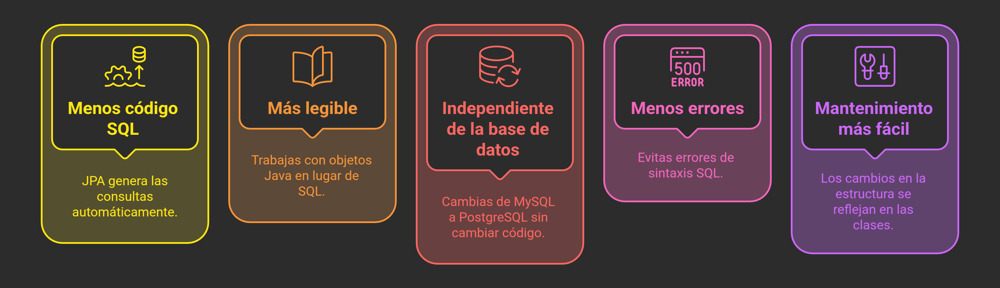

### Ciclo de Vida de una Aplicación JPA

#### 🔷 1. Crear la estructura del Proyecto (Código Fuente)

📁 **src/main/java**
🔹 `controllers/UsuarioController.java`
🔹 `entities/Usuario.java`
🔹 `persistence/UsuarioJPA.java`

📁 **src/main/resources**
🔹 `META-INF/persistence.xml`

📄 `pom.xml`

👉 Qué hay aquí:
El código fuente, configuraciones JPA y dependencias, organizados en paquetes y archivos específicos según su responsabilidad.

#### 🔷 2. Maven (`pom.xml`) - Fase de Compilación y Empaquetado

🛠️ mvn compile

🔹 El compilador de Maven (usando el JDK) convierte el código fuente `.java` y lo compila en bytecode `.class`.
🔹 Descarga automáticamente las dependencias indicadas en pom.xml (Hibernate, MySQL, etc.) especificadas en `pom.xml`.
🔹 Se incluye persistence.xml, que configura el acceso a la base de datos: driver, URL, credenciales, proveedor JPA, etc.

#### 🔷 3. Generación de .class + Configuración JPA

🧩 Archivos generados:
🔹 `Usuario.class`
🔹 `UsuarioJPA.class`
🔹 `UsuarioController.class`

📦 El proveedor JPA (como Hibernate) detecta las **clases** anotadas con `@Entity` a través del archivo `persistence.xml`.

#### 🔷 4. Ejecución del Proyecto🚀

🔹 La **JVM** carga los archivos `.class` compilados
🔹 **JPA** lee el archivo `persistence.xml` y configura la **conexión** a la base de datos
🔹 Se crea el **EntityManager** que actuará como intermediario con la base de datos
🔹 La aplicación queda lista para recibir y procesar peticiones

#### 🔷 5. JVM (Java Virtual Machine)

🟡 La **JVM** carga los `.class` compilados y mantiene la aplicación en funcionamiento.

🧠 El proveedor JPA (ej. Hibernate) usa el `persistence.xml` para mantener activa la **conexión** con la base de datos y estar listo para traducir `objetos` **Java** a datos persistentes.

#### 🔷 6. Resultado Final

💻 La aplicación está ejecutándose y lista para trabajar:
🔹 Conexión a base de datos establecida
🔹 EntityManager configurado y funcional
🔹 Aplicación preparada para recibir peticiones
🔹 Sistema listo para realizar operaciones CRUD
🔹 Toda la lógica se ha ejecutado gracias a **Maven** (construcción), **JPA** (persistencia) y la **JVM** (ejecución).

### Flujo de una Petición

#### 📱 Recorrido completo: De la petición a la respuesta

🌐 PETICIÓN → 🎮 Controller → 💾 Persistence → 🗄️ Base de Datos → 📤 RESPUESTA

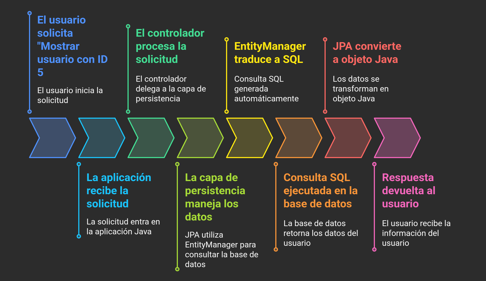

📋 Paso a paso detallado:

1. **Llega la petición**
   👤 Usuario solicita: "Mostrar usuario con ID 5"
   ⬇️
   🌐 Aplicación recibe la petición

2. **Controller procesa la petición**

   ```java
    // UsuarioController.java
   public Usuario obtenerUsuario(Long id) {
   // El controller delega al layer de persistencia
   return usuarioJPA.buscarPorId(id);
   }
   ```

3. **Capa de persistencia maneja los datos**

   ```java
    // UsuarioJPA.java (capa de acceso a datos)
   public Usuario buscarPorId(Long id) {
   // Usa EntityManager para consultar la base de datos
   return entityManager.find(Usuario.class, id);
   }
   ```

4. **EntityManager traduce a SQL**
   🤖 EntityManager convierte automáticamente:
   entityManager.find(Usuario.class, 5)
   ⬇️

   ```sql
   SELECT * FROM usuarios WHERE id = 5
   ```

5. **Se ejecuta la consulta SQL en la base de datos**
   🗄️ Base de datos ejecuta la consulta SQL
   📊 Retorna los datos: { id: 5, nombre: "Ana", email: "ana@email.com" }

6. **JPA convierte a objeto Java**
   🔄 Los datos de la tabla se convierten automáticamente en:
   Usuario usuario = new Usuario(5, "Ana", "ana@email.com")

7. **Se devuelve la respuesta**
   📤 Controller retorna el objeto Usuario
   👤 Usuario recibe: "Usuario: Ana (ana@email.com)"

🗂️ Archivos involucrados en orden:

📞 **Punto de entrada** → `Main.java` o `Servlet` (recibe petición)
🎮 **Controlador** → `UsuarioController.java` (procesa lógica)
💾 **Acceso a datos** → `UsuarioJPA.java` (maneja persistencia)
🏷️ **Entidad** → `Usuario.java` (representa los datos)
⚙️ **Configuración** → `persistence.xml` (conexión DB)

### Anotaciones para Mapeo de Clases (Annotations)

Las **anotaciones** son etiquetas que se colocan en las `clases` y sus `miembros` para indicar cómo deben ser **mapeados** a la base de datos. Estas **anotaciones** son parte de la especificación **JPA** y permiten definir el comportamiento de las `entidades`.

| Anotación           | Descripción                                                                                                           |
| ------------------- | --------------------------------------------------------------------------------------------------------------------- |
| **@Entity**         | Indica que la clase es una entidad JPA y debe ser mapeada a una tabla en la base de datos.                            |
| **@Table**          | Especifica el nombre de la tabla en la base de datos a la que se mapea la entidad.                                    |
| **@Id**             | Indica que el campo es la clave primaria de la entidad.                                                               |
| **@GeneratedValue** | Especifica cómo se generará el valor de la clave primaria (por ejemplo, auto-incremental).                            |
| **@Column**         | Especifica el nombre de la columna en la tabla y otras propiedades de la columna (como longitud, nullabilidad, etc.). |
| **@Temporal**       | Indica que un campo es de tipo fecha y hora. Se usa para mapear tipos `Date` o `LocalDateTime`.                       |

Ejemplo: entidad `Usuario` mapeada a una tabla `usuarios`:

```java
import javax.persistence.*;
import java.util.Date;

@Entity
@Table(name = "usuarios")
public class Usuario {

    @Id
    @GeneratedValue(strategy = GenerationType.IDENTITY)
    private Long id;

    @Column(name = "nombre", nullable = false, length = 50)
    private String nombre;

    @Column(name = "email", unique = true, length = 100)
    private String email;

    @Temporal(TemporalType.DATE)
    @Column(name = "fecha_nacimiento")
    private Date fechaNacimiento;

    @Temporal(TemporalType.TIMESTAMP)
    @Column(name = "fecha_creacion")
    private Date fechaCreacion;
}
```

### Modelo de Capas

El **Modelo de Capas** es una arquitectura que organiza el código en diferentes niveles o capas, cada una con una responsabilidad específica. Este enfoque ayuda a separar las preocupaciones, mejorar la mantenibilidad y facilitar el desarrollo y las pruebas.

Capas mas comunes en una aplicación Java:

| Capa                                  | Descripción                                                            | Responsabilidad principal                                            | Paquete                                |
| ------------------------------------- | ---------------------------------------------------------------------- | -------------------------------------------------------------------- | -------------------------------------- |
| **Interfaz Gráfica de Usuario (GUI)** | Interfaz de usuario que interactúa directamente con el usuario final   | Mostrar datos, recibir entradas, validación básica de formularios    | Templates, vistas web, ...             |
| **Lógica de Negocio**                 | Agrupa las capas que implementan la funcionalidad y reglas del sistema | Procesar datos, aplicar reglas de negocio y coordinar operaciones    | `controllers`, `services` y `entities` |
| ↳**Controladores**                    | Capa que recibe las peticiones HTTP y coordina las respuestas          | Manejar requests/responses, routing, validación de entrada           | `controllers`                          |
| ↳**Servicios**                        | Capa que contiene la lógica de negocio y orquesta las operaciones      | Implementar reglas de negocio, transacciones, validaciones complejas | `services`                             |
| ↳**Entidades**                        | Clases que representan las tablas de la base de datos                  | Definir la estructura de los datos y sus relaciones                  | `entities`                             |
| **Persistencia**                      | Capa de acceso a datos que abstrae las operaciones de persistencia     | Operaciones CRUD, consultas personalizadas, acceso a BD              | `persistence`                          |
