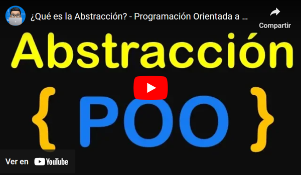
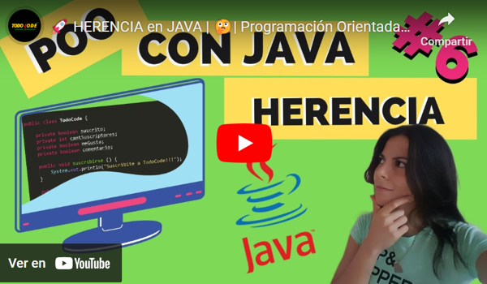
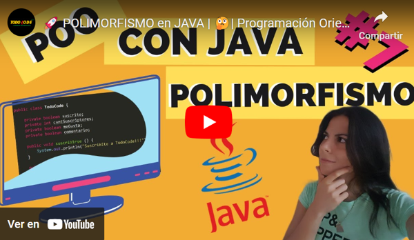

# 07. Propiedades de la POO

<br>

## Propiedades de la POO - Temas a tratar

En esta clase se abordarán las siguientes temáticas:

- Propiedades de la POO
    - Abstracción
    - Encapsulamiento
        - Modificadores de acceso: public, private y protected
    - Herencia
    - Polimorfismo

<br>

---
---

<br>

## Abstracción

La abstracción en Java se trata de tomar conceptos complicados de la vida real y simplificarlos o "abstraerlos" de cierta manera para que puedan ser utilizados de forma lógica en las aplicaciones o programas que desarrollemos. Para llevar a cabo un correcto proceso de abstracción se puede tener en cuenta los siguientes pasos:

1. **Identificación de conceptos:** Primero, identificamos los conceptos o características importantes de la vida real que queremos representar en nuestro programa. Por ejemplo, si estamos haciendo un programa para administrar una biblioteca, podríamos identificar conceptos como "libro", "prestamo", "lector", etc.

2. **Simplificación:** Luego, simplificamos estos conceptos, eliminando detalles innecesarios o complicados. Por ejemplo, en nuestro programa de biblioteca, no necesitamos representar todos los detalles de un libro (como su peso o color), solo los detalles importantes, como el título, el autor y el número de copias disponibles.

3. **Creación de clases:** En Java, creamos "clases" para representar estos conceptos simplificados. Cada clase tiene atributos que representan las características importantes y métodos que realizan acciones relacionadas con el concepto. Por ejemplo, podríamos tener una clase "Libro" con atributos como "titulo" y "autor", y métodos para prestar y devolver libros.

4. **Uso en el programa:** Luego, utilizamos estas clases en nuestro programa para crear objetos que representan los conceptos simplificados. Por ejemplo, creamos un objeto de la clase "Libro" para representar un libro específico en nuestra biblioteca.

[](https://youtu.be/oBO01Cx_YwQ)

<br>

---
---

<br>

## Encapsulamiento

Encapsulamiento en Java es un concepto fundamental que se refiere a la práctica de ocultar los detalles internos de un objeto y proporcionar un conjunto de métodos públicos para interactuar con él. En términos simples, el encapsulamiento es como poner un "escudo" alrededor de los datos de un objeto para protegerlos y garantizar que solo se puedan modificar de las formas permitidas.

>💡 _Ejemplo: Imagina un automóvil como un objeto. El automóvil tiene datos internos, como la velocidad y la cantidad de gasolina, y acciones que puedes realizar, como acelerar y frenar. El encapsulamiento en Java permite asegurarte de que no puedes modificar directamente la velocidad o la cantidad de gasolina sin usar los métodos proporcionados para ello, como ser por ejemplo "acelerar" o "recargar gasolina". Esto garantiza que los datos internos del automóvil se mantengan en un estado válido y consistente._

<br>

### Modificadores de acceso: public, private y protected

Para llevar a cabo un correcto encapsulamiento, Java utiliza un concepto llamado "Modificadores de acceso". Los **modificadores de acceso** en **Java** son palabras clave que determinan quién puede acceder a las variables y métodos de una clase y de qué manera. Los tres principales son:

1. **public:** Cuando una variable o método se declara como público, se vuelve accesible desde cualquier lugar en el programa. Otras clases pueden acceder a estas variables y métodos sin restricciones.

**Ejemplo:**

```java
public class MiClase {

    public int miAtributoPublico;

    public void miMetodoPublico() {
        // Código aquí
    }
}
```

2. **private**: Cuando se declara una variable o método como privado, solo se puede acceder a ellos dentro de la misma clase. Esto oculta los detalles internos de la clase a otras partes del programa.

**Ejemplo:**

```java
public class Auto {

    private double litrosGasolina;
    private double velocidad;

    private void acelerar() {
        // Código aquí
    }
}
```

>💡 **Nota de color:** _"private" se pronuncia "PRAIVIT" no "PRIVEIT"_ 😉

3. **protected:** Este modificador permite el acceso a las clases que se encuentran dentro del mismo paquete y a las subclases (clases hijas heredadas) de la clase padre que contiene el elemento protegido. Esto es útil en la herencia (concepto que veremos más adelante).

**Ejemplo:**

```java
public class MiClase {

    protected int miAtributoProtegido;

    protected void miMetodoProtegido() {
        // Código aquí
    }
}
```

[](https://youtu.be/4pnG1h2-fC8)

<br>

---
---

<br>

## Herencia

El concepto de **herencia en programación** es muy similar al concepto de **herencia en la vida real** entre los humanos. La herencia en la programación es un concepto que se basa en la idea de que una nueva clase (llamada clase hija o subclase) puede heredar características y comportamientos de una clase existente (llamada clase padre o superclase).

>💡 **Ejemplo práctico:** _Imagina a una familia de perros. Los padres son perros con ciertas características y habilidades, por lo que sus cachorros heredan muchas de estas características y habilidades. Por ejemplo, pueden heredar el color del pelaje, la velocidad, la capacidad de ladrar y otros rasgos. Si los padres son buenos cazadores, es probable que los cachorros también hereden esa habilidad._

_En programación, esto se traduce de manera similar. Puedes tener una clase "Animal" como la clase padre que tiene propiedades y métodos comunes a todos los animales. Luego, puedes crear subclases como "Perro" y "Gato", que heredan las características generales de "Animal", pero también pueden tener sus propias características y comportamientos únicos._

_Por ejemplo, la clase "Animal" puede tener un método "comer", que todas las subclases heredarán. Sin embargo, la subclase "Perro" podría tener un método adicional "ladrar" que solo se aplica a los perros, y la subclase "Gato" podría tener un método "maullar" que solo se aplica a los gatos._

En java para manifestar que una clase hereda de otra se utiliza la palabra clave "extends" que básicamente significa extiende. De esa manera podemos decir, por ejemplo, la clase perro hereda/extiende de la clase animal, como si fuese una "extensión" de la misma. De igual manera, se utiliza (sobre todo en constructores) la palabra clave "super". Ésta indica que los atributos allí presentes se heredan e inicializan a partir de la clase padre.

A nivel código podríamos representarlo de esta manera:

<br>

**Clase ANIMAL**

```java
//ejemplo clase animal en código

public class Animal {
    String nombre;
    int edad;

    public Animal(String nombre, int edad) {
        this.nombre = nombre;
        this.edad = edad;
    }

    public void comer() {
        System.out.println(nombre + " está comiendo.");
    }
}
```

<br>

**SUBCLASES O CLASES HIJAS PERRO Y GATO (AMBAS HEREDAN DE ANIMAL)**

```java
// Clase "Perro" que hereda de "Animal"
class Perro extends Animal {
    public Perro(String nombre, int edad) {
        super(nombre, edad);
    }

    public void ladrar() {
        System.out.println(nombre + " está ladrando.");
    }
}
```
	

```java
// Clase "Gato" que hereda de "Animal"
class Gato extends Animal {

     public Gato(String nombre, int edad) {
        super(nombre, edad);
    }

    public void maullar() {
        System.out.println(nombre + " está maullando.");
    }
}
```

Si quisiéramos ejecutar un ejemplo en el _main_ de nuestro proyecto podríamos llevar a cabo lo siguiente:

```java
public class Main {
    public static void main(String[] args) {
        Perro miPerro = new Perro("Rocco", 3);
        Gato miGato = new Gato("Pelusa", 2);

        miPerro.comer();
        miPerro.ladrar();

        miGato.comer();
        miGato.maullar();
    }
}
```

**Conclusión:** En este ejemplo, tenemos una clase base "Animal" que tiene dos propiedades comunes: nombre y edad, y un método común llamado comer. Luego, tenemos dos clases derivadas, "Perro" y "Gato", que heredan de la clase "Animal" y agregan métodos específicos para ladrar y maullar, respectivamente.

En el método _main_, creamos una instancia de "Perro" y una instancia de "Gato" y llamamos a sus métodos tanto comunes como específicos de cada clase. Esto ilustra cómo la herencia permite compartir características comunes y tener características específicas en las subclases.

[](https://youtu.be/2hYhpRZFuns)

<br>

---
---

<br>

## Polimorfismo

Vamos a pensar el significado de esta palabra a nivel etimológico.. Poli significa "muchas" y morfismo significa "formas"... El polimorfismo permite que objetos de clases distintas utilicen los mismos nombres de método, pero actúen de manera diferente según su propia implementación. Esto va de la mano con dos conceptos muy importantes, la "sobreescritura" y "sobrecarga" de métodos. Sobrecargar significa definir nuevos métodos y sobrescribir significa reutilizar un método ya existente pero llevando a cabo una implementación diferente.

>💡**Ejemplo práctico:** _Imagina que tienes una serie de objetos de animales (como perro y gato), y a todos estos animales les puedes pedir que emitan un sonido mediante un método llamado "emitir sonido". Usando polimorfismo, cada tipo de animal puede tener su propia forma de hacer ruido (mediante la sobreescritura de métodos), por más que todos llamen al mismo método (con el mismo nombre)._

```java
public class Animal {
    public void emitirSonido() {
        System.out.println("El animal hace un sonido genérico.");
    }
}

public class Perro extends Animal {
    public void emitirSonido() {
        System.out.println("Guauu Guauu");
    }
}

public class Gato extends Animal {
    public void emitirSonido() {
        System.out.println("Miauuuuuu");
    }
}
```

El **polimorfismo** también permite que si creamos un objeto de una clase padre (por ejemplo un array/vector de tipo animal), pueda contener en su estructura distintos objetos de sus clases hijas por más que sus características sean diferentes.

[](https://youtu.be/bblFTvuk4pY)
	
[](https://youtu.be/2jX22t4Bh4k)

---
> [⬅️ Anterior: Introducción a la POO](06-introduccion-a-la-POO.md) | 📂 [Volver al índice](./README.md) | [Siguiente: POO avanzada ➡](08-POO-avanzado.md)
