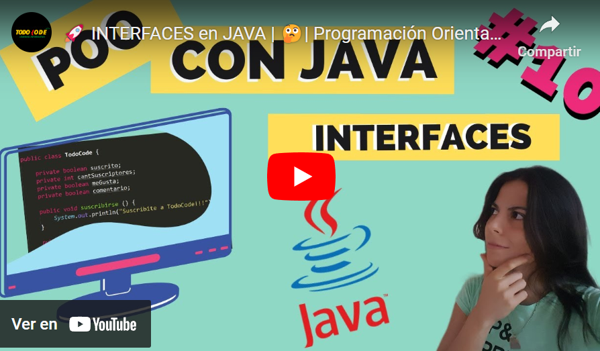

# 08. Programación Orientada a Objetos Avanzada

<br>

## Interfaces

Una interfaz es un "tipo especial de clase" que se caracteriza por no poder presentar atributos (de forma normal) y que SÓLO puede poseer métodos abstractos, es decir, planteo de métodos sin su correspondiente implementación. Las interfaces permiten "simular" un concepto que no es posible en Java de forma nativa, que es la "herencia múltiple", dado que una clase puede implementar varias interfaces al mismo tiempo. Así como las clases abstractas buscan ser una plantilla general para sus clases hijas, las interfaces buscan ser plantillas de igual manera pero de sus COMPORTAMIENTOS (métodos).

<br>

### Características de las Interfaces

- Se definen con la palabra clave `interface`.
  
- No pueden contener atributos (salvo los `static final`).
  
- Una clase puede implementar múltiples interfaces.

- Las interfaces no pueden contener implementaciones de métodos (hasta Java 8, cuando se introdujeron los métodos `default` y `static`)
  
- Desde Java 9, pueden tener métodos privados.

<br>

### Ejemplo de una Interfaz

```java
public interface Animal {
    void hacerSonido();
}

class Perro implements Animal {
    public void hacerSonido() {
        System.out.println("Guau guau");
    }
}
```

<br>

[](https://youtu.be/hfwtzjOhvKk)


---
---

<br>

## Enumeraciones (Enums)

Las **enumeraciones** en Java son un tipo especial de clase que representa un conjunto fijo de constantes.

<br>

### Características de los Enums

- Se definen con la palabra clave `enum`.
  
- Son `final`, lo que significa que no pueden ser extendidos.
  
- Pueden contener atributos, métodos y constructores.
  
- Se utilizan comúnmente para representar estados o categorías fijas.

<br>

### Ejemplo de un Enum

```java
enum Dia {
    LUNES, MARTES, MIERCOLES, JUEVES, VIERNES, SABADO, DOMINGO
}

public class TestEnum {
    public static void main(String[] args) {
        Dia diaActual = Dia.LUNES;
        System.out.println("Hoy es: " + diaActual);
    }
}
```

<br>

---
---

<br>

## Clases Abstractas

Una clase abstracta es una clase especial en Java que tiene la principal característica de que no puede ser instanciada directamente. Esto quiere decir, que no se pueden crear objetos a partir de ella. Se utiliza como una plantilla o modelo para crear otras clases derivadas. Las clases abstractas pueden contener métodos abstractos (sin cuerpo/implementación) y métodos concretos (con implementación de código).

Entre las principales características de las clases abstractas tenemos:

- **Palabra clave abstract:** Se deben declarar como abstractas usando la palabra clave abstract antes de la palabra clave class.
    
- **Métodos abstractos:** Puede tener tanto métodos abstractos como métodos implementados. Sin embargo, una clase abstracta debe tener de forma OBLIGATORIA al menos un método abstracto.
    
- **Herencia:** Las clases concretas pueden extender (heredar) de una clase abstracta. Esto significa que las clases hijas deben proporcionar implementaciones de forma OBLIGATORIA para todos los métodos abstractos de la clase base abstracta mediante sobreescritura de métodos.
	  
- No pueden ser instanciadas directamente.
	  
- Pueden contener atributos y constructores.

<br>

**Ejemplo de una Clase Abstracta Figura**

```java
abstract class Figura {
    abstract double calcularArea();
}

class Circulo extends Figura {
    private double radio;

    Circulo(double radio) {
        this.radio = radio;
    }

    @Override
    double calcularArea() {
        return Math.PI * radio * radio;
    }
}
```

<br>

**Ejemplo de una  Clase Abstracta Vehículo**

```java
public abstract class Vehiculo {
    String marca;
    
    public Vehiculo(String marca) {
        this.marca = marca;
    }

//métodos abstractos (sin implementación)
    public abstract void arrancar();
    public abstract void detener();

//método implementado
    public void limpiarParabrisas() {
      System.out.println("Limpiando parabrisas");
    }
}
```

**Extensión Auto**

```java
public class Auto extends Vehiculo {

private String placa;
private String modelo;
    
    // Constructor que llama al constructor de la clase madre/padre
    public Auto(String marca) {
        super(marca);
    }

    // Implementación del método 'arrancar'
    @Override
    public void arrancar() {
        System.out.println("El auto" + marca + " está arrancando.");
    }

    // Implementación del método 'detener'
    @Override
    public void detener() {
        System.out.println("El auto " + marca + " se está deteniendo.");
    }

    //como el método limpiar parabrisas ya está implementado, no es necesario especificarlo acá sino que se accede simplemente a el mediante la "herencia"
}
```

<br>

[](https://youtu.be/I4o7fvSQvBA)

<br>

---
---

<br>

### Diferencias entre clases abstractas e interfaces

[](https://youtu.be/Id3kTuEPB_s)

<br>

### ¿Cuándo elegir clases abstractas y cuando interfaces?

[](https://youtu.be/riGDna9zme4)

<br>

---
---

## Clases dentro de Clases

Java permite definir **clases anidadas** dentro de otras clases. Estas clases pueden ser de diferentes tipos:

<br>

### Tipos de Clases Anidadas

1. **Clases Internas**: Definidas dentro de otra clase.
   
2. **Clases Estáticas Internas**: Usan `static` y no dependen de una instancia externa.
   
3. **Clases Locales**: Definidas dentro de un método.
   
4. **Clases Anónimas**: Clases sin nombre que se crean para ser utilizadas inmediatamente.

<br>

### Ejemplo de Clase Interna

```java
class Externa {
    class Interna {
        void mostrar() {
            System.out.println("Soy una clase interna");
        }
    }
}

public class TestInterna {
    public static void main(String[] args) {
        Externa externa = new Externa();
        Externa.Interna interna = externa.new Interna();
        interna.mostrar();
    }
}
```

<br>


---
---

## Materiales/ejercicios prácticos complementarios

- [Interfaces con figuras geométricas](https://youtu.be/VMbt-Zc5OZs?si=1KTg0lO99CUu7ux0)
    
- [Interfaces y clases abstractas con seres vivos](https://youtu.be/J2aXYUA1h20?si=ZAbi2wgVpxDt5agH)
    
- [Clases abstractas e interfaces con Pokemon](https://youtu.be/O3hKxRLkLVU?si=JF6pgvJY9CiY530d)

---
> [⬅️ Anterior: Propiedades de la POO](07-propiedades-de-la-POO.md) | 📂 [Volver al índice](./README.md) | [Siguiente: Collections en Java ➡](09-collections-en-java.md)
