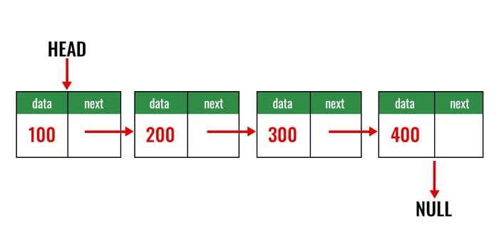
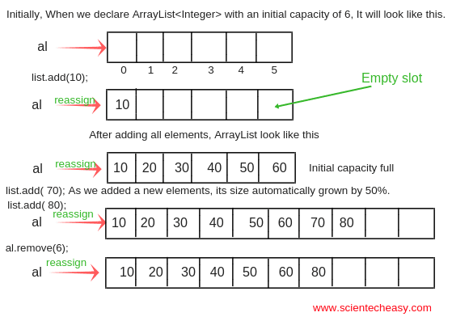

# 09. Collections en Java

<br>

## Collections en Java - Temas a tratar

En esta clase se abordarán las siguientes temáticas:

- Collections:
    - List
    - LinkedList
    - ArrayList
    - Map

<br>

---
---

<br>

## Collections

En Java, las "collections" (colecciones) se refieren a estructuras de datos que se utilizan para almacenar y organizar grupos de objetos. Estas estructuras de datos son fundamentales en la programación y son proporcionadas por la biblioteca estándar de Java en forma de clases e interfaces. Las "_collections_" permiten el almacenamiento, la manipulación y la gestión eficiente de datos, como listas de elementos, conjuntos, mapas y más.

<br>

### List

List es una interfaz en Java que se utiliza para almacenar una colección de objetos en un orden específico. Representa (como lo dice su nombre) una LISTA de objetos. Dependiente de cómo se organizan sus elementos, una lista puede ser de distintos tipos. Por ejemplo: LinkedList o ArrayList.

<br>

### LinkedList

LinkedList es una clase que implementa la interfaz principal List. Almacena elementos en una estructura de lista doblemente enlazada, es decir, una lista de objetos que se puede recorrer de diferente manera u orden. Es muy eficiente para inserciones o eliminaciones en cualquier parte de la lista, pero no tan eficiente para el acceso mediante índices. Su principal uso es en proyectos donde se realizan muchas inserciones o eliminaciones.



**Ejemplo de código**

```java
import java.util.LinkedList;

public class EjemploLinkedList {
    public static void main(String[] args) {
        // Crear una LinkedList de tipo String
        // Puede ser de una clase en particular también
        LinkedList<String> miLinkedList = new LinkedList<>();

        // Agregar elementos al final de la lista
        miLinkedList.add("Manzana");
        miLinkedList.add("Banana");
        miLinkedList.add("Cereza");

        // Agregar un elemento en una posición específica
        miLinkedList.add(1, "Uva");

        // Acceder a elementos por índice
        String fruta = miLinkedList.get(0); // Obtendrá "Manzana"

        // Eliminar un elemento por índice
        miLinkedList.remove(2); // Eliminará "Banana"

        // Tamaño de la LinkedList
        int tamaño = miLinkedList.size(); // Devolverá 3

        // Iterar sobre la LinkedList
        for (String elemento : miLinkedList) {
            System.out.println(elemento);
        }
    }
}
```

<br>

### ArrayList

Los **ArrayLists** en Java son una estructura de datos que se utiliza para almacenar una colección de elementos. Son flexibles y dinámicos, lo que significa que puedes agregar o eliminar elementos de manera eficiente sin tener que preocuparte por el tamaño inicial de la lista.

ArrayList utiliza un arreglo (array) para almacenar sus elementos. Esto significa que tiene un tamaño fijo inicial y, cuando se llena, se redimensiona automáticamente para acomodar más elementos. El acceso a elementos por índice es rápido y constante, lo que lo hace eficiente cuando necesitas recuperar elementos rápidamente. Sin embargo, las operaciones de inserción o eliminación en el medio de la lista pueden ser costosas, ya que podrían requerir desplazar elementos en el arreglo.



<br>

#### **Ejemplos de Código de ArrayList**

<br>

**Declaración y creación de un ArrayList**

```java
import java.util.ArrayList;

ArrayList<String> miLista = new ArrayList<String>();
```

**Agregar Elementos**

```java
miLista.add("Manzana");
miLista.add("Banana");
miLista.add("Cereza");
```

**Acceder a elementos**

```java
String fruta = miLista.get(0);  // Obtendrá "Manzana"
```

**Eliminar elementos**

```java
miLista.remove(1);  // Eliminará el elemento en el índice 1 (en este caso, "Banana")
```

**Tamaño de un ArrayList**

```java
int tamaño = miLista.size();  // Devolverá 2 después de eliminar "Banana"
```

**Iterar sobre un ArrayList**

```java
for (int i = 0; i < miLista.size(); i++) {
    System.out.println(miLista.get(i));
}
```

<br>

### Map

Un Map es una estructura de datos que se utiliza para almacenar pares clave-valor. En otras palabras, relaciona un valor (el valor) con una etiqueta única (la clave). Esto es útil cuando necesitas asociar datos relacionados. Imagina que tienes un diccionario en el que buscas una palabra (la clave) para obtener su definición (el valor). En Java, un Map funciona de manera similar. Puedes buscar un valor específico proporcionando la clave correspondiente.

Algunas características clave de los Map en Java son:

- No permite claves duplicadas: Cada clave en un Map debe ser única, lo que significa que no puedes tener dos claves iguales con valores diferentes.
    
- Eficiencia en la búsqueda: Los Map están diseñados para permitir una búsqueda rápida de valores asociados con una clave. Esto se logra mediante una estructura de datos optimizada, como un árbol o una tabla hash.
    
- Implementaciones diferentes: En Java, hay varias implementaciones de la interfaz Map, como HashMap, TreeMap y LinkedHashMap, que ofrecen diferentes comportamientos y características.
    
- Utilidad para el almacenamiento de configuraciones y asociaciones: Los Map son útiles para almacenar configuraciones de aplicaciones, datos relacionados y asociaciones clave-valor en general.

**Ejemplo de Código:**

```java
import java.util.HashMap;
import java.util.Map;

public class EjemploMap {
    public static void main(String[] args) {
        // Crear un Map que relaciona nombres con edades
        Map<String, Integer> edades = new HashMap<>();

        // Agregar valores al Map
        edades.put("Juan", 25);
        edades.put("María", 30);
        edades.put("Pedro", 22);

        // Obtener el valor asociado a una clave
        int edadJuan = edades.get("Juan"); // Devolverá 25

        // Verificar si una clave existe en el Map
        boolean existeAna = edades.containsKey("Ana"); // Devolverá false
    }
}
```

---
> [拘勇 Anterior: POO avanzada](08-POO-avanzado.md) | 游늭 [Volver al índice](./README.md) | [Siguiente: Clases utilitarias 俱멯(10-clases-utilitarias.md)
