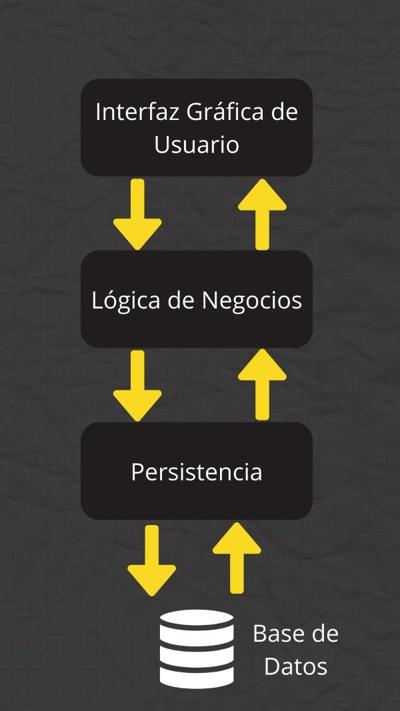
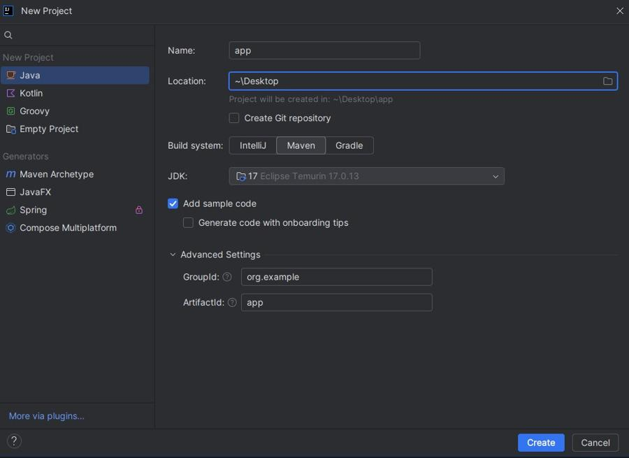

# 11. JPA -  Conectándonos a una Base de Datos.

## Conexión a bases de datos con JPA - Temas a tratar

En esta clase se abordarán las siguientes temáticas:

- ¿Qué son los ORM?
  
- Java Persistence API (JPA) + Hibernate
    - Modelo de capas    
    - Annotations en JPA
    - Configurando JPA en mi Proyecto de Java

<br>

---
---

<br>

> ⚠️ **Advertencia:** Recuerda que para poder llevar con total normalidad esta clase debes tener conocimientos previos de BASES DE DATOS RELACIONALES y consultas SQL. En la sección "04. Bases de Datos Relacionales" dentro del Curso 0, cuentas con el contenido complementario necesario.

<br>

---
---

## ¿Qué es un ORM?

**ORM (_Object-Relational Mapping_)** es una técnica de programación que permite mapear objetos en un lenguaje de programación, como Java, a estructuras de datos en una base de datos relacional. En otras palabras, un ORM facilita la interacción entre aplicaciones orientadas a objetos y bases de datos relacionales, abstrayendo gran parte de la complejidad de escribir consultas SQL y permitiendo a los desarrolladores trabajar con objetos y clases en lugar de tablas y registros de bases de datos.

[](https://youtu.be/2pNaYOBWxa0)

<br>

---
---
## JPA (Java Persistence API)

**Java Persistence API (JPA)** es una API estándar de Java que se utiliza para gestionar la persistencia de objetos en bases de datos relacionales. JPA proporciona un conjunto de especificaciones y estándares que facilitan el mapeo de objetos Java a tablas de base de datos y simplifican las operaciones de lectura, escritura y administración de datos en una base de datos.

<br>

## Proveedores de JPA

Existen varios proveedores de persistencia (implementaciones) para Java Persistence API (JPA), que son compatibles con la especificación JPA y proporcionan la funcionalidad necesaria para mapear objetos Java a bases de datos relacionales. Algunos de los proveedores de JPA más conocidos incluyen:

- **Hibernate:** Hibernate es uno de los proveedores de JPA más populares y ampliamente utilizados. Ofrece una amplia gama de funcionalidades, soporta mapeo objeto-relacional, y proporciona características avanzadas como caché de segundo nivel y búsqueda de texto completo.
    
- **EclipseLink:** EclipseLink es otra implementación de JPA ampliamente utilizada y es la referencia de JPA proporcionada por Eclipse Foundation. Es conocida por su alto rendimiento y soporte para características avanzadas, como mapeo de herencia y caché.

- Hay muchos más pero los mas famosos son estos, en nuestra cursada nos dedicaremos a conocer Hibernate principalmente.


> ⚠️ **Advertencia:** Existe una confusión muy común a que JPA y Hibernate son conceptos o tecnologías diferentes y esto no es así. Hibernate es un Proveedor de JPA, por lo que es una forma de implementar dicha tecnología.

<br>

---
---
## Modelo de capas

Para poder implementar **JPA** de manera correcta en nuestros proyectos de **Java**, es necesario que contemos con una estructura de carpetas/paquetes bien establecida. Para ello, existen diferentes modelos a seguir; sin embargo dos de los más utilizados son el MVC (que veremos más adelante) y el Modelo de Capas, el cual te sugerimos utilizar actualmente.



<br>

---
---
## ¿Que es una Interfaz Gráfica de Usuario (GUI)?

Una interfaz gráfica de usuario (GUI) es un entorno visual que permite a los usuarios interactuar con un sistema informático de manera intuitiva y fácil de usar. En lugar de tener que escribir comandos complejos, los usuarios pueden interactuar con el sistema a través de elementos gráficos como ventanas, iconos, botones y menús.

La GUI se basa en el principio de "lo que ves es lo que obtienes" (WYSIWYG), lo que significa que la representación visual de la interfaz refleja fielmente el resultado de las acciones del usuario. Esto facilita la comprensión y el uso del sistema, especialmente para usuarios sin conocimientos técnicos avanzados.

Las GUI modernas suelen incluir las siguientes características:

- Elementos visuales: Ventanas, iconos, botones, menús, barras de desplazamiento, etc.
  
- Interacción directa: Los usuarios pueden interactuar con los elementos visuales mediante el uso de un ratón, teclado o pantalla táctil.
  
- Retroalimentación visual: El sistema proporciona retroalimentación visual inmediata a las acciones del usuario, como resaltar un botón al pasar el ratón por encima o mostrar una barra de progreso durante la carga de un archivo.
  
- Metáfora de escritorio: Muchas GUI utilizan la metáfora de un escritorio, con ventanas que representan documentos y carpetas, y un menú de inicio que proporciona acceso a las aplicaciones.

Se utilizará la terminal como interfaz principal para interactuar con el sistema, a pesar de que pueda ser menos intuitiva que una GUI.

<br>

---
---
## ¿Que es una Unidad de Persistencia?

Una **unidad de persistencia (_Persistence Unit_)** a es una configuración que define cómo una aplicación Java interactúa con una base de datos utilizando tecnologías de persistencia, como por ejemplo Java Persistence API (JPA). Podemos imaginarla como una "caja" que contiene toda la información importante sobre cómo los objetos que creemos en nuestra aplicación Java se van a almacenar en una base de datos.

De manera sencilla, una unidad de persistencia especifica:

- **La fuente de datos:** Indica a qué base de datos se conectará la aplicación para almacenar y recuperar datos.
    
- **Las clases de entidades:** Enumera las clases Java que representan tablas en la base de datos. Estas clases se conocen como "entidades".
    
- **La configuración de JPA:** Define cómo se mapean las clases Java a las tablas de la base de datos y cómo se administran las transacciones.
    
- **Las propiedades de conexión:** Incluye detalles como la URL de conexión, el nombre de usuario y la contraseña para acceder a la base de datos.

<br>

---
---
## JPA Controllers

Los controladores JPA (_Java Persistence API_) son componentes que se utilizan en aplicaciones Java empresariales para gestionar la interacción con la capa de persistencia de la base de datos. Estos controladores se utilizan comúnmente en aplicaciones basadas en JPA para realizar operaciones CRUD (Crear, Leer, Actualizar, Eliminar) en las entidades de la base de datos.

Los controladores JPA facilitan la gestión de la persistencia en aplicaciones Java, ya que encapsulan la lógica de acceso a la base de datos y brindan una interfaz sencilla para realizar operaciones en las entidades.

<br>

---
---

Para entender el modelo de capas y su implementación, te dejamos a continuación un video explicativo:

[](https://youtu.be/C6J0TOlCieM)

<br>

---
---
## Annotations en JPA

Las anotaciones en el contexto de la programación son metadatos especiales que se incorporan en el código fuente de un programa para proporcionar información adicional y directrices sobre cómo se debe procesar ese código. Estas anotaciones son utilizadas por el compilador, herramientas de desarrollo y tiempo de ejecución para realizar diversas tareas, como la generación de código, la verificación de tipos, la configuración de la aplicación y más.

Java Persistence API (JPA) utiliza anotaciones para mapear clases de objetos Java a tablas de bases de datos y para proporcionar información sobre cómo gestionar la persistencia de los objetos. EclipseLink es uno de los proveedores de JPA y soporta un conjunto de anotaciones que son estándar en JPA.

Aquí tienes una explicación de algunas de las principales anotaciones utilizadas en JPA con EclipseLink (proveedor que utilizaremos en esta oportunidad):

- **`@Entity`:** Esta anotación se utiliza para marcar una clase Java como una entidad, lo que significa que la clase representa una tabla en la base de datos. Cada instancia de esta clase corresponde a una fila en la tabla.
    
- **`@Table`:** Puede ser utilizada para personalizar la tabla de base de datos asociada a una entidad. Puedes especificar el nombre de la tabla, el esquema y otras opciones de configuración de la tabla.
    
- **`@Id`:** Esta anotación se utiliza para marcar una propiedad de una clase como la clave primaria de la entidad. Cada entidad debe tener una clave primaria única.
    
- **`@GeneratedValue`:** Se utiliza junto con la anotación `@Id` para especificar cómo se generará automáticamente el valor de la clave primaria. Puedes usar estrategias como IDENTITY, SEQUENCE, TABLE, entre otras.
    
- **`@Column`:** Se utiliza para personalizar la asignación entre una propiedad de la entidad y una columna de la tabla. Puedes especificar detalles como el nombre de la columna, su tipo de datos, y si permite nulos.

**¡Veamos el ejemplo de una clase Persona mapeada con Annotations!**

>💡 **Recordatorio:** La clase persona debe estar creada dentro del paquete "logica" (o model).

<br>

```java
import javax.persistence.Entity;
import javax.persistence.Id;
import javax.persistence.GeneratedValue;
import javax.persistence.GenerationType;

@Entity
public class Persona {
    @Id
    @GeneratedValue(strategy = GenerationType.IDENTITY)
    private Long id;
    private String nombre;
    private int edad;

    // Constructor por defecto
    public Persona() {}

    // Constructor con parámetros
    public Persona(String nombre, int edad) {
        this.nombre = nombre;
        this.edad = edad;
    }

    // Getters y Setters para las propiedades
    public Long getId() {
        return id;
    }

    public String getNombre() {
        return nombre;
    }

    public void setNombre(String nombre) {
        this.nombre = nombre;
    }

    public int getEdad() {
        return edad;
    }

    public void setEdad(int edad) {
        this.edad = edad;
    }
}
```

>💡 **Recordatorio:** GenerationType nos indica el tipo de generación automática que queremos para nuestra Id. Además de Identity (que vemos en el ejemplo) también existen otros tipos. 
>
>Veamos en detalle cada uno de ellos:
>
>	- **GenerationType.IDENTITY:** Este valor indica que la generación de la clave primaria se basa en la identidad de la base de datos. En general, se utiliza con bases de datos que admiten la generación automática de claves primarias, como MySQL con columnas AUTO_INCREMENT o PostgreSQL con columnas SERIAL.  
> 		 
>	- **GenerationType.SEQUENCE:** Se utiliza para indicar que la generación de la clave primaria se basa en una secuencia de base de datos preexistente. Esto es común en bases de datos como Oracle, donde se crea una secuencia para generar valores únicos.  
> 		 
>	- **GenerationType.TABLE:** Con esta estrategia, se utiliza una tabla de base de datos especial para generar valores únicos. Esta estrategia puede ser útil en bases de datos que no admiten secuencias o identidades.  
> 		 
>	- **GenerationType.AUTO:** Este valor permite que el proveedor JPA elija automáticamente la estrategia de generación más adecuada según la base de datos subyacente. Puede variar según el proveedor de JPA que estés utilizando.  
> 		
>	- **GenerationType.NONE:** Indica que no se generará automáticamente ningún valor para la clave primaria. El valor debe ser proporcionado manualmente en el código antes de la inserción en la base de datos.  

<br>

---
---
## Configurando JPA en mi Proyecto de Java

<br>

## Pre-requisitos

- **XAMPP instalado y en funcionamiento**: Asegúrate de que el servidor MySQL de XAMPP esté iniciado.
  
- **Base de datos "personass_db" creada**: Esta base de datos debe contener las tablas que deseas mapear con tus entidades Java.
  
- **IntelliJ IDEA instalado**: Con el plugin de Maven configurado. Llamado `Maven` para crear un soporte para este tipo de proyectos.

<br>

## Paso a Paso

### 1) Crear proyecto con Maven

> ⚠️ **Advertencia:** Para llevar a cabo las siguientes configuraciones utilizaremos como IDE IntelliJ.

- Paso 1: Abrir nuestro SGBD Mysql Workbench y crear una base de datos. En este caso crearemos un programa llamada `app`.
    
- Paso 2: Si ya estamos dentro de Intelli J. Creamos un nuevo proyecto `Maven` en IntelliJ. File -> New -> Project -> Maven Archetype

    
- Paso 3: Define el Nombre, Ubicación y la versión de tu proyecto. Selecciona el arquetipo deseado (por ejemplo, maven project).



<br>

### 2) Descargar dependencias para la persistencia.

- Paso 1: Debemos configurar nuestro conector de MySQL. Por defecto es probable que no lo tengas configurado, por lo que podrás descargarlo desde esta [URL](./resources/8_1-mysql-connector-j-8.1.0.jar). Se puede utilizar de las 2 maneras.

Si deseas agregarlo mediante el pom.xml seria de el siguiente código:

- Paso 2: Agregar las dependencias al `pom.xml`:

```xml
<dependencies>
    <dependency>
        <groupId>org.hibernate</groupId>
        <artifactId>hibernate-core</artifactId>
        <version>...</version>
    </dependency>
    <dependency>
        <groupId>jakarta.persistence</groupId>
        <artifactId>jakarta.persistence-api</artifactId>
        <version>...</version>
    </dependency>
    <dependency>
        <groupId>mysql</groupId>
        <artifactId>mysql-connector-java</artifactId>
        <version>...</version>
    </dependency>
</dependencies>
```


> ⚠️ **pom.xml:** Es un archivo XML que actúa como el centro de control de un proyecto Maven. En esencia, es la definición completa de un proyecto, donde se especifican todas sus características, dependencias y configuraciones necesarias para su construcción y gestión. Piénsalo como el plano de un edificio: contiene las instrucciones detalladas sobre cómo construirlo, qué materiales utilizar y cómo debe ser el resultado final.

Una vez agregada las dependencias necesarias, procederemos a configurar los datos de nuestra base de datos:

> ⚠️ **Advertencia:** Recuerda que debes tener abierto tu servidor o SGBD y que debe existir previamente tu base de datos con los datos que hayas configurado.

<br>

### 3)  Configurar la unidad de persistencia: `persistence.xml`


1. **Crear la carpeta `META-INF` en `/src/main/resources`**.
   
2. **Copiar el texto de `persistence.xml`** dentro de `META-INF`.
   - Ajusta las propiedades de conexión (`persistence-unit`, `URL`, `usuario`, `contraseña`) para que coincidan con tu base de datos.

```xml
<persistence xmlns="http://xmlns.jcp.org/xml/ns/persistence" version="2.1">
    <persistence-unit name="unidadDePersistencia"> <!-- Atentos con este dato -->
        <class>com.example.User</class>
        <properties>
            <!-- Configuración de la base de datos -->
            <property name="javax.persistence.jdbc.driver" value="com.mysql.cj.jdbc.Driver" />
            <property name="javax.persistence.jdbc.url" value="jdbc:mysql://localhost:3306/nombreDB?serverTimezone=UTC" />
            <property name="javax.persistence.jdbc.user" value="root" />
            <property name="javax.persistence.jdbc.password" value="" />

            <!-- Mostrar sentencias SQL -->
            <property name="hibernate.show_sql" value="true" />
            <property name="hibernate.format_sql" value="true" />

            <!-- Crear las tablas automáticamente -->
            <property name="hibernate.hbm2ddl.auto" value="update" />
        </properties>
    </persistence-unit>
</persistence>
```

<br>

### 4) Crear los Paquetes

Dentro del paquete principal de tu proyecto (por ejemplo, `com.example`), crea los siguientes paquetes:

- `/controllers`
  
- `/entities`
  
- `/persistence`

<br>

### 5) Crear las siguientes Clases

- **En el paquete `persistence`**:
  - `ConfigJPA.java`: Configura Hibernate.
  - `PersonasJPA.java`: DAO (Data Access Object) para operaciones CRUD sobre la entidad `Persona`.
    
- **En el paquete `entities`**:
  - `Personas.java`: Mapea la tabla `personas`. Usa el código de Personas que te dimos anteriormente, donde encontraras las anotaciones de Hibernate (`@Entity`, `@Table`, `@Id`, `@Column`).

<br>

### 6) Configuración de la Unidad de Persistencia

En el paquete `/persistence`, crearemos una clase de configuración de persistencia llamada `ConfigJPA`:

```java
import jakarta.persistence.EntityManager;
import jakarta.persistence.EntityManagerFactory;
import jakarta.persistence.Persistence;

public class ConfigJPA {
    private static final EntityManagerFactory emf = 
        Persistence.createEntityManagerFactory("unidadDePersistencia"); //Mismo nombre que en el persistense.xml

    public static EntityManager getEntityManager() {
        return emf.createEntityManager();
    }

    public static void close() {
        emf.close();
    }
}
```

<br>

### 7) Crear el PersonaJPA

- **En el paquete `/persistence`**:
  - `PersonasJPA`: Aqui desarrolladremos la logica y Métodos para operaciones CRUD sobre la entidad `Personas`.

```java
import java.util.List;

public class PersonaJPA {
  
    public List<Persona> findAll() {
        EntityManager em = ConfigJPA.getEntityManager();
        try{
            TypedQuery<Persona> query = em.createQuery("SELECT p FROM personas p", Persona.class);
            return query.getResultList();
        }finally {
            em.close();
        }
    }
}
```

<br>

### 8) Crear el Controller

- **En el paquete `controllers`**:
  - `PersonasController`: Aquí debes hacer el llamado a los métodos para operaciones CRUD sobre la clase `PersonaJPA`.

```java

public class PersonaController {

    PersonaJPA personaJPA = new PersonaJPA();
  
    public List<Persona> findAll() {
        return personaJPA.findAll();
    }

}

```

<br>

### 9. Configurar el `Main.java`

En el método `main`, crea una instancia de `PersonasController` para realizar operaciones CRUD.

```java
public class Main {
    public static void main(String[] args) {

        PersonaController personaController = new PersonaController();
      
        // Buscar todas las peliculas
        List<Persona> todasLasPeliculas =  personaController.findAll();

        for (Persona persona: todasLasPeliculas) {
            System.out.println(persona);
        }
    }
}
```

<br>

## Importante

- **Ajusta las propiedades de conexión en `persistence.xml`**.
  
- **Mapeo de entidades**: Usa anotaciones de Hibernate (`@Entity`, `@Table`, `@Id`, `@Column`).
  
- **Manejo de transacciones**: Usa transacciones de Hibernate para la integridad de datos.
  
- **Manejo de errores**: Captura excepciones y proporciona mensajes informativos.

Este es un esquema general. El código completo dependerá de la complejidad de tu aplicación y las características específicas de tu base de datos.

---
> [⬅️ Anterior: Clases utilitarias](10-clases-utilitarias.md) | 📂 [Volver al índice](./README.md) | [Siguiente: CRUD con JPA ➡](12-crud-jpa.md)
