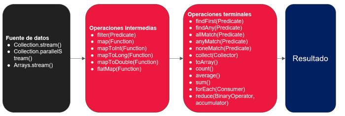
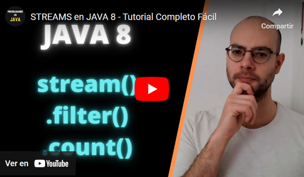

# 05. Programación Funcional con Streams en Java

En esta clase se abordarán las siguientes temáticas:

- **Programación Funcional en Java**
    - Introducción a Streams
    - Creación de Streams
    - Operaciones comunes en Streams

<br>

## Streams en Java

### Introducción a Streams

En Java, los **Streams** proporcionan una forma más declarativa y funcional de procesar colecciones de datos. Un Stream es una secuencia de elementos que admite operaciones de procesamiento de datos en colecciones, como filtrado, mapeo y reducción. Los Streams permiten realizar operaciones de manera más concisa y expresiva que con las estructuras de control tradicionales.

<br>

### Características clave de Streams

1. **Declarativos:** Los Streams permiten expresar operaciones de procesamiento de datos de manera declarativa, lo que significa que puedes describir qué operación realizar en lugar de cómo hacerlo.
    
2. **Perezosos (Lazy):** Las operaciones en un Stream no se ejecutan hasta que se solicite un resultado. Esto permite la optimización de recursos, ya que solo se procesan los elementos necesarios.
    
3. **Pipelines:** Puedes encadenar varias operaciones en un _pipeline_ para realizar una secuencia de transformaciones en los datos.
    
<br>

### Creación de Streams

En Java, hay varias formas de crear Streams:

- **Desde una colección:**

```java
List<String> lista = Arrays.asList("uno", "dos", "tres");
Stream<String> streamDeLista = lista.stream();
```

- **Desde valores individuales:**

```java
Stream<String> streamDeValores = Stream.of("valor1", "valor2", "valor3");
```

- **Mediante generación:**

```java
Stream<Integer> streamDeGeneracion = Stream.iterate(0, n -> n + 2).limit(5);
```

<br>

## Operaciones comunes en Streams

### Operaciones de filtro

- `filter(Predicate<T> predicate)`: Filtra los elementos del Stream basándose en un predicado.

<br>

### Operaciones de transformación

- `map(Function<T, R> mapper)`: Transforma cada elemento del Stream utilizando la función dada.
    
- `flatMap(Function<T, Stream<R>> mapper)`: Transforma cada elemento y aplana el resultado en un solo Stream.

<br>

### Operaciones de reducción

- `reduce(BinaryOperator<T> accumulator)`: Combina los elementos del Stream en un solo resultado.

<br>

### Operaciones terminales

- `forEach(Consumer<T> action)`: Realiza una acción para cada elemento del Stream.
    
- `collect(Collector<T, A, R> collector)`: Recolecta los elementos del Stream en una estructura de datos.

<br>

## Ejemplo práctico

Veamos un ejemplo práctico con Streams. Supongamos el siguiente escenario:

Imagina que tienes una lista de nombres y deseas filtrar aquellos que tengan más de cierta longitud y luego imprimirlos en mayúsculas.

**Tener en cuenta los siguientes criterios:**

- Utiliza Streams para realizar las operaciones de filtrado y transformación.
    
- Imprime los nombres resultantes en mayúsculas en la consola.

**¡Veamos como resolverlo!**

```java
import java.util.Arrays;
import java.util.List;
import java.util.stream.Collectors;

public class EjemploStreams {

    public static void main(String[] args) {
        List<String> nombres = Arrays.asList("Ana", "Juan", "Carlos", "Elena", "Pedro", "Maria");

        List<String> nombresFiltrados = nombres.stream()
                .filter(nombre -> nombre.length() > 4)  // Filtrar nombres con más de 4 caracteres
                .map(String::toUpperCase)  // Convertir a mayúsculas
                .collect(Collectors.toList());  // Recolectar en una lista

        // Imprimir los nombres resultantes
        nombresFiltrados.forEach(System.out::println);
    }
}
```

**¿Qué hacemos en este ejemplo?**

**1.** **Creación de la lista:** Creamos una lista de nombres usando `Arrays.asList()`.

**2.** **Uso de Stream para filtrar y transformar:** Utilizamos un Stream para filtrar los nombres que tienen más de 4 caracteres y luego convertimos cada nombre a mayúsculas.

**3.** **Recolección de resultados:** Utilizamos `collect(Collectors.toList())` para recolectar los resultados en una nueva lista.

**4.** **Impresión de resultados:** Finalmente, utilizamos `forEach(System.out::println)` para imprimir los nombres resultantes.

Este es un caso simple, pero ilustra la potencia y la expresividad de los Streams al realizar operaciones en colecciones de manera más concisa y legible. En aplicaciones más complejas, los Streams pueden ser utilizados para realizar operaciones más avanzadas como mapeo, filtrado condicional, reducción, y mucho más.

<br>

## Resumen métodos de Streams



<br>

## Videos explicativos

¡Complementemos nuestra información mediante videos explicativos!

[](https://youtu.be/ACQtz4zpBLE)

[](https://youtu.be/hz6hlaU5o58)

---
[⬅️ Volver al índice](./README.md)