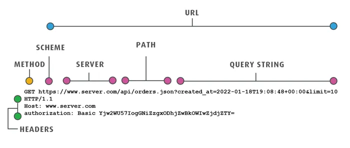

# 10. Mundo Web

En esta clase se abordarán las siguientes temáticas:

- Arquitectura Cliente Servidor: Requests y Responses
- Protocolo HTTP. Métodos GET y POST
- Otros métodos HTTP

 

## Introducción al mundo web

El **mundo web** es un ecosistema interconectado de recursos digitales accesibles a través de internet. Su génesis se remonta al surgimiento de la **World Wide Web** (WWW) en la década de 1990, concebida por _Tim Berners-Lee_. Este entorno ha evolucionado desde la presentación estática de información hacia una plataforma dinámica y participativa, integrando aplicaciones, servicios y contenido interactivo.

**Java**, conocido por su portabilidad y robustez, ha sido una opción popular en el desarrollo web. Sus frameworks y herramientas, como **Java Enterprise Edition (Java EE)** y **Spring Framework**, simplifican y agilizan el desarrollo de aplicaciones web.

**Java EE** proporciona un entorno para el desarrollo de aplicaciones empresariales, mientras que Spring Framework ofrece una amplia gama de módulos y funciones que facilitan la creación de aplicaciones robustas y escalables.

El desarrollo web con Java implica el uso de tecnologías como servlets, **JavaServer Pages (JSP)** y APIs específicas. Los servlets son clases Java que extienden las capacidades de un servidor para manejar solicitudes y respuestas web. **JSP**, por otro lado, permite la creación de páginas web dinámicas combinando **HTML** y código Java.

Todos estos conceptos los iremos viendo más adelante, pero a partir de esto, veamos los conceptos básicos que necesitamos comprender para desarrollar web en Java.

 

## Arquitectura Cliente-Servidor

La **arquitectura cliente-servidor** es un modelo de comunicación donde un cliente realiza solicitudes a un servidor, que a su vez proporciona respuestas a esas peticiones. Este modelo define claramente los roles de ambas partes: el cliente inicia la comunicación y el servidor responde a las solicitudes.

 

### Cliente

Un **cliente** es cualquier dispositivo o programa informático que solicita recursos o servicios a otro programa o dispositivo. En el contexto web, el cliente suele ser un navegador web (como Chrome, Firefox, Safari) o una aplicación que solicita información a un servidor. Cuando un usuario ingresa una URL en un navegador, este actúa como el cliente, enviando una solicitud al servidor para acceder a la página web correspondiente.

El **cliente** inicia la comunicación y envía solicitudes al servidor, generalmente utilizando un protocolo como HTTP. Estas solicitudes pueden ser para obtener páginas web, imágenes, archivos, datos o cualquier otro recurso disponible en el servidor.

 

### Servidor

Un **servidor** es una computadora u ordenador con un programa informático que proporciona servicios, recursos o datos a otros dispositivos o programas, llamados clientes. En el contexto web, el servidor aloja y gestiona recursos como páginas web, archivos, servicios o aplicaciones. Responde a las solicitudes realizadas por los clientes y les proporciona la información solicitada.

Cuando un cliente envía una solicitud al servidor, este procesa la solicitud, realiza las acciones necesarias y devuelve una respuesta al cliente. Por ejemplo, cuando un navegador solicita una página web, el servidor busca esa página, la procesa (puede incluir bases de datos, lógica de aplicación, etc.) y envía el contenido de vuelta al navegador para que lo muestre al usuario.

A nivel gráfico podemos ver la Arquitectura Cliente-Servidor de la siguiente manera:

**Veamos la arquitectura Cliente-Servidor más a fondo en el siguiente video:**

 

# Arquitectura Cliente Servidor: MVC

La arquitectura Cliente-Servidor es un modelo en el que dos entidades principales interactúan: el **cliente** y el **servidor**. El cliente realiza solicitudes (_requests_) y el servidor responde (_responses_). En el contexto de aplicaciones web, el cliente suele ser el navegador, mientras que el servidor es una aplicación que maneja la lógica de negocios y el acceso a la base de datos.

 

### MVC (Modelo-Vista-Controlador)

El patrón **MVC** es un enfoque común para estructurar aplicaciones web. Se divide en tres componentes principales:

1. **Modelo (_Model_):** Gestiona los datos y la lógica de la aplicación. Es responsable de interactuar con la base de datos y realizar cálculos o procesamientos necesarios.
2. **Vista (_View_):** Presenta la información al usuario. Genera la interfaz gráfica o visualización de los datos.
3. **Controlador (_Controller_):** Maneja la lógica de negocio y actúa como intermediario entre el modelo y la vista. Recibe las solicitudes del cliente, procesa los datos a través del modelo y actualiza la vista en consecuencia.

El flujo típico en MVC es:
1. El usuario realiza una solicitud al controlador.
2. El controlador interactúa con el modelo para obtener datos.
3. El controlador pasa los datos a la vista.
4. La vista genera una respuesta que el cliente recibe.

 

## Protocolo HTTP (Hypertext Transfer Protocol)

Ya entendemos que un cliente se comunica con un servidor pero para esto necesita un lenguaje o forma de comunicación, es ahí donde entra en juego el **Protocolo HTTP**.

El **protocolo HTTP** es la base de la comunicación en la web. Se trata de un protocolo de transferencia de hipertexto que permite la transferencia de datos entre clientes y servidores. Este protocolo opera bajo una arquitectura de solicitud-respuesta sin estado, lo que significa que cada solicitud se trata de manera independiente, sin retener información sobre solicitudes anteriores.

El **protocolo HTTP** se basa principalmente en dos conceptos, en las _requests_ (solicitudes) y las _responses_ (respuestas). Veamos ambas en mayor detalle.

 

### Request (Solicitud)

Una solicitud (_request_) es un mensaje enviado por un cliente (como un navegador web) a un servidor. Esta solicitud se envía cuando un usuario solicita acceder a una página web, archivo u otro recurso ubicado en el servidor.

**Componentes de una solicitud HTTP:**

- **URL:** Es la dirección del recurso solicitado.
    
- **Método HTTP:** Indica qué acción se desea realizar en el recurso (GET, POST, PUT, DELETE, etc.).
    
- **Encabezados (_Headers_):** Proporcionan información adicional sobre la solicitud (tipo de navegador, idioma preferido, tipo de contenido, etc.).
    
- **Cuerpo (_Body_):** Contiene datos adicionales que pueden ser enviados al servidor, por ejemplo, al utilizar el método POST para enviar información de un formulario.

 

### Response (respuesta)

Una respuesta (_response_) es lo que el servidor envía de vuelta al cliente como resultado de la solicitud que ha recibido. Contiene la información solicitada o indica el estado de la operación solicitada.

**Componentes de una respuesta HTTP:**

- **Código de Estado (Status Code):** Un número que indica si la solicitud se ha procesado correctamente o si ha habido algún error. Por ejemplo, el código 200 indica éxito, 404 indica que el recurso no fue encontrado, 500 indica un error interno del servidor, entre otros.
    
- **Encabezados (Headers):** Proporcionan información adicional sobre la respuesta (tipo de contenido, longitud del contenido, información sobre el servidor, etc.).
    
- **Cuerpo (Body):** Contiene los datos o el recurso solicitado, como el HTML de una página web, imágenes, archivos, etc.

**¡Veamos al Protocolo HTTP más a fondo en el siguiente video!**

 

### Métodos GET y POST

**GET y POST** son dos de los métodos principales en HTTP. **GET** se utiliza para solicitar datos del servidor y se representa en la URL del navegador. Es útil para recuperar información y es un método idempotente, es decir, múltiples solicitudes devolverán el mismo resultado.

Por otro lado, **POST** se emplea para enviar datos al servidor. A diferencia de GET, los datos no se exponen en la URL, lo que lo hace adecuado para el envío de información sensible. POST no es idempotente, ya que enviar la misma solicitud puede generar diferentes resultados.

 

### Otros métodos HTTP

Además de los métodos GET y POST, el protocolo HTTP tiene otros métodos que permiten diferentes tipos de interacciones entre el cliente y el servidor. Algunos de estos métodos comunes son:

**1. PUT**: El método PUT se utiliza para enviar datos al servidor para crear o actualizar un recurso en una ubicación específica. Es similar a POST en el sentido de que también envía datos, pero generalmente se usa para actualizar recursos específicos en una ubicación conocida.

**2. DELETE**: El método DELETE se emplea para solicitar al servidor que elimine un recurso específico. Al enviar una solicitud DELETE a una URL específica, se espera que el servidor elimine el recurso asociado con esa URL.

**3. PATCH**: PATCH se usa para aplicar modificaciones parciales a un recurso. A diferencia de PUT, que actualiza completamente un recurso, PATCH se utiliza para realizar modificaciones parciales o incrementales en el recurso existente.

Cada uno de estos métodos tiene un propósito específico y se utiliza según las necesidades de interacción entre el cliente y el servidor en una aplicación web.

 

## ¿Qué es un Servidor Web?

Un **servidor web** no es más que una pc/servidor que cuenta con un software diseñado para atender solicitudes HTTP (Protocolo de Transferencia de Hipertexto) provenientes de clientes, como navegadores web, y enviarles los recursos solicitados, como páginas web, imágenes, archivos, entre otros. Es responsable de manejar el tráfico de internet y distribuir contenido a los usuarios.

Un **servidor web** funciona de la siguiente manera:

1. **Escucha y Responde Solicitudes:** El servidor web está constantemente escuchando por solicitudes HTTP provenientes de los clientes.
    
2. **Procesamiento de Solicitudes:** Una vez que recibe una solicitud, el servidor la procesa, busca el recurso solicitado y prepara la respuesta.
    
3. **Envío de Respuestas:** Envía la respuesta al cliente, ya sea el recurso solicitado (página web, imagen, etc.) o un código de error si el recurso no está disponible.

 

## ¿Qué  Servidor Web usaremos?

**Apache Tomcat** es un contenedor de servlets y servidor web de código abierto desarrollado por la _Apache Software Foundation_. Está diseñado para ejecutar aplicaciones web Java Servlet, JavaServer Pages (JSP) y tecnologías relacionadas.

 

### Características de Apache Tomcat

- **Contenedor de Servlets y JSP:** Tomcat actúa como un contenedor para ejecutar aplicaciones basadas en estas tecnologías.
    
- **Soporte para Especificaciones Java EE:** Implementa las especificaciones de Java EE relacionadas con la capa web, como Servlets, JSP, WebSocket, etc.
    
- **Configuración y Despliegue Sencillos:** Es fácil de configurar y desplegar aplicaciones web en Tomcat.
    
- **Buena Performance:** Ofrece un rendimiento sólido y es ampliamente utilizado en entornos de producción.

 

### ¿Cómo utilizo Apache Tomcat en Java?

Para utilizar Apache Tomcat en un proyecto Java, es necesario descargarlo desde el sitio web oficial, luego configurarlo y desplegar la aplicación web de forma correcta. Posteriormente, Tomcat se encarga de servir la aplicación web a través de su puerto por defecto (generalmente el puerto 8080).

Repasemos el paso a paso de cómo configurar Apache Tomcat en el IDE IntelliJ para poder hacer uso y crear nuestro primer proyecto web. Vamos a descargarlo hoy para implementarlos en las siguiente clases.

---
[⬅️ Volver al índice](./README.md)