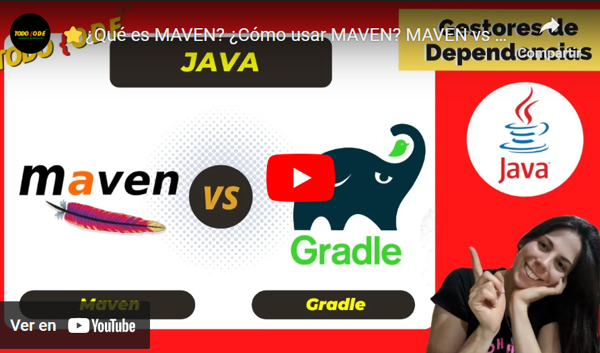
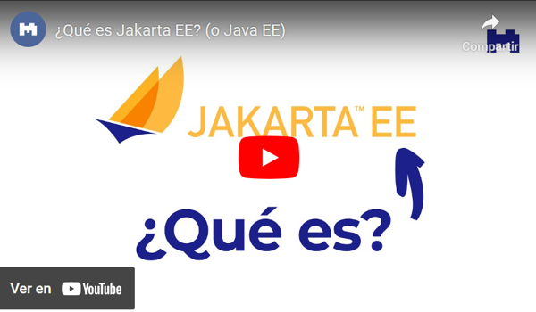
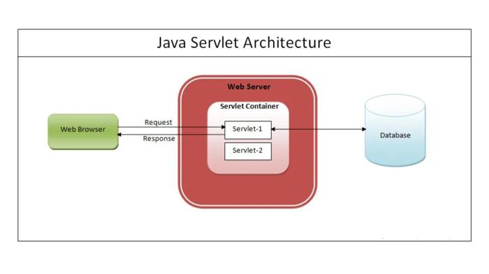
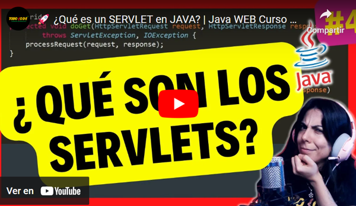

# 11. Creación y gestión de proyectos con Maven

### ¿Qué es Maven?

Maven es una herramienta de gestión y construcción de proyectos de software desarrollada por _Apache Software Foundation_. Se utiliza para automatizar el proceso de construcción, manejo de dependencias, compilación, pruebas y despliegue de aplicaciones Java y otros lenguajes como C#, Ruby, Scala, etc.

 

#### Características principales de Maven

Entre las principales características de Maven podemos encontrarnos con:

- **Manejo de dependencias:** Permite gestionar las dependencias de un proyecto de manera eficiente, descargando automáticamente las bibliotecas necesarias desde repositorios remotos.
    
- **Estructura de directorios estandarizada:** Fomenta una estructura de proyecto coherente y fácil de comprender, lo que facilita la colaboración entre desarrolladores.
    
- **Ciclo de vida del proyecto:** Define fases específicas (compilación, pruebas, empaquetado, instalación, despliegue, etc.) que se ejecutan en un orden predefinido para construir y gestionar el proyecto.
    
- **Plugins:** Maven se basa en _plugins_ que amplían sus funcionalidades, permitiendo a los desarrolladores personalizar y ampliar sus procesos de construcción.

 

#### Funcionamiento de Maven

Maven opera con un enfoque estructurado y predefinido para simplificar la gestión y construcción de proyectos. Su funcionamiento se basa en la configuración centralizada a través del archivo POM (_Project Object Model_) y en el uso de repositorios para administrar dependencias y _plugins_. Veamos en detalle cada una de estas partes:

- **Archivo POM (_Project Object Model_):** Es el núcleo de Maven. Es un archivo XML que describe el proyecto y sus configuraciones, incluyendo dependencias, _plugins_, versiones, entre otros aspectos.
    
- **Repositorios:** Maven utiliza repositorios para almacenar bibliotecas, dependencias y _plugins_. Los repositorios pueden ser locales o remotos (como Maven Central).
    
- **Comandos y Ciclo de vida:** Se ejecutan comandos Maven, como _mvn compile_, _mvn test_, que activan fases específicas del ciclo de vida del proyecto definido en el POM.

 

### Maven vs Gradle (diferencias y similitudes)

Maven y Gradle son herramientas de construcción y gestión de proyectos ampliamente utilizadas en el desarrollo de software. Ambas están diseñadas para simplificar tareas como la compilación, pruebas, gestión de dependencias y despliegue, pero difieren en su enfoque y estructura. Sin embargo, tienen ciertas diferencias y similitudes...

**¡Veamos algunas de ellas!**

| Características         | Maven                                                  | Gradle                                                              |
| ----------------------- | ------------------------------------------------------ | ------------------------------------------------------------------- |
| Lenguaje                | Basado en XML                                          | Basado en DSL (Groovy o Kotlin)                                     |
| Flexibilidad            | Menos flexible, sigue una estructura definida          | Altamente flexible, permite personalización                         |
| Configuración           | Define un ciclo de vida predefinido                    | Permite definir scripts personalizados                              |
| Gestión de dependencias | Eficiente, pero puede ser rígido                       | Gestión de dependencias más dinámica                                |
| Rendimiento             | Rápido, pero puede ser menos ágil en proyectos grandes | Considerado más rápido, especialmente en proyectos complejos        |
| Curva de aprendizaje    | Más fácil para proyectos con convenciones estándar     | Más empinada al principio, pero más adaptable a proyectos complejos |

 

### Creación de un proyecto Java con Maven

**Maven** se ha convertido en un pilar esencial en el ecosistema de desarrollo Java, gracias a su capacidad para gestionar dependencias, automatizar la construcción, y estandarizar la estructura de los proyectos. A continuación, aprenderemos los conceptos clave y las mejores prácticas para utilizar Maven de manera efectiva en tus proyectos creando uno de forma sencilla utilizando IntelliJ como IDE.

¡Comencemos a desbloquear el potencial de Maven y llevar tus proyectos Java al siguiente nivel! ¡VAMOS!

> ⚠️ **Advertencia:** El video presentado demuestra la implementación de código en el IDE de NetBeans. Pero el profesor utilizará IntelliJ para la demostración en clase. Se recomienda prestar atención a la lógica del código, sin enfocarse en los detalles de la interfaz mostrada.

 

### Maven más a fondo

Si bien utilizaremos las herramientas básicas de Maven para descarga de dependencias mediante el POM, no es lo único que podemos hacer realmente con esta potente herramienta, por lo que, si te has quedado con ganas de aprender más, te dejamos la siguiente lista de reproducción a continuación: 
[https://youtube.com/playlist?list=PLvimn1Ins-40atMWQkxD8r8pRyPLAU0iQ&si=lGHFBc_JGDr8DoHn](https://youtube.com/playlist?list=PLvimn1Ins-40atMWQkxD8r8pRyPLAU0iQ&si=lGHFBc_JGDr8DoHn)

 

## Java y Jakarta EE

**Java EE** (_Java Platform, Enterprise Edition_) es una plataforma de programación desarrollada por Oracle para construir aplicaciones empresariales en Java. Proporciona un conjunto de especificaciones, APIs y herramientas para simplificar el desarrollo de aplicaciones empresariales escalables, seguras y robustas.

 

### Características de Java EE

- **Componentes Basados en Contenedores:** Java EE se basa en el concepto de contenedores, que gestionan y proporcionan servicios a los componentes de la aplicación (como Servlets, EJBs, JSPs, etc.).
    
- **Amplia Gama de APIs:** Ofrece APIs para el desarrollo de aplicaciones web, de negocios, acceso a bases de datos, mensajería, seguridad, entre otras.
    
- **Seguridad Integrada:** Proporciona mecanismos de seguridad robustos para autenticación, autorización y gestión de identidades.

 

### Transición de Java EE a Jakarta EE

**Java EE** era previamente desarrollado y mantenido por Oracle bajo el nombre de J2EE (_Java 2 Platform, Enterprise Edition_). Posteriormente, se convirtió en Java EE y se hizo popular para el desarrollo de aplicaciones empresariales.

Debido a la necesidad de llevar Java EE a una comunidad de desarrollo más abierta y colaborativa, Oracle transfirió las especificaciones de Java EE a la Eclipse Foundation en 2017. Esto condujo al renombramiento de la plataforma a Jakarta EE.

**Jakarta EE** es una continuación de Java EE con un proceso de desarrollo más comunitario y abierto. Las especificaciones y APIs que solían ser parte de Java EE ahora se están desarrollando y manteniendo bajo el proyecto Jakarta EE.

 

#### Ventajas y beneficios de Jakarta EE

- **Mayor Involucramiento de la Comunidad:** Jakarta EE fomenta la colaboración de la comunidad de desarrolladores en la evolución de la plataforma.
    
- **Desarrollo de Código Abierto:** Las especificaciones y tecnologías bajo Jakarta EE se desarrollan bajo licencias de código abierto, lo que fomenta la transparencia y la participación.

**¡Veamos Jakarta EE más a fondo en este video!**

 

## Servlets

Los **Servlets** son clases Java que se utilizan para ampliar las capacidades de los servidores web y generar respuestas dinámicas a las solicitudes HTTP. Actúan como componentes fundamentales en el desarrollo de aplicaciones web basadas en Java y se ejecutan en el servidor, procesando las solicitudes de los clientes y generando respuestas dinámicas.

 

### Funcionamiento de los Servlets

Los **servlets** funcionan de la siguiente manera:

- **Manejo de Solicitudes:** Los Servlets reciben y manejan solicitudes HTTP (GET, POST, PUT, DELETE, etc.) enviadas por los clientes (navegadores web, aplicaciones móviles, etc.).
    
- **Generación de Respuestas Dinámicas:** Procesan la solicitud, ejecutan lógica de negocio, acceden a bases de datos o a otros recursos y generan respuestas dinámicas, generalmente en formato HTML, XML o JSON.
    
- **Interacción con Ciclo de Vida del Servlet:** Los Servlets tienen un ciclo de vida que incluye métodos como `init()`, `service()`, `doGet()`, `doPost()`, `destroy()`, que se ejecutan en diferentes etapas del ciclo de vida del Servlet.

 

### Creando un Servlet

Los **Servlets** son una parte fundamental del desarrollo de aplicaciones web Java y ofrecen un enfoque poderoso y flexible para manejar solicitudes HTTP y generar respuestas dinámicas en el entorno del servidor.

**¡Veamos en detalle cómo crear uno!**

> ⚠️ **Advertencia:** El video presentado demuestra la implementación de código en el IDE de NetBeans. Pero el profesor utilizará IntelliJ para la demostración en clase. Se recomienda prestar atención a la lógica del código, sin enfocarse en los detalles de la interfaz mostrada.

 

### Pasando datos a un servlet

Ya sabemos cómo crear un servlet, ahora veamos cómo podemos pasar datos a uno en el siguiente video:

> ⚠️ **Advertencia:** El video presentado demuestra la implementación de código en el IDE de NetBeans. Pero el profesor utilizará IntelliJ para la demostración en clase. Se recomienda prestar atención a la lógica del código, sin enfocarse en los detalles de la interfaz mostrada.

 

### Traer datos desde un servlet

Ya sabemos cómo enviar datos a un servlet, ahora, veamos cómo podemos obtener los mismos mediante el método Get y solicitudes. ¡Vamos a eso!

> ⚠️ **Advertencia:** El video presentado demuestra la implementación de código en el IDE de NetBeans. Pero el profesor utilizará IntelliJ para la demostración en clase. Se recomienda prestar atención a la lógica del código, sin enfocarse en los detalles de la interfaz mostrada.

---
[⬅️ Volver al índice](./README.md)
