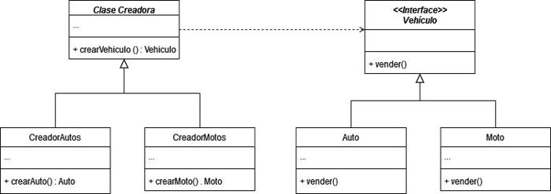
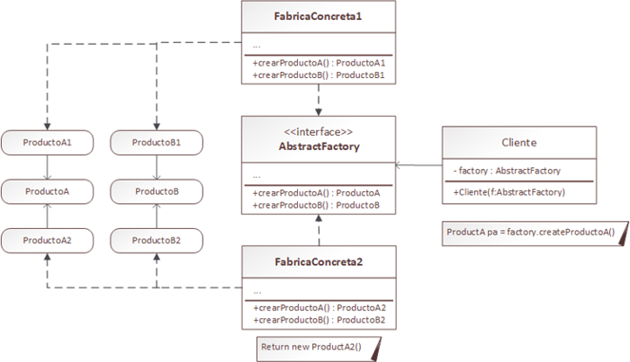

# 17. Patrones de diseño creacionales

En esta clase se abordarán las siguientes temáticas:

- Introducción a los patrones de diseño
- Patrones de diseño creacionales
    - Factory Method
    - Abstract Factory
    - Builder
    - Singleton

<br>

## Introducción a los Patrones de Diseño

Los patrones de diseño son soluciones generales y reutilizables a problemas comunes que surgen al diseñar software. Estos patrones representan las mejores prácticas utilizadas por desarrolladores experimentados para resolver problemas específicos al diseñar una aplicación. Al aplicar patrones de diseño, se facilita la creación de software más flexible, mantenible y escalable.

En Java, los patrones de diseño se dividen en tres categorías principales:
- Patrones Creacionales
- Patrones Estructurales
- Patrones de Comportamiento

<br>

### ¿Por qué usar Patrones de Diseño?

- Implementan soluciones a problemas ya existentes, sin la necesidad de tener replantear las mismas.
- Simplifican y acortan el tiempo de desarrollo.
- Implementan soluciones que ya están validadas y comprobadas (no surgen a prueba y error)

<br>

### ¿Cuáles son las contras de los Patrones de Diseño?

- Muchos programadores tienen la tendencia a seguir los patrones “al pie de la letra”, sin tener en cuenta que son “adaptables”.
    
- Existen problemas pequeños que no ameritan el uso de patrones de diseño. Implementarlos en este caso, puede dificultar en lugar de facilitar la solución.
    

Veamos en mayor detalle uno de los tipos de patrones más usados… ¡Los CREACIONALES!

<br>

## Patrones de Diseño Creacionales

Estos patrones se centran en el proceso de creación de objetos. Ayudan a abstraer el proceso de instanciación y hacer que el sistema sea independiente de cómo sus objetos son creados, compuestos y representados.

Proporcionan mecanismos de creación de objetos que incrementan la flexibilidad y la reutilización de código existente y entre los más conocidos utilizados en Java se encuentran:

- **Factory Method**
- **Abstract Factory**
- **Builder**
- **Singleton**

¡Veamos en detalle cada uno de ellos!

<br>

### Patrón Factory Method

El patrón Factory Method es un patrón de creación que proporciona una interfaz para crear un objeto en una superclase, pero permite que las subclases alteren el tipo de objetos que se crearán. Esto se logra definiendo una interfaz para crear un objeto, pero delegando la responsabilidad de instanciación a las subclases.

¡Veamos ejemplos!

<br>

#### Ejemplo 1: Venta de Autos

Supongamos que desarrollamos una aplicación para **venta de autos**. Como su idea original era la de manejar venta de autos, tenemos una **clase Auto** donde se encuentran todos los métodos relacionados.

Nuestro desarrollo tuvo éxito y ahora nos solicitan que podamos adaptarla para **venta de motos**… Pero tenemos un problema,  para agregar esto deberíamos cambiar GRAN PARTE de nuestro código…

Para ello, **Factory Method** nos permite crear un método fábrica especial que nos ahorrará estas adaptaciones.



<br>

#### Ejemplo Nº 2: Generador de Documentos

Consideremos un ejemplo en el contexto de una aplicación de creación de documentos donde se pueden generar diferentes tipos de documentos, como PDF y Word. Utilizaremos el patrón Factory Method para crear instancias específicas de generadores de documentos.

```java
// Interfaz para representar un generador de documentos
interface DocumentGenerator {
    void generateDocument();
}

// Implementaciones concretas de DocumentGenerator
class PdfDocumentGenerator implements DocumentGenerator {
    @Override
    public void generateDocument() {
        System.out.println("Generando documento PDF");
    }
}

class WordDocumentGenerator implements DocumentGenerator {
    @Override
    public void generateDocument() {
        System.out.println("Generando documento Word");
    }
}

// Clase abstracta DocumentApp con el Factory Method
abstract class DocumentApp {
    // El Factory Method abstracto que las subclases deben implementar
    abstract DocumentGenerator createDocumentGenerator();

    // Otro método que utiliza el generador de documentos creado por el Factory Method
    void createDocument() {
        DocumentGenerator documentGenerator = createDocumentGenerator();
        System.out.println("Creando un nuevo documento...");
        documentGenerator.generateDocument();
    }
}

// Subclase de DocumentApp que implementa el Factory Method para PDF
class PdfDocumentApp extends DocumentApp {
    @Override
    DocumentGenerator createDocumentGenerator() {
        return new PdfDocumentGenerator();
    }
}

// Otra subclase de DocumentApp que implementa el Factory Method para Word
class WordDocumentApp extends DocumentApp {
    @Override
    DocumentGenerator createDocumentGenerator() {
        return new WordDocumentGenerator();
    }
}
```

Ahora puedes usar este ejemplo de la siguiente manera:

```java
public class Main {
    public static void main(String[] args) {
        // Utilizando PdfDocumentApp (generación de documentos PDF)
        DocumentApp pdfDocumentApp = new PdfDocumentApp();
        pdfDocumentApp.createDocument(); // Imprime "Generando documento PDF"

        // Utilizando WordDocumentApp (generación de documentos Word)
        DocumentApp wordDocumentApp = new WordDocumentApp();
        wordDocumentApp.createDocument(); // Imprime "Generando documento Word"
    }
}
```

En este caso, `PdfDocumentApp` y `WordDocumentApp` son las subclases que implementan el Factory Method para crear instancias específicas de `DocumentGenerator` (en este caso, `PdfDocumentGenerator` y `WordDocumentGenerator`). La clase `DocumentApp` utiliza el Factory Method para crear y trabajar con instancias de `DocumentGenerator`, sin conocer los detalles específicos de la generación del documento. Este enfoque permite agregar nuevos tipos de generadores de documentos en el futuro sin modificar el código existente en `DocumentApp`.

<br>

#### Video Explicativo

Para profundizar con la explicación, te dejamos el siguiente video explicativo:

[](https://youtu.be/v-NdSDNVb4U)

<br>

### Patrón Abstract Factory

El patrón Abstract Factory es otro patrón de diseño creacional que proporciona una interfaz para crear familias de objetos relacionados o dependientes sin especificar sus clases concretas. Este patrón se utiliza cuando hay múltiples familias de `productos` y el sistema debe ser independiente de cómo se crean, componen o representan estos `productos`. (Entiéndase producto como una analogía/referencia a una fábrica como tal y los “productos” que genera).

Mientras el código cree objetos a través de esta interfaz, no habrá que preocuparse por crear la variante errónea de un producto que no combine con los demás que ya ha creado la aplicación.

<br>

#### Ejemplo Nº 1: Ejemplo general



<br>

#### Ejemplo Nº 2: Creación de Muebles

Imaginemos un sistema de creación de muebles donde se deben producir diferentes tipos de muebles, como sillas y mesas, y cada tipo de mueble puede tener variantes según el estilo, como moderno o clásico. Utilizaremos el patrón Abstract Factory para manejar la creación de estas familias de productos.

```java
// Interfaz para el producto Silla
interface Chair {
    void sitOn();
}

// Implementaciones concretas de silla
class ModernChair implements Chair {
    @Override
    public void sitOn() {
        System.out.println("Sentándose en una silla moderna");
    }
}

class ClassicChair implements Chair {
    @Override
    public void sitOn() {
        System.out.println("Sentándose en una silla clásica");
    }
}

// Interfaz para el producto Mesa
interface Table {
    void putOn();
}

// Implementaciones concretas de mesa
class ModernTable implements Table {
    @Override
    public void putOn() {
        System.out.println("Colocando objetos en una mesa moderna");
    }
}

class ClassicTable implements Table {
    @Override
    public void putOn() {
        System.out.println("Colocando objetos en una mesa clásica");
    }
}

// Interfaz para la fábrica abstracta que produce productos relacionados
interface FurnitureFactory {
    Chair createChair();
    Table createTable();
}

// Implementación concreta de la fábrica de muebles modernos
class ModernFurnitureFactory implements FurnitureFactory {
    @Override
    public Chair createChair() {
        return new ModernChair();
    }

    @Override
    public Table createTable() {
        return new ModernTable();
    }
}

// Implementación concreta de la fábrica de muebles clásicos
class ClassicFurnitureFactory implements FurnitureFactory {
    @Override
    public Chair createChair() {
        return new ClassicChair();
    }

    @Override
    public Table createTable() {
        return new ClassicTable();
    }
}
```

Ahora puedes utilizar este ejemplo de la siguiente manera:

```java
public class Main {
    public static void main(String[] args) {
        // Utilizando ModernFurnitureFactory (muebles modernos)
        FurnitureFactory modernFactory = new ModernFurnitureFactory();
        Chair modernChair = modernFactory.createChair();
        Table modernTable = modernFactory.createTable();

        modernChair.sitOn(); // Imprime "Sentándose en una silla moderna"
        modernTable.putOn(); // Imprime "Colocando objetos en una mesa moderna"

        // Utilizando ClassicFurnitureFactory (muebles clásicos)
        FurnitureFactory classicFactory = new ClassicFurnitureFactory();
        Chair classicChair = classicFactory.createChair();
        Table classicTable = classicFactory.createTable();

        classicChair.sitOn(); // Imprime "Sentándose en una silla clásica"
        classicTable.putOn(); // Imprime "Colocando objetos en una mesa clásica"
    }
}
```

En este ejemplo, `ModernFurnitureFactory` y `ClassicFurnitureFactory` son las implementaciones concretas de la interfaz `FurnitureFactory`. Cada una de ellas es responsable de crear productos relacionados con muebles modernos o clásicos, respectivamente. El patrón Abstract Factory facilita la creación de familias de productos coherentes y permite cambiar fácilmente entre estilos de muebles sin modificar el código cliente.

<br>

#### Video Explicativo

Para profundizar con la explicación, te dejamos el siguiente video explicativo:

[](https://youtu.be/xNsPGA7zrVQ)

<br>

### Patrón Builder

El patrón Builder es otro patrón de diseño creacional que se utiliza cuando se necesita construir un objeto complejo paso a paso. Este patrón permite crear diferentes tipos y representaciones de un objeto utilizando el mismo proceso de construcción. Se compone de una interfaz común para la construcción y varias clases concretas que implementan esa interfaz para construir objetos específicos.

<br>

#### Ejemplo Nº 1: Ejemplo general


<br>

#### Ejemplo Nº 2: Construcción de una casa

Vamos a utilizar el ejemplo de la construcción de una casa, donde hay diferentes tipos de casas y cada una puede tener características diferentes, como el número de habitaciones, el tipo de techo, etc.

```java
// Producto: Casa
class House {
    private int rooms;
    private String roofType;
    // Puedes añadir más atributos según sea necesario

    public House(int rooms, String roofType) {
        this.rooms = rooms;
        this.roofType = roofType;
    }

    // Puedes añadir más métodos según sea necesario

    @Override
    public String toString() {
        return "House{" +
                "rooms=" + rooms +
                ", roofType='" + roofType + '\'' +
                '}';
    }
}

// Interfaz para el constructor (Builder)
interface HouseBuilder {
    void buildRooms();
    void buildRoof();
    House getResult();
}

// Implementación concreta del constructor para una casa normal
class NormalHouseBuilder implements HouseBuilder {
    private House house;

    public NormalHouseBuilder() {
        this.house = new House(0, "Normal");
    }

    @Override
    public void buildRooms() {
        house = new House(4, house.roofType); // Una casa normal suele tener 4 habitaciones
    }

    @Override
    public void buildRoof() {
        // Puede mantener el tipo de techo predeterminado o personalizar según sea necesario
    }

    @Override
    public House getResult() {
        return house;
    }
}

// Implementación concreta del constructor para una casa de lujo
class LuxuryHouseBuilder implements HouseBuilder {
    private House house;

    public LuxuryHouseBuilder() {
        this.house = new House(0, "Luxury");
    }

    @Override
    public void buildRooms() {
        house = new House(6, house.roofType); // Una casa de lujo suele tener 6 habitaciones
    }

    @Override
    public void buildRoof() {
        house = new House(house.rooms, "Luxury Roof"); // Puede personalizar el tipo de techo de una casa de lujo
    }

    @Override
    public House getResult() {
        return house;
    }
}

// Director que utiliza el constructor para construir una casa
class HouseDirector {
    private HouseBuilder houseBuilder;

    public HouseDirector(HouseBuilder houseBuilder) {
        this.houseBuilder = houseBuilder;
    }

    public void constructHouse() {
        houseBuilder.buildRooms();
        houseBuilder.buildRoof();
    }

    public House getConstructedHouse() {
        return houseBuilder.getResult();
    }
}
```

Ahora puedes usar este patrón de la siguiente manera:

```java
public class Main {
    public static void main(String[] args) {
        // Construcción de una casa normal
        HouseBuilder normalHouseBuilder = new NormalHouseBuilder();
        HouseDirector normalHouseDirector = new HouseDirector(normalHouseBuilder);

        normalHouseDirector.constructHouse();
        House normalHouse = normalHouseDirector.getConstructedHouse();
        System.out.println("Casa normal: " + normalHouse);

        // Construcción de una casa de lujo
        HouseBuilder luxuryHouseBuilder = new LuxuryHouseBuilder();
        HouseDirector luxuryHouseDirector = new HouseDirector(luxuryHouseBuilder);

        luxuryHouseDirector.constructHouse();
        House luxuryHouse = luxuryHouseDirector.getConstructedHouse();
        System.out.println("Casa de lujo: " + luxuryHouse);
    }
}
```

En este ejemplo, `HouseBuilder` es la interfaz que define las operaciones para construir diferentes partes de una casa. Las implementaciones concretas, como `NormalHouseBuilder` y `LuxuryHouseBuilder`, proporcionan la lógica para construir casas específicas. El `HouseDirector` coordina el proceso de construcción utilizando un `HouseBuilder`. Este enfoque permite construir diferentes tipos de casas utilizando el mismo proceso de construcción y proporciona flexibilidad para personalizar cada tipo de casa según sea necesario.

<br>

#### Video explicativo

Para profundizar con la explicación, te dejamos el siguiente video explicativo:

[](https://youtu.be/MRoZCgtQX1E)

<br>

### Patrón de Diseño Singleton

El patrón Singleton es un patrón de diseño creacional que garantiza que una clase tiene solo una instancia y proporciona un punto de acceso global a esa instancia. Esto es útil cuando exactamente una instancia de una clase es necesaria para coordinar acciones en todo el sistema.

En Java, la implementación del patrón Singleton generalmente implica los siguientes elementos:

1. **Constructor Privado:** Se define un constructor privado para evitar que otras clases instancien directamente la clase Singleton.
    
2. **Instancia Única:** La clase Singleton mantiene una única instancia privada de sí misma.
    
3. **Método de Acceso:** Se proporciona un método público que actúa como punto de acceso global a la instancia única. Si no existe una instancia, se crea; de lo contrario, se devuelve la instancia existente.
    

Es un patrón de diseño creacional que nos permite asegurarnos de que una clase tenga **una única instancia**, a la vez que proporciona un punto de acceso global a la misma.

<br>

#### Ejemplo Nº 1: Ejemplo General


<br>

#### Ejemplo Nº 2: Registor de eventos en un edificio

Vamos a considerar un escenario de una aplicación de registro de eventos en un sistema de monitoreo de sensores en un edificio. Queremos garantizar que solo haya una instancia del registro de eventos para evitar duplicación y para que todos los eventos se registren en un único lugar.

```java
// Clase que simula el registro de eventos en un sistema de monitoreo
public class EventLogger {
    // La instancia única de la clase EventLogger
    private static EventLogger instance;

    // Constructor privado para evitar instanciación directa
    private EventLogger() {
        // Inicialización del registro de eventos
        System.out.println("Inicializando el registro de eventos.");
    }

    // Método de acceso para obtener la instancia única
    public static synchronized EventLogger getInstance() {
        // Si la instancia no existe, la crea
        if (instance == null) {
            instance = new EventLogger();
        }
        // Devuelve la instancia existente
        return instance;
    }

    // Método para registrar un evento en el sistema
    public void logEvent(String eventName) {
        System.out.println("Registrando evento: " + eventName);
        // Lógica de registro de eventos
    }
}
```

Ahora puedes utilizar este patrón Singleton en un escenario de la vida real:

```java
public class SensorSystem {
    public static void main(String[] args) {
        // Acceder al registro de eventos desde diferentes sensores
        EventLogger loggerSensor1 = EventLogger.getInstance();
        EventLogger loggerSensor2 = EventLogger.getInstance();

        // Ambas referencias deberían apuntar a la misma instancia
        System.out.println(loggerSensor1 == loggerSensor2); // Debería imprimir true

        // Registrar eventos desde diferentes sensores
        loggerSensor1.logEvent("Sensor 1 - Detección de movimiento");
        loggerSensor2.logEvent("Sensor 2 - Temperatura elevada");
    }
}
```

En este escenario, `EventLogger` es la clase Singleton que representa el registro de eventos del sistema de monitoreo. Al acceder al registro de eventos desde diferentes sensores (`loggerSensor1` y `loggerSensor2`), ambas referencias deberían apuntar a la misma instancia única de `EventLogger`. Esto asegura que todos los eventos se registren en el mismo lugar y evita la duplicación del registro de eventos en diferentes instancias.

<br>

#### Video explicativo

Para profundizar con la explicación, te dejamos el siguiente video explicativo:

[](https://youtu.be/uB3FFZsdx3w)

<br>

## 📝 Material Extra

Si quieres leer más información respecto a los Patrones de Diseño Creacionales existentes, te recomendamos profundizar información en la siguiente web:

[https://refactoring.guru/es/design-patterns/creational-patterns](https://refactoring.guru/es/design-patterns/creational-patterns)

---
[⬅️ Volver al índice](./README.md)