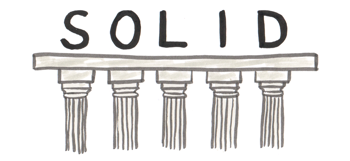

## Temas a tratar

En esta clase se abordarán las siguientes temáticas:

- Refactorización de código
- Clean Code en Java
- Principios SOLID

<br>

## Refactorización de código

La refactorización es el proceso de reestructurar el código existente sin cambiar su comportamiento externo. El objetivo principal es mejorar la legibilidad, mantenibilidad y eficiencia del código, sin alterar su funcionalidad.

Es una técnica de desarrollo de software que se centra en mejorar la calidad del código sin modificar su funcionalidad.

<br>

### Beneficios de refactorizar

1. **Mejora de la Legibilidad:** Hace que el código sea más comprensible para los desarrolladores, facilitando su mantenimiento.
    
2. **Aumento de la Mantenibilidad:** Facilita la incorporación de cambios y la resolución de problemas.
    
3. **Reducción de la Duplicación:** Elimina duplicaciones innecesarias en el código, lo que hace que sea más fácil de mantener y menos propenso a errores.
    
4. **Optimización del Rendimiento:** Permite realizar ajustes para mejorar la eficiencia del código.    

<br>

### Ejemplos de refactorización

**Renombrar Variables/Métodos:** Cambiar nombres de variables o métodos para que sean más descriptivos.

Por ejemplo:

```java
// Antes
int a = 10;
int b = 20;
int c = suma(a, b);

// Después
int num1 = 10;
int num2 = 20;
int sumaResultante = sumar(num1, num2);
```

**Extraer Métodos:** Dividir un método grande en varios métodos más pequeños y específicos.

Por ejemplo:

**Código Antes**

```java
// Antes
void realizarOperacionCompleja() {
    // Código complejo y muy largo con muchas funcionalidades mezcladas...
}
```

**Código Después**

```java
// Después
void realizarOperacionCompleja() {
    operacionParte1();
    operacionParte2();
}

void operacionParte1() {
    // Código parte 1...
}

void operacionParte2() {
    // Código parte 2...
}
```

**Eliminar Código Duplicado:** Identificar y eliminar código duplicado para mejorar la mantenibilidad.

Por ejemplo: Si varias veces escribes el mismo código en diferentes partes de tu aplicación, puedes simplificar esto en un método que pueda ser llamado cuando necesites, en lugar de reescribir las mismas líneas.

<br>

### ¿Cuándo es conveniente REFACTORIZAR?

La refactorización es una práctica valiosa, pero también es esencial hacerla de manera consciente y equilibrada. Aquí hay algunas situaciones comunes en las que es conveniente considerar la refactorización:

1. **Dificultad de Mantenimiento:**
    
    - **Síntomas:** Si el código es difícil de entender y modificar, o si realizar cambios simples provoca errores inesperados.
        
    - **Solución:** La refactorización puede mejorar la estructura del código, haciéndolo más claro y fácil de mantener.
        
2. **Identificación de Duplicación:**
    
    - **Síntomas:** Cuando se encuentra código duplicado en diferentes partes del sistema.
        
    - **Solución:** Eliminar la duplicación mediante la refactorización para mejorar la consistencia y reducir la posibilidad de errores.
        
3. **Mejora del Rendimiento:**
    
    - **Síntomas:** Código que podría ejecutarse de manera más eficiente.
        
    - **Solución:** Refactorizar para optimizar algoritmos, eliminar bucles innecesarios o mejorar la complejidad temporal.
        
4. **Incorporación de Nuevas Funcionalidades:**
    
    - **Síntomas:** Antes de agregar nuevas características, es difícil encontrar el lugar adecuado en el código existente.
        
    - **Solución:** Refactorizar para preparar el código base y hacerlo más flexible para la incorporación de nuevas funcionalidades.
        
5. **Cambio de Requerimientos:**
    
    - **Síntomas:** Cuando los requisitos del proyecto cambian y el código existente no se adapta fácilmente.
        
    - **Solución:** La refactorización puede ajustar la arquitectura y el diseño para acomodar los nuevos requisitos de manera más eficiente.
        
6. **Código "Smelly" (código con mal olor):**
    
    - **Síntomas:** Código que viola principios de diseño como la alta cohesión y el bajo acoplamiento.
        
    - **Solución:** Identificar y refactorizar el código que no cumple con buenas prácticas de programación.
        
7. **Antes de la Introducción de Nuevos Desarrolladores:**
    
    - **Síntomas:** Cuando nuevos miembros del equipo se unen al proyecto y el código actual puede ser difícil de entender.
        
    - **Solución:** Refactorizar para hacer que el código sea más legible y comprensible, facilitando la incorporación de nuevos desarrolladores.
        
8. **Mantenimiento de Código Heredado:**
    
    - **Síntomas:** En proyectos con código antiguo o heredado que no sigue las prácticas modernas.
        
    - **Solución:** La refactorización gradual puede mejorar la calidad y la compatibilidad del código heredado.
        
    
9. Para ver un poco más a fondo la refactorización y cuándo es conveniente implementarla, te dejamos a continuación el siguiente video explicativo:

[](https://youtu.be/Cd-tw8xxMu8)

<br>

### Material complementario

Para complementar lo que acabamos de ver respecto a refactorización, te dejamos el siguiente link a un artículo completo donde se habla al respecto y se implementan diferentes opciones prácticas.
    
[https://codegym.cc/es/groups/posts/es.196.como-funciona-la-refactorizacion-en-java](https://codegym.cc/es/groups/posts/es.196.como-funciona-la-refactorizacion-en-java)

<br>

### 📝 EJERCICIO PRÁCTICO

¿Recuerdas la prueba técnica Nº 1 del módulo de Java Básico? Te desafiamos a que lleves a cabo, en base a estos conceptos de refactorización que has aprendido más las correcciones que hayas tenido, las modificaciones que consideres necesarias para mejorar tu código.

<br>

## Clean Code

**Clean Code** se refiere a la escritura de código de manera que sea fácil de entender, fácil de mantener y libre de complicaciones innecesarias. La idea central es que el código debe ser legible como una buena prosa: claro, conciso y expresivo.

> Dato curioso: Robert C. Martin, también conocido como "Uncle Bob", popularizó este concepto en su libro "*Clean Code: A Handbook of Agile Software Craftsmanship*".

Aquí te dejamos algunos principios y prácticas asociadas con Clean Code, junto con ejemplos de cómo se pueden aplicar en Java:

**Nombres Significativos:** Usa nombres descriptivos para variables, métodos y clases. 

```java
// Mal
int d; // Días 
int el; // Elemento 

// Bien 
int diasTranscurridos; 
int elementoActual;
```

**Funciones/Métodos Pequeños:** Crea funciones/métodos pequeños y específicos que hagan una sola cosa. 

```java
// Mal 
void procesarDatos() { 
	// Código extenso y tedioso... 
} 

/*Podríamos mejorarlo mediant divisón de tareas : */ 
void leerDatos() { 
	// Código para leer datos... 
} 

void procesarDatos() { 
	// Código para procesar datos... 
} 
```

**Comentarios Significativos:** Evita comentarios obvios y utiliza comentarios para explicar el porqué de las decisiones, no tanto el qué. 

```java
// Mal 
// Incrementa el contador contador++; 

// Bien 
// Se incrementa el contador para mantener un seguimiento del número de elementos procesados
contador++; 
```

>💡**Nota:** Existen situaciones donde un comentario puede parecer OBVIO; sin embargo, cuando trabajos en equipos de desarrollo es mejor comentar cada detalle que podamos (sobre todo las funciones que hacen métodos que hayamos desarrollado y que nuestros compañeros desconozcan) .

**Estructuras de Control Simples:** Evita estructuras de control complejas y anidadas (siempre y cuando sea posible hacerlo)

```java
// Mal
if (condicionA) {
    if (condicionB) {
        // Lógica...
    }
}

// Bien
if (condicionA && condicionB) {
    // Lógica...
}
```

**Uso Consistente de Convenciones de Nombres:** Sigue las convenciones de nombres de Java y sé consistente. (Por ejemplo, el uso de camel case como estándar/convención)

```java
// Mal
int NumeroDeElementos;

// Bien
int numeroDeElementos;
```

1. **Clases Pequeñas:** Las clases deben tener una única responsabilidad y ser lo más pequeñas posible.
    
2. **Uso de Espacios en Blanco y Formato Consistente:** Formatea el código de manera consistente y utiliza espacios en blanco para mejorar la legibilidad.
    
3. **Mantenimiento Continuo:** Realiza la refactorización y el mantenimiento continuo para evitar la acumulación de deudas técnicas o posibles malos funcionamientos o lentitud en el código.
    

La aplicación de Clean Code en Java implica adoptar estos principios y prácticas en la escritura de código diaria. Esto no solo mejora la calidad del código, sino que también facilita el trabajo colaborativo y el mantenimiento a largo plazo del software.

Ahora… ¿Estos principios deben seguirse a RAJATABLA? ¿O hay situaciones donde podemos o debemos omitirlos? ¡Veamos más al respecto en el siguiente video!

[](https://youtu.be/uQfm6YaJTJI)

<br>

## Principios SOLID

Los principios SOLID son un conjunto de cinco principios de diseño de software que fueron introducidos por Robert C. Martin para ayudar a los desarrolladores a crear sistemas más mantenibles, flexibles y escalables. Estos principios forman la base de la programación orientada a objetos (OOP) y son una guía invaluable para escribir código de calidad.

Estos cinco principios nos ayudan a comprender la necesidad de ciertos patrones de diseño y arquitectura de software en general.



SOLID hace referencia a 5 principios que son los siguientes:

```java
S - Single Responsibility Principle
O - Open/Closed Principle
L - Liskov Substitution Principle
I - Interface Segregation Principle
D - Dependency Inversion Principle
```

¡Veamos en mayor detalle cada una de ellas!

<br>

### 1. Principio de Responsabilidad Única (_Single Responsibility Principle_ - SRP)

El Principio de Responsabilidad Única dice que una clase debe hacer una cosa y, por lo tanto, debe tener una sola razón para cambiar.

Para enunciar este principio más técnicamente: Solo un cambio potencial (lógica de base de datos, lógica de registro, etc.) en la especificación del software debería poder afectar la especificación de la clase.

Esto significa que si una clase es un contenedor de datos, como una clase Libro o una clase Estudiante, y tiene algunos campos relacionados con esa entidad, debería cambiar solo cuando cambiamos el modelo de datos.

**Por ejemplo:**

```java
// Mal
class ManejadorDeDatos {
    void procesarDatos() {
        // Código para procesar datos...
    }

    void generarInforme() {
        // Código para generar informe...
    }
}

// Bien
class ProcesadorDeDatos {
    void procesarDatos() {
        // Código para procesar datos...
    }
}

class GeneradorDeInforme {
    void generarInforme() {
        // Código para generar informe...
    }
}
```

<br>

### 2. Principio de Abierto/Cerrado (_Open/Closed Principle_ - OCP)

Este principio establece que una clase debe estar abierta para la extensión pero cerrada para la modificación. Es decir, deberías poder agregar nuevas funcionalidades sin modificar el código existente. (Modificación significa cambiar el código de una clase existente y extensión significa agregar una nueva funcionalidad).

Entonces, lo que este principio quiere decir es: Deberíamos poder agregar nuevas funciones sin tocar el código existente para la clase. Esto se debe a que cada vez que modificamos el código existente, corremos el riesgo de crear errores potenciales. Por lo tanto, debemos evitar tocar el código de producción probado y confiable (en su mayoría) si es posible.

Pero, ¿Cómo vamos a agregar una nueva funcionalidad sin tocar la clase?, puede preguntarse. Por lo general, en Java, se hace con la ayuda de interfaces y clases abstractas.

Ejemplo:

```java
// Mal
class Calculadora {
    double sumar(double a, double b) {
        return a + b;
    }

    // Se necesita modificar la clase para agregar nuevas operaciones.
    double restar(double a, double b) {
        return a - b;
    }
}

/*----------------------------------------------------*/

// Aplicando Principio
interface Operacion {
    double calcular(double a, double b);
}

class Suma implements Operacion {
    @Override
    public double calcular(double a, double b) {
        return a + b;
    }
}

class Resta implements Operacion {
    @Override
    public double calcular(double a, double b) {
        return a - b;
    }
}

class Calculadora {
    double calcular(Operacion operacion, double a, double b) {
        return operacion.calcular(a, b);
    }
}
```

<br>

### 3. Principio de Sustitución de Liskov (_Liskov Substitution Principle_ - LSP)

Este principio establece que los objetos de una clase base deben poder ser reemplazados por objetos de sus clases derivadas sin afectar la funcionalidad correcta del programa.

Esto significa que, dado que la clase B es una subclase de la clase A, deberíamos poder pasar un objeto de la clase B a cualquier método que espere un objeto de la clase A y el método no debería dar ningún resultado extraño en ese caso.

Este es el comportamiento esperado, porque cuando usamos la herencia asumimos que la clase secundaria hereda todo lo que tiene la superclase. La clase secundaria extiende el comportamiento pero nunca lo reduce.

Por ejemplo, supongamos que tienes una jerarquía de clases que representan figuras geométricas, y cada figura tiene un método para calcular su área.

```java
// Mal
class Figura {
    void calcularArea() {
        // Código para calcular el área de la figura...
    }
}

class Cuadrado extends Figura {
    @Override
    void calcularArea() {
        // Código para calcular el área del cuadrado...
    }
}

class Circulo extends Figura {
    @Override
    void calcularArea() {
        // Código para calcular el área del círculo...
    }
}
```

En este caso, la clase Cuadrado y la clase Circulo heredan de la clase Figura y cada una implementa su propio método calcularArea(). Sin embargo, el principio de Liskov se ve comprometido aquí, ya que al usar estas clases, podríamos encontrarnos con problemas si esperamos que todas las figuras compartan un comportamiento común.

Una mejor aproximación sería utilizar una interfaz o clase abstracta que defina un contrato para el cálculo de áreas y luego implementar ese contrato en cada clase derivada:

```java
// Bien
interface Figura {
    double calcularArea();
}

class Cuadrado implements Figura {
    double lado;

    Cuadrado(double lado) {
        this.lado = lado;
    }

    @Override
    public double calcularArea() {
        return lado * lado;
    }
}

class Circulo implements Figura {
    double radio;

    Circulo(double radio) {
        this.radio = radio;
    }

    @Override
    public double calcularArea() {
        return Math.PI * radio * radio;
    }
}
```

En este ejemplo, todas las clases que implementan la interfaz Figura garantizan que tendrán un método calcularArea(). Esto sigue el principio de Liskov, ya que las instancias de las clases derivadas pueden sustituir sin problemas a las instancias de la clase base en cualquier contexto que espere un objeto Figura.

<br>

### 4. Principio de Segregación de Interfaces (_Interface Segregation Principle_ - ISP)

Este principio establece que una clase no debe verse obligada a implementar interfaces que no utiliza. En otras palabras, es mejor tener interfaces pequeñas y específicas.

El principio establece que muchas interfaces específicas del cliente son mejores que una interfaz de propósito general. No se debe obligar a los clientes a implementar una función que no necesitan.

Por ejemplo: Supongamos que tienes una interfaz que define las capacidades de un sistema de gestión de documentos:

```java
// Mal
interface SistemaGestionDocumentos {
    void abrirDocumento();
    void guardarDocumento();
    void imprimirDocumento();
    void escanearDocumento();
}

class Impresora implements SistemaGestionDocumentos {
    // Implementación de abrirDocumento(), guardarDocumento(), imprimirDocumento(), escanearDocumento()
}

class Escaner implements SistemaGestionDocumentos {
    // Implementación de abrirDocumento(), guardarDocumento(), imprimirDocumento(), escanearDocumento()
}
```

En este caso, las clases Impresora y Escaner deben implementar todas las operaciones definidas en la interfaz SistemaGestionDocumentos. Sin embargo, un escáner no necesita implementar métodos de impresión, y una impresora no necesita implementar métodos de escaneo.

Esto viola el principio de segregación de interfaces, ya que las clases deben ser libres de implementar solo lo que necesitan.

Una mejor aproximación sería dividir la interfaz en interfaces más pequeñas y específicas:

```java
// Bien
interface DocumentoAbierto {
    void abrirDocumento();
}

interface DocumentoGuardado {
    void guardarDocumento();
}

interface DocumentoImpreso {
    void imprimirDocumento();
}

interface DocumentoEscaneado {
    void escanearDocumento();
}

class Impresora implements DocumentoImpreso {
    // Implementación de imprimirDocumento()
}

class Escaner implements DocumentoEscaneado {
    // Implementación de escanearDocumento()
}

class SistemaCompleto implements DocumentoAbierto, DocumentoGuardado, DocumentoImpreso, DocumentoEscaneado {
    // Implementación completa
}
```

Ahora, cada clase puede implementar solo las interfaces que son relevantes para su funcionalidad, siguiendo el principio de segregación de interfaces y evitando que las clases tengan que implementar métodos que no necesitan.

<br>

### 5. Principio de Inversión de Dependencia (_Dependency Inversion Principle_ - DIP)

El principio de inversión de dependencia establece que nuestras clases deben depender de interfaces o clases abstractas en lugar de clases y funciones concretas.

Ejemplo: Supongamos que tienes un sistema de notificación que envía mensajes por diferentes canales, como correo electrónico y mensajes de texto (SMS). Antes de aplicar el principio de inversión de dependencia, podrías tener una implementación directa donde el sistema de notificación depende directamente de las implementaciones concretas de los canales de notificación.

```java
// Mal
class CorreoElectronico {
    void enviarCorreo(String mensaje) {
        // Lógica para enviar correo electrónico...
    }
}

class MensajeTexto {
    void enviarMensajeTexto(String mensaje) {
        // Lógica para enviar mensaje de texto (SMS)...
    }
}

class SistemaNotificacion {
    private CorreoElectronico correoElectronico;
    private MensajeTexto mensajeTexto;

    SistemaNotificacion() {
        this.correoElectronico = new CorreoElectronico();
        this.mensajeTexto = new MensajeTexto();
    }

    void notificar(String mensaje) {
        correoElectronico.enviarCorreo(mensaje);
        mensajeTexto.enviarMensajeTexto(mensaje);
    }
}
```

En este ejemplo, SistemaNotificacion depende directamente de las implementaciones concretas CorreoElectronico y MensajeTexto. Esto hace que sea difícil cambiar o extender el sistema, ya que cualquier cambio en la implementación de los canales de notificación requeriría modificar directamente SistemaNotificacion.

Aplicando el Principio de Inversión de Dependencia, podríamos introducir abstracciones (interfaces en este caso) que las implementaciones concretas deben seguir. De esta manera, SistemaNotificacion dependerá de abstracciones en lugar de implementaciones concretas:

```java
// Bien
interface CanalNotificacion {
    void enviarNotificacion(String mensaje);
}

class CorreoElectronico implements CanalNotificacion {
    @Override
    public void enviarNotificacion(String mensaje) {
        // Lógica para enviar correo electrónico...
    }
}

class MensajeTexto implements CanalNotificacion {
    @Override
    public void enviarNotificacion(String mensaje) {
        // Lógica para enviar mensaje de texto (SMS)...
    }
}

class SistemaNotificacion {
    private CanalNotificacion canalCorreo;
    private CanalNotificacion canalTexto;

    SistemaNotificacion(CanalNotificacion canalCorreo, CanalNotificacion canalTexto) {
        this.canalCorreo = canalCorreo;
        this.canalTexto = canalTexto;
    }

    void notificar(String mensaje) {
        canalCorreo.enviarNotificacion(mensaje);
        canalTexto.enviarNotificacion(mensaje);
    }
}
```

Ahora, SistemaNotificacion depende de la abstracción CanalNotificacion, lo que facilita la extensión y modificación del sistema. Puedes agregar nuevos canales de notificación simplemente creando nuevas implementaciones de CanalNotificacion sin tener que modificar SistemaNotificacion.

Este enfoque sigue el principio de dependencia de abstracciones y promueve un sistema más flexible y fácil de mantener.

<br>

### Material complementario

¿Quieres saber más sobre los principios SOLID? Te dejamos un video explicativo al respecto:

[](https://youtu.be/2X50sKeBAcQ)

---
[⬅️ Volver al índice](./README.md)
