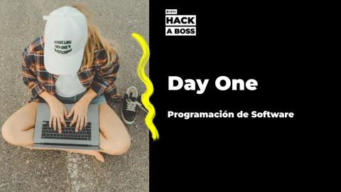

# 🏁 Bienvenida

**¡Hola, #WARRIOR!** 👋

Bienvenidx a tu **campus virtual de JVB02RT**.

Para comenzar con buen pie, lee atentamente esta guía con toda la información necesaria para el Bootcamp. Sabemos que puede parecer mucha información 😅, pero no te preocupes, **te acompañaremos en cada paso** y estamos disponibles para cualquier duda.

 

## 🙋🏽 Conoce al equipo que te acompañará en HACK A BOSS

- **Docente y tutor**: **Luís Saavedra**, se encargará de todas las cosas relacionadas con el soporte técnico, los días prácticos, las tutorías, ejercicios, además de la gestión y evaluación de los proyectos.

- **Docente:** **Nahuel Regueira**, te guiará en las clases teóricas del Bootcamp, ayudándote a establecer las bases necesarias para llevarlas a la práctica.

- **Equipo de soporte:** **Vanessa**, **Selene** y **Patricia**, es el equipo que te acompañará en todo lo que está por fuera de lo técnico.

 

---
---

## 💻 Ordenador y requisitos técnicos

¿Necesitas que te prestemos un ordenador? 

Solicita uno aquí: [Formulario de solicitud.](https://airtable.com/appNLta9G29XQ3zkd/shreWs7spITr56EYO)

✔️ Recuerda que tu ordenador debe tener al menos 8GB de RAM.

 

---
---

# Plataformas 

>📢 **IMPORTANTE:** **Usa el mismo correo en todas las plataformas**. Debe ser **el mismo que registraste en el proceso de admisión**, ya que será nuestro principal medio de comunicación y acceso a los recursos.

Si tienes problemas para acceder a alguna plataforma o no recibes la invitación en tu correo, avísanos a través de la **plataforma de soporte a estudiantes**:

#### 🆘 [https://hackaboss.freshdesk.com/](https://hackaboss.freshdesk.com/)

 

## 👥 Freshdesk (Soporte al estudiante)

**Freshdesk** es la plataforma oficial de soporte para el alumnado. Aquí puedes **solicitar tutorías, resolver dudas, reportar problemas técnicos o notificar ausencias justificadas**.

Regístrate con tu correo y una contraseña de tu elección y listo 😜. Es decir, puedes hacerlo ya y no necesitas una invitación de registro.

#### 🌐 [hackaboss.freshdesk.com](https://hackaboss.freshdesk.com/)

🔗 [Manual de Uso Freshdesk](./resources/Freshdesk-Soporte_Estudiantes.pdf)

> ℹ️ **Cuando envíes una solicitud de soporte, indica siempre tu código de curso**: **JVB02RT**

 

## 🖥 Zoom

Todas las clases se emitirán por Zoom, por favor [instálalo en tu equipo](https://support.zoom.us/hc/es/sections/200704559-Instalaci%C3%B3n). Puedes hacerlo ya, no necesitas una invitación de registro.

- #### **Sala**: [https://us02web.zoom.us/j/81197126418?pwd=Os9kVvyPnxbwyEbIe5bZfJMCRazaUF.1](https://us02web.zoom.us/j/81197126418?pwd=Os9kVvyPnxbwyEbIe5bZfJMCRazaUF.1)  
  
- **ID de acceso a la sala**: 811 9712 6418  

- **Contraseña**: hab123  

> **⚠️ IMPORTANTE:** Accede a Zoom con el **mismo email** que registraste en el Bootcamp.

 

## 💬 Slack (Chat del grupo)

**Slack** es la plataforma de **mensajería instantánea** donde se realizarán avisos, comunicaciones rápidas y compartirán fragmentos de código. Te recomendamos [descargar la aplicación en tu móvil y ordenador.](https://slack.com/intl/es-es/)

**Recibirás una invitación a Slack el viernes previo al inicio de la formación**.

#### 🌐 [https://hab-bootcamp.slack.com/archives/C08S0JGLQUC](https://hab-bootcamp.slack.com/archives/C08S0JGLQUC)

> Por favor, en **Slack**, utiliza tu **nombre completo y foto** para que podamos reconocerte.

 

## 💻 Plataforma Educativa

En la plataforma educativa encontrarás la documentación, el código de clase y otros recursos complementarios.

#### 🌐 [https://students.hackaboss.com/bootcamps/jvb02rt](https://students.hackaboss.com/bootcamps/jvb02rt)

 

## 🎥 Videos de las clases

Si te pierdes una clase o quieres repasarla, podrás acceder a las **grabaciones durante 12 meses**.

**Podrás acceder una vez que ya hayas tenido tu primera clase, es decir, una vez que haya iniciado el Bootcamp.**

#### 🌐 [https://videos.hackaboss.com/](https://videos.hackaboss.com/)

 

---
---

# Eventos

## 🚀 Day One

Este evento ocurrirá aproximadamente en la semana antes del inicio del Bootcamp. Aquí despejarás todas tus dudas, repasaremos el programa académico, requisitos y dinámicas del curso, y la instalación de herramientas básicas. Además, nos pondremos cara, lo que es muy importante :)

Te dejamos el vídeo del evento:

  

> 🎬 [Day One - JVB02RT](https://www.youtube.com/watch?v=pc7NjBYA_cY)

 

## 📅 Calendario completo del Bootcamp

Es importante que descargues el calendario de la formación para mantenerte organizado.

#### [Calendario JVB02RT](https://calendar.google.com/calendar/u/0/embed?src=c_4708d9bb2da9b28dff26c9e420a0ec622d456692a285b81e11e118c434915edb@group.calendar.google.com&ctz=Europe/Madrid&dates=20250501/20250531)

⚠️ **Importante:** El horario del **Curso 0** es diferente al del resto del bootcamp.  
A continuación puedes ver el horario específico del Curso 0.  

Horario Curso 0

| Día    |    Horario    |
| ------ | :-----------: |
| Lunes  | 18:30 - 20:30 |
| Martes | 18:30 - 20:30 |
| Jueves | 18:30 - 22:30 |

 

**El horario habitual de las clases durante el bootcamp será**:

| Día       |    Horario    | Tipo de clase                |
| --------- | :-----------: | ---------------------------- |
| Lunes     | 18:30 - 20:30 | Clases teórico-prácticas     |
| Martes    | 18:30 - 20:30 | Clases teórico-prácticas     |
| Miércoles | 18:30 - 22:30 | Sesión práctica con el tutor |
| Jueves    | 18:30 - 20:30 | Clases teórico-prácticas     |
| Viernes   | 18:30 - 20:30 | Clases teórico-prácticas     |

> **Nota:** Por favor, comprueba el calendario porque puede haber semanas con algún cambio. No te preocupes que la clase quedará grabada :) 😊

En las **semanas de proyectos no hay clases** pero dispondrás de tutorías. Las tutorías deben ser solicitadas previamente usando la plataforma de soporte a estudiantes (**FreshDesk**).
