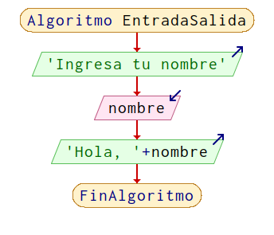

# CURSO 0

## DIA 2

### Algoritmos

#### Definición

Un algoritmo es un conjunto de instrucciones o pasos que se siguen para resolver un problema o realizar una tarea específica. Es una forma de describir cómo se debe llevar a cabo un proceso de manera sistemática y ordenada.

#### Características

- **Finito**: Un algoritmo debe terminar en un número finito de pasos.
- **Preciso**: Cada paso del algoritmo debe ser claro y no ambiguo.
- **Orden**: Los pasos deben seguir un orden lógico y secuencial.
- **Entrada**: Un algoritmo puede tener cero o más entradas, que son los datos necesarios para llevar a cabo el proceso.
- **Salida**: Un algoritmo debe producir al menos una salida o resultado, que es la solución al problema planteado.
- **Eficaz**: Debe usar los recursos de forma óptima.
- **General**: Debe resolver una clase de problemas, no solo uno específico.

#### Tipos de escritura de algoritmos

- **`Lenguaje natural`**: Descripción en palabras.

  ```
  - Pedir su nombre al usuario
  - Recibir el nombre
  - Mostrar el saludo
  ```

- **`Diagrama de flujo`**: Representación gráfica de los pasos.

  

- **`Pseudocódigo`**: Lenguaje intermedio entre el lenguaje natural y el código de programación.

  ```pseudocodigo
  Inicio
    Escribir "¿Cuál es tu nombre?"
    Leer nombre
    Escribir "Hola", nombre
  Fin
  ```

- **`Código fuente`**: Implementación en un lenguaje de programación específico.

  ```java
  public class Saludo {
      public static void main(String[] args) {
          Scanner scanner = new Scanner(System.in);
          System.out.print("¿Cuál es tu nombre? ");
          String nombre = scanner.nextLine();
          System.out.println("Hola " + nombre);
      }
  }
  ```

#### Tipos de datos en PSeint

- **`Entero`**: Números enteros (ej. 1, -5, 0).
- **`Real`**: Números decimales (ej. 3.14, -0.5).
- **`Carácter`**: Un solo carácter (ej. 'a', '1', '$').
- **`Cadena`**: Secuencia de caracteres (ej. "Hola", "123").
- **`Lógico`**: Verdadero o falso (ej. verdadero, falso).
