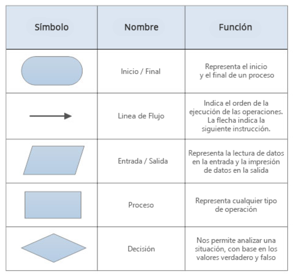
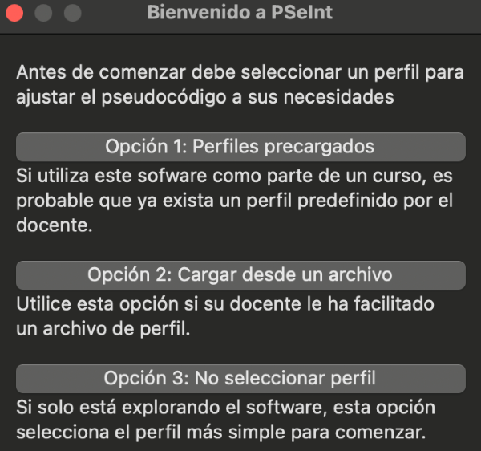
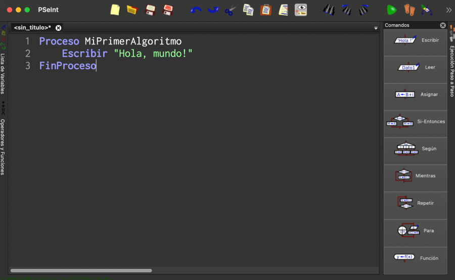

# Pensamiento Algorítmico I

Un **algoritmo** es una secuencia de pasos ordenados que permiten resolver un problema o realizar una tarea. En la vida cotidiana usamos algoritmos sin darnos cuenta. Ejemplo:

-   **Cómo preparar un sándwich**
    1. Tomar dos rebanadas de pan.
    2. Untar mantequilla en una de ellas.
    3. Colocar jamón y queso.
    4. Cubrir con la otra rebanada.
    5. Servir el sándwich.

Este ejemplo muestra cómo desglosamos una tarea en pasos específicos.

<br>

## Importancia de dividir un problema en pasos ordenados

Dividir un problema en pasos ayuda a:

-   Estructurar soluciones claras.

-   Reducir errores en la ejecución.

-   Facilitar la depuración y modificación.

-   Hacer que la solución sea comprensible para otros.

<br>

## Introducción al pseudocódigo

El **pseudocódigo** es una manera estructurada de escribir un algoritmo usando lenguaje natural y términos similares a la programación, pero sin depender de la sintaxis específica de un lenguaje de programación. Ejemplo:

```pseudocode
Inicio
  Leer edad
  Si edad >= 18 Entonces
    Escribir "Eres mayor de edad"
  Si no
    Escribir "Eres menor de edad"
  Fin Si
Fin
```

Elementos clave:

-   **Inicio y Fin** → Delimitan el algoritmo.

-   **Entrada de datos** → `Leer`.

-   **Condiciones** → `Si - Entonces - Si no`.

-   **Salida de datos** → `Escribir`.

<br>

## Introducción a los diagramas de flujo

Los **diagramas de flujo** representan algoritmos gráficamente mediante símbolos.



<br>

## Herramientas para simular algoritmos

Para practicar pseudocódigo y diagramas de flujo usaremos **PSeInt**, una herramienta educativa que permite escribir y ejecutar algoritmos en pseudocódigo de manera visual.

<br>

### Instalación y configuración de PSeInt

1. Descargar PSeInt desde su [sitio web oficial](http://pseint.sourceforge.net/).
   
2. Instalar siguiendo las instrucciones de la plataforma.
   
3. Abrir PSeInt y configurar:

    - **Idioma**: Español (si el sistema operativo está en español debería ser la opción por defecto del programa).
    - **Perfil**: Opción 3: No seleccionar ningún perfil.

        

<br>

### Interfaz de PSeInt

PSeInt cuenta con una interfaz organizada en secciones que facilitan tanto la creación como la ejecución del pseudocódigo:

-   **Editor de código:** Área principal para redactar y modificar el pseudocódigo.

-   **Ejecución normal:** Botón con icono de _play_ en color verde, que ejecuta el programa de manera completa.

-   **Ejecución paso a paso:** Botón identificado por dos huellas, ideal para depurar y analizar el flujo del programa en cada etapa.

-   **Vista de diagrama de flujo:** Ubicada justo a la derecha del botón de ejecución paso a paso, permite visualizar gráficamente la lógica del pseudocódigo.

    

---
> ⬅ [Anterior: Terminal - Acciones prácticas](../01-terminal/03_acciones_practicas.md) | 📂 [Volver al índice](../README.md) | [Siguiente: Algoritmos II ➡](02_algoritmos_2.md)