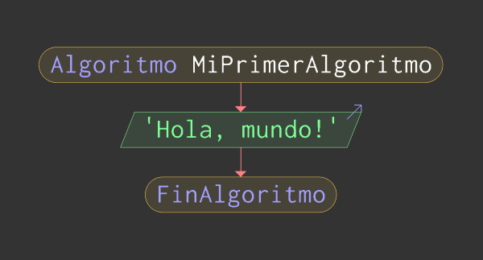
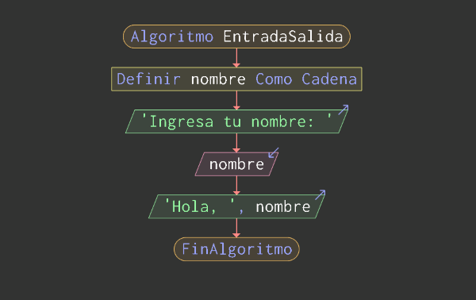
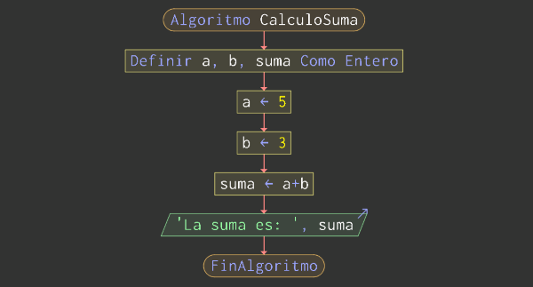
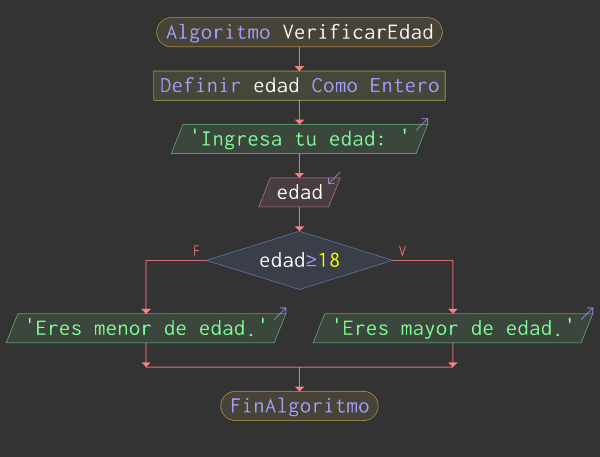
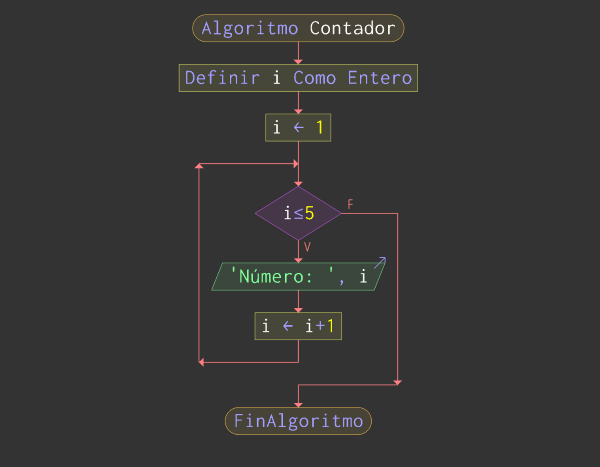
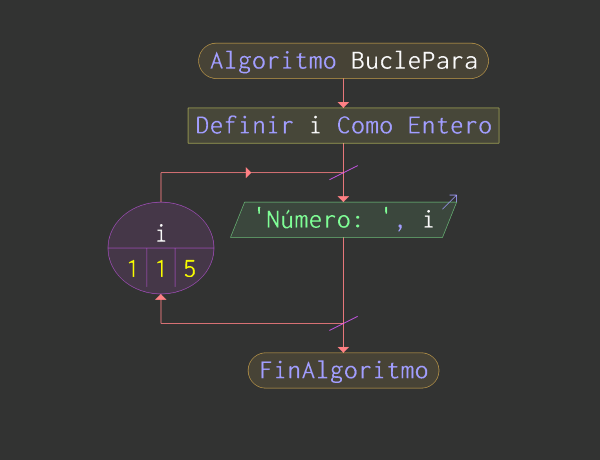
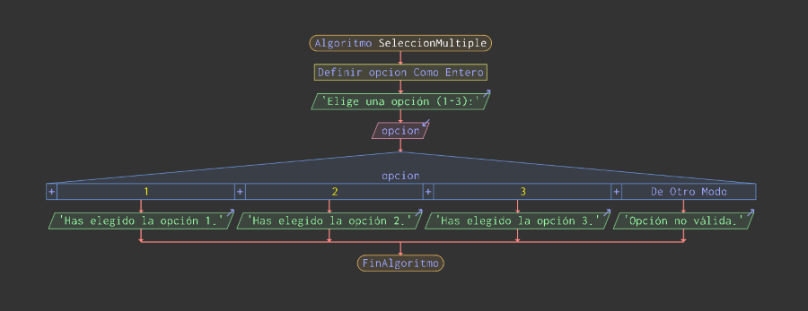

# Pensamiento Algorítmico II

En **PSeInt**, los algoritmos pueden representarse tanto en **pseudocódigo** como en **diagramas de flujo**, y cualquier cambio en uno de estos formatos se refleja automáticamente en el otro. Esto facilita la comprensión y el diseño de soluciones algorítmicas. A continuación, exploramos los bloques fundamentales con ejemplos prácticos, cada uno acompañado de su respectivo diagrama de flujo.

<br>

## 1. Bloque de Inicio y Fin

Todo algoritmo en **PSeInt** comienza con `Algoritmo` y finaliza con `FinAlgoritmo`:

```pseudocode
Algoritmo MiPrimerAlgoritmo
  Escribir "Hola, mundo!"
FinAlgoritmo
```



<br>

## 2. Bloques de Entrada y Salida

Permiten interactuar con el usuario ingresando o mostrando datos en pantalla:

```pseudocode
Algoritmo EntradaSalida
  Definir nombre Como Caracter
  Escribir "Ingresa tu nombre: "
  Leer nombre
  Escribir "Hola, ", nombre
FinAlgoritmo
```



<br>

## 3. Bloques de Asignación

Se utilizan para almacenar valores y realizar cálculos:

```pseudocode
Algoritmo CalculoSuma
  Definir a, b, suma Como Entero
  a <- 5
  b <- 3
  suma <- a + b
  Escribir "La suma es: ", suma
FinAlgoritmo
```



<br>

## 4. Bloques Condicionales

Permiten tomar decisiones dentro del algoritmo según una condición:

```pseudocode
Algoritmo VerificarEdad
  Definir edad Como Entero
  Escribir "Ingresa tu edad: "
  Leer edad
  Si edad >= 18 Entonces
    Escribir "Eres mayor de edad."
  Sino
    Escribir "Eres menor de edad."
  FinSi
FinAlgoritmo
```



<br>

## 5. Bloques de Ciclos

Se utilizan para repetir instrucciones múltiples veces:

-   **Mientras** (ejecuta el bloque mientras la condición sea verdadera):

    ```pseudocode
    Algoritmo Contador
      Definir i Como Entero
      i <- 1
      Mientras i <= 5 Hacer
        Escribir "Número: ", i
        i <- i + 1
      FinMientras
    FinAlgoritmo
    ```

    

-   **Para** (cuando conocemos la cantidad exacta de repeticiones):

    ```pseudocode
    Algoritmo BuclePara
      Definir i Como Entero
      Para i <- 1 Hasta 5 Hacer
        Escribir "Número: ", i
      FinPara
    FinAlgoritmo
    ```

    

<br>

## 6. Bloque de Selección Múltiple

Cuando hay múltiples opciones, el bloque `Segun` permite evaluar diferentes valores y ejecutar instrucciones específicas según el caso:

```pseudocode
Algoritmo SeleccionMultiple
  Definir opcion Como Entero
  Escribir "Elige una opción (1-3):"
  Leer opcion
  Segun opcion Hacer
    1:
      Escribir "Has elegido la opción 1."
    2:
      Escribir "Has elegido la opción 2."
    3:
      Escribir "Has elegido la opción 3."
    De Otro Modo:
      Escribir "Opción no válida."
  FinSegun
FinAlgoritmo
```



Este bloque simplifica la toma de decisiones cuando se comparan múltiples valores posibles.

---
> ⬅ [Anterior: Algoritmos I](01_algoritmos_1.md) | 📂 [Volver al índice](../README.md) | [Siguiente: Entorno de desarrollo ➡](../03-entorno/01_entorno_de_desarrollo.md)
