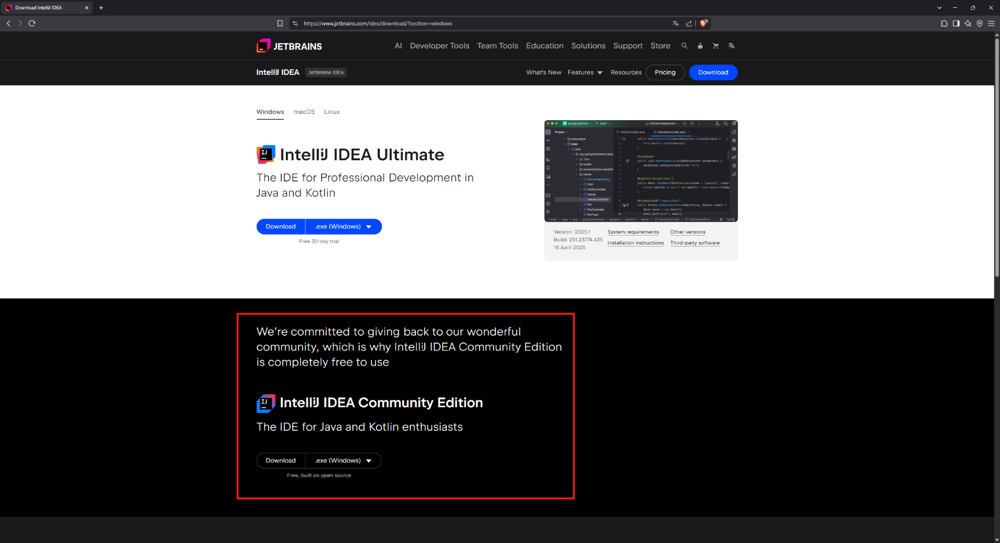

# Configuración del Entorno de Desarrollo

Para trabajar con Java y bases de datos, es necesario instalar y configurar las siguientes herramientas. Si nunca has trabajado con programación, sigue cada paso con calma y verifica cada instalación.

<br>

## 1. Instalación de Java y IntelliJ IDEA (Windows, Mac y Ubuntu)

### Windows

1. Descarga [JDK 17](https://www.oracle.com/java/technologies/javase/jdk17-archive-downloads.html) (descargar el archivo con extensión `.exe`).
   
2. Ejecuta el archivo descargado y sigue las instrucciones en pantalla. Deja las opciones por defecto y haz clic en **Siguiente** hasta completar la instalación.
   
3. Descarga [IntelliJ IDEA Community Edition](https://www.jetbrains.com/idea/download/) (asegúrate de **NO seleccionar la versión Ultimate**, que aparece destacada en la página, selecciona la _**Community Edition**_ que está justo debajo).



4. Instala **IntelliJ IDEA Community Edition** siguiendo los pasos del asistente de instalación.

<br>

### Mac

1. Instala **Homebrew** (si no lo tienes) ejecutando en la terminal:

    ```sh
    /bin/bash -c "$(curl -fsSL https://raw.githubusercontent.com/Homebrew/install/HEAD/install.sh)"
    ```

2. Instala el JDK con:

    ```sh
    brew install openjdk@17
    ```

3. Descarga e instala IntelliJ IDEA desde [aquí](https://www.jetbrains.com/idea/download/) (elige la versión _**Community Edition**_).

<br>

### Ubuntu

1. Abre la terminal y ejecuta:

    ```sh
    sudo apt update
    sudo apt install openjdk-17-jdk
    ```

2. Verifica la instalación con:

    ```sh
    java -version
    ```

3. Descarga IntelliJ IDEA Community desde [aquí](https://www.jetbrains.com/idea/download/) y descomprímelo con:

    ```sh
    cd idea-IC-*/bin
    ./idea.sh
    ```

<br>

## 2. Instalación de XAMPP

XAMPP incluye Apache, MySQL y PHP, facilitando el uso de bases de datos sin configuraciones adicionales.

<br>

### Windows y Mac

1. Descarga [XAMPP](https://www.apachefriends.org/es/download.html) e instálalo.
   
2. Durante la instalación, selecciona solo **MySQL** y **phpMyAdmin** si no necesitas los otros componentes.
   
3. Abre el **Panel de Control de XAMPP** y haz clic en **Start** en MySQL.
   
4. Accede a **phpMyAdmin** desde tu navegador ingresando a:

    ```
    http://localhost/phpmyadmin/
    ```

5. Para acceder a MySQL desde la terminal, usa:

    ```sh
    mysql -u root -p
    ```

    Deja el campo de contraseña vacío si no la configuraste.

<br>

### Ubuntu

1. Visita la página oficial de [XAMPP](https://www.apachefriends.org/es/download.html) y descarga la versión para Linux. Asegúrate de que el archivo descargado tenga la extensión **`.run`**.

2. Abre una terminal (`Ctrl + Alt + T`) y navega a la carpeta donde se descargó el archivo:
   
   ```bash
	cd ~/Downloads
	```

	Asigna permisos de ejecución al archivo y luego ejecuta el instalador:

    ```sh
    chmod +x xampp-linux-x64-*.run
    sudo ./xampp-linux-x64-*.run
    ```

    > ⚠ **Nota:** El nombre del archivo puede variar según la versión descargada. El comodín `*` ayuda a evitar errores al escribir el nombre exacto de la versión.

<br>

3. Inicia XAMPP:

	Una vez instalado, puedes iniciar el servidor Apache y MySQL con:

    ```sh
    sudo /opt/lampp/lampp start
    ```

	Si deseas detener los servicios, usa:

	```bash
	sudo /opt/lampp/lampp stop
	```


4. Abre phpMyAdmin en el navegador ingresando:

    ```
    http://localhost/phpmyadmin/
    ```

Esto te permitirá gestionar bases de datos a través de phpMyAdmin.

<br>

#### Uso del Panel de Control de XAMPP en Ubuntu

Si deseas usar la interfaz gráfica para administrar XAMPP: 

**1 - Abre una terminal:** Puedes hacerlo presionando `Ctrl+Alt+T` o buscando "Terminal" en el menú de aplicaciones.  

**2 - Ejecuta el gestor de XAMPP:** 

```bash
sudo /opt/lampp/manager-linux-x64.run
```

Esto iniciará la interfaz gráfica del panel de control de XAMPP, donde podrás iniciar o detener los servicios, ver logs, y realizar otras configuraciones.

**3 - Ingresa tu contraseña de sudo:**  

Se te pedirá tu contraseña de administrador para ejecutar el comando con privilegios elevados. Si encuentras algún problema (por ejemplo, que el archivo no sea ejecutable), asegúrate de darle permisos de ejecución con:  

```bash
sudo chmod +x /opt/lampp/manager-linux-x64.run
```

Luego, vuelve a ejecutar el comando inicial. 

<br>

## 3. Instalación de Git

### Windows

La instalación de **Git** ya fue tratada en el **[tema 01. Terminal](../01-terminal/01_introduccion_y_configuracion.md)**, en la sección _"¿Por qué recomendamos Git Bash en Windows?"_. Dado que ya instalamos **Git** previamente, **Git Bash** viene incluido por defecto como parte de su instalación.

<br>

### Mac

1. Abre la terminal y escribe:

    ```sh
    brew install git
    ```

2. Verifica la instalación con:

    ```sh
    git --version
    ```

<br>

### Ubuntu

1. Verifica la instalación:

    ```sh
    git --version
    ```

2. Si no está instalado, utiliza estos comandos:

    ```sh
    sudo apt update
    sudo apt install git
    ```


---
> ⬅ [Anterior: Algoritmos II](../02-algoritmos/02_algoritmos_2.md) | 📂 [Volver al índice](../README.md) | [Siguiente: Explorando IntelliJ ➡](02_explorando_intellij.md)
