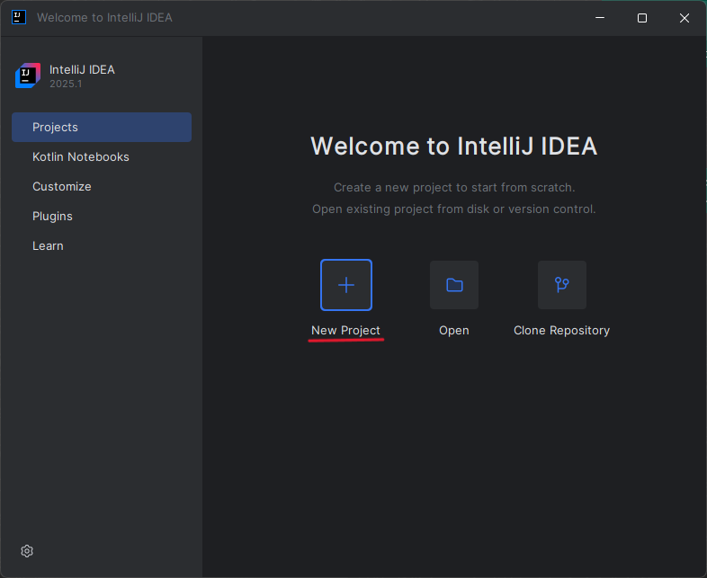
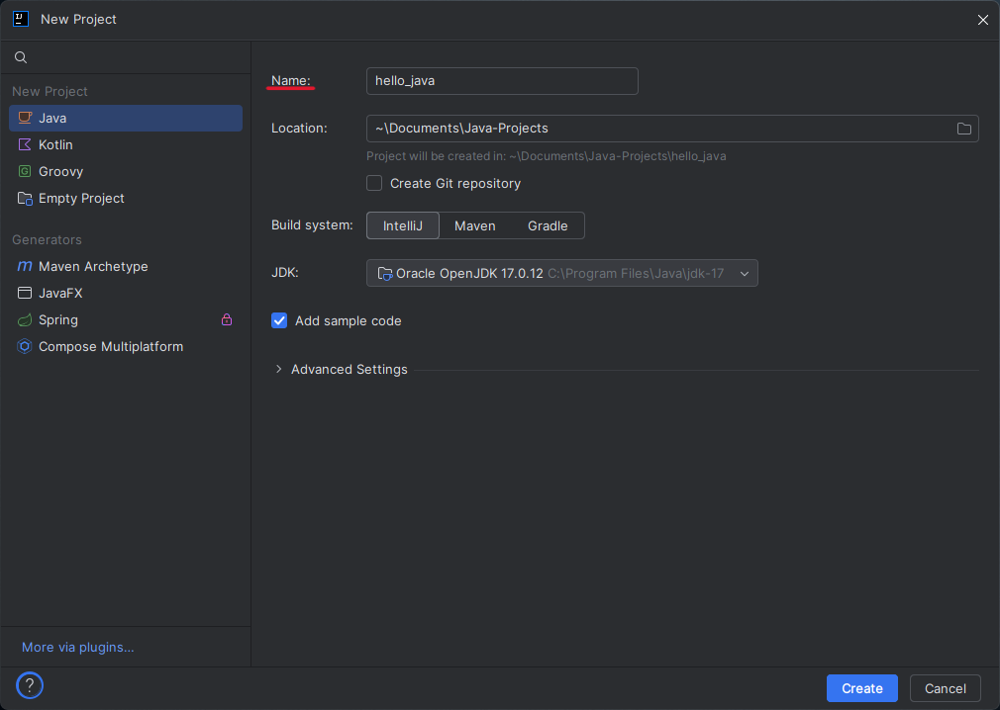
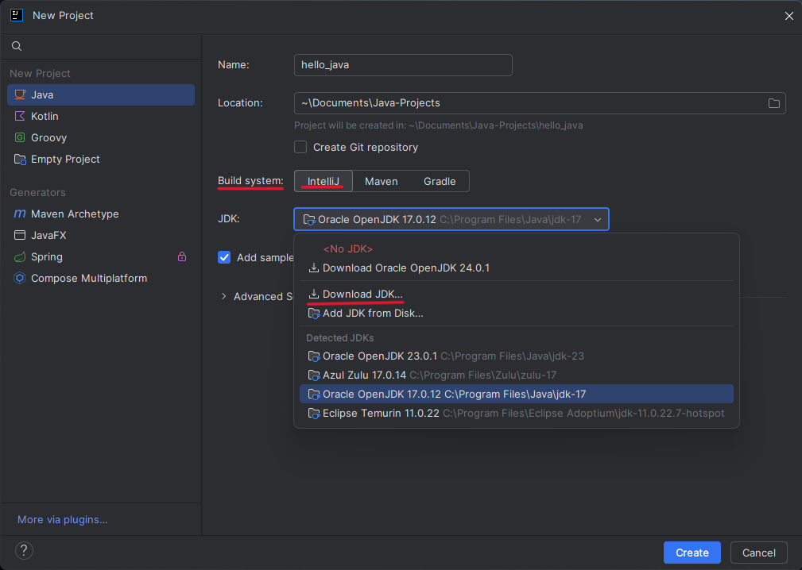
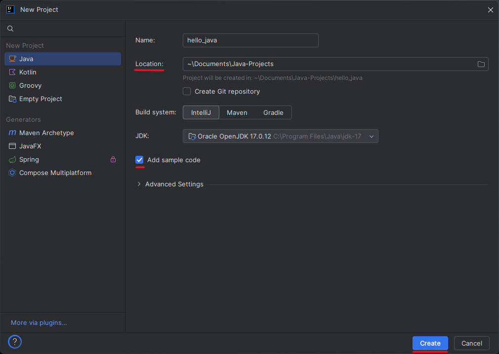
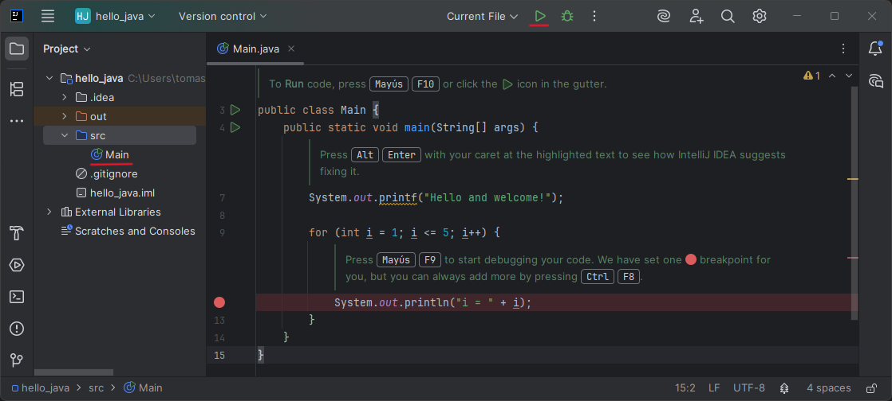
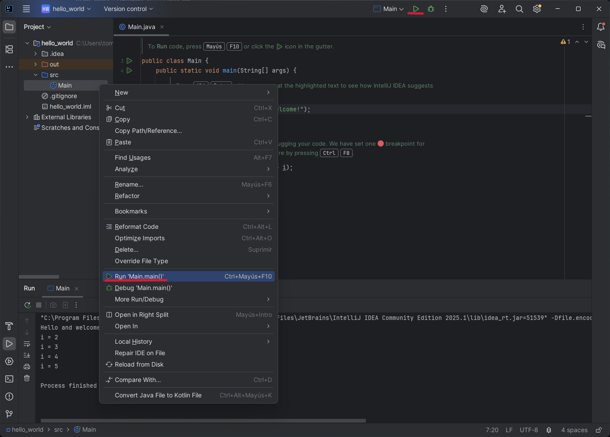

# Primeros Pasos con IntelliJ IDEA
	
<br>

## Explorando la Interfaz de IntelliJ IDEA

Al abrir IntelliJ IDEA por primera vez, verás la **pantalla de inicio**, donde puedes crear un nuevo proyecto o abrir uno existente. Si es tu primera vez utilizando IntelliJ, selecciona **Nuevo Proyecto** para comenzar.

Una vez que el proyecto esté creado, encontrarás varias secciones importantes dentro del entorno de desarrollo:

1. **Editor de código**: Área central donde se escribe y edita el código. Aquí escribirás tu programa.
   
2. **Barra de herramientas**: Contiene accesos rápidos a funciones como ejecutar o depurar código. El botón de **Run** (un icono de _play_ verde) ejecuta tu programa.
   
3. **Consola de salida**: Muestra mensajes del programa, errores y resultados de ejecución. Aquí verás los resultados cuando ejecutes tu código.

<br>

## Creación y ejecución de un proyecto Java

Vamos a crear un proyecto básico de Java.

<br>

### Creando un proyecto Java

1. Abre IntelliJ IDEA y selecciona **Nuevo Proyecto**.


	
<br>

2. En la sección **_Name:_**, introduce el nombre que deseas asignar a tu proyecto. Este nombre determinará el nombre de la carpeta raíz donde se almacenarán los archivos del proyecto. Es recomendable elegir un nombre descriptivo y coherente con el propósito del proyecto, como por ejemplo `GestorTareas` o en este caso `hello_java`.



> 	Aunque IntelliJ IDEA no impide el uso de espacios en los **nombres de proyectos**, adoptar esta práctica desde el inicio contribuirá a una gestión más eficiente y libre de problemas en el desarrollo de tus aplicaciones.

<br>

3. En la sección **_Build system_**, selecciona **IntelliJ**. A continuación, asegúrate de que haya seleccionado un **JDK** válido. Se recomienda usar la **versión 17** o superior ya que son versiones estables y compatibles. Si no tienes ningún JDK instalado, haz clic en **"Download JDK..."**, selecciona la versión 17 y completa la instalación.



<br>

4. Indica una **ubicación para guardar el proyecto** en el campo **_Location_** y pulsa en el botón **"Create"** para crear el proyecto.

	Puedes marcar la casilla de **"_Add sample code_"** para que IntelliJ genere automáticamente una clase principal con un ejemplo funcional.



<br>

5. IntelliJ IDEA preparará el entorno y abrirá el proyecto. Si marcaste la opción de **"_Add sample code_"**, encontrarás un archivo llamado `Main.java` con un pequeño ejemplo de código ya listo para ejecutar.



> Puedes ejecutar el código de ejemplo pulsando en el botón de _play_ verde en la parte superior de la pantalla.

<br>

### Ejecutando el código de ejemplo

1. Para ejecutar el código de ejemplo, tienes dos opciones:
   
    a. Haz clic derecho sobre `Main` y selecciona **_Run 'Main.main()'_**.
    
    b. O bien, usa el botón de **_Run_** en la barra de herramientas (icono de _play_ verde).

<br>

2. En la consola de salida, deberías ver:

    ```
    Hello and welcome!i = 1
	i = 2
	i = 3
	i = 4
	i = 5
	
	Process finished with exit code 0
    ```
	
<br>



¡Felicidades! Ahora ya tienes tu primer programa ejecutándose en IntelliJ IDEA.

---
> ⬅ [Anterior: Entorno de desarrollo](01_entorno_de_desarrollo.md) | 📂 [Volver al índice](../README.md) | [Siguiente: Git - Instalación y configuración ➡](../04-git/00_instalacion_configuracion.md)

