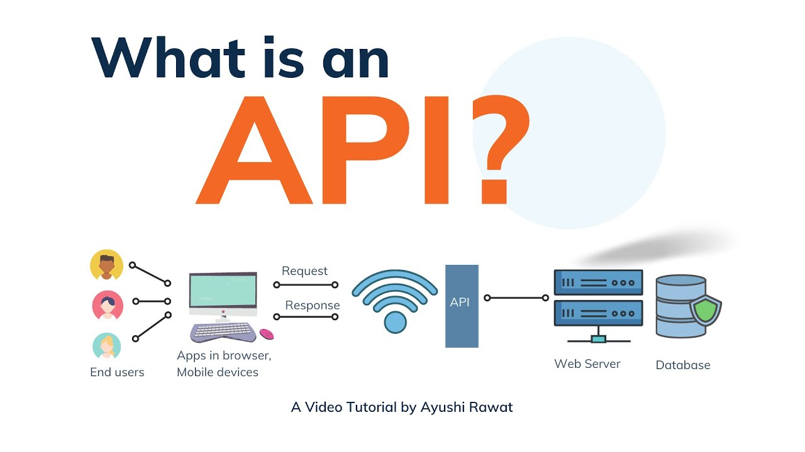
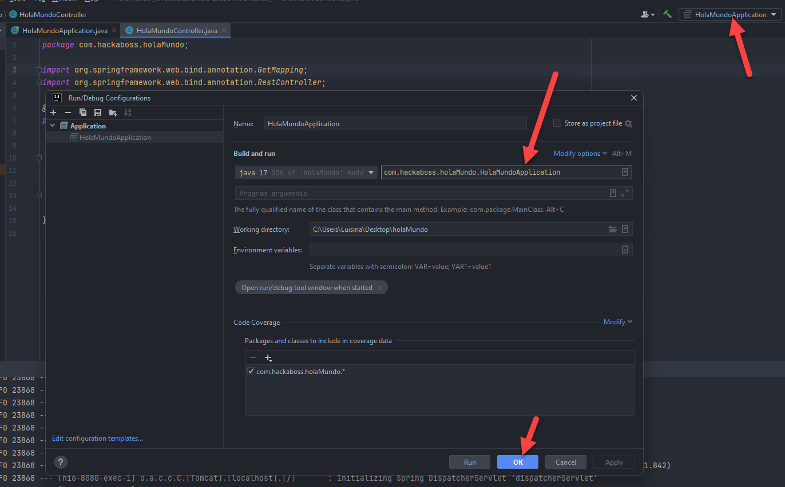

## Temas a tratar

En esta clase se abordarán las siguientes temáticas:

- **Introducción a las API**
    - ¿Qué son las APIs?
      
- **Creación de una API**
    - Creamos una API
      
- **¿Qué es JSON?**
    - Sintaxis básica
    - Principales usos
      
- **Sistema de ruteo**
    - URL
    - Rutas
    - Estructura de las rutas
      
- **Conceptos importantes**
    - Glosario en las Apis

<br>

---
---

<br>

## ¿Qué son las APIs?

Una **API** (_application programming interface_) es un conjunto de funciones y procedimientos (métodos) que se usa para diseñar e integrar el software de diferentes aplicaciones.

**REST (_Representational State Transfer_)** es un tipo de servicio que no posee estado. Es cualquier interfaz (interconexión) entre sistemas que use HTTP como protocolo para obtener datos o generar operaciones sobre los mismos en formatos como XML y JSON.

[](https://youtu.be/IwnIxk8DdHs)

<br>

### ¿Qué permite hacer una API-Rest?

- Las **API** representan un puente entre sistemas independientemente del lenguaje en el que estén programados.
    
- Su función radica en ofrecer servicios o aplicaciones específicas que pueden ser utilizadas simultáneamente por diversos usuarios.
    
- Una de sus funciones clave es simplificar el trabajo de los desarrolladores al permitirles reutilizar recursos y software existentes.
    
- Por ejemplo, al crear una tienda en línea, emplear APIs evitaría la necesidad de construir un sistema de pagos desde cero. En su lugar, podrías integrar sin complicaciones la API de un servicio de pagos ya establecido, como por ejemplo PayPal o cualquier pasarela de pagos.



<br>

## Creación de una API

Vamos a convertir nuestro proyecto **“holaMundo”** en una API de saludos. Para ello, crearemos una nueva clase llamada **“HolaMundoController”** que será nuestro controlador, esto basado en el **patrón MVC** (que veremos en mayor detalle más adelante 😉).

- Para indicar que esta clase es un controlador, agregaremos la annotation `@RestController`
    
- Dentro de la clase vamos a crear el método decirHola() que va a devolver un String que diga “Hola Mundo”.
    
- A este método lo vamos a mapear también con una annotation que será `@GetMapping` (veremos más adelante en profundidad esta annotation y para qué sirve, como adelanto, te contamos que sirve para atender solicitudes mediante el método GET 😀)

<br>

Si todo sale bien, deberíamos de tener algo similar a esto:

```java
package com.hackaboss.holaMundo;

import org.springframework.web.bind.annotation.GetMapping;
import org.springframework.web.bind.annotation.RestController;

@RestController
public class HolaMundoController {

   @GetMapping
   public String decirHola () {

       return "Hola Mundo";
   }

}
```

<br>

Con todo esto listo, deberíamos ser capaces de ejecutar nuestra api y recibir como respuesta el mensaje “Hola Mundo”, tal como podemos ver en la siguiente imagen:


<br>

>💡Tip a tener en cuenta
>- Para poder ejecutar de forma automática nuestras aplicaciones hechas con Spring Boot debemos configurar y especificar cuál es nuestra clase Main.
>- Esto lo debemos hacer desde las configuraciones de nuestro IDE, en Intellij lo logramos de la siguiente manera:
>	- Dentro de nuestro proyecto vamos arriba a la derecha (al lado del play verde de ejecución) donde veremos el nombre de nuestra aplicación “HolaMundoApplication”.
>	- Hacemos click allí y luego en“Edit Configurations”
>	- Se nos abrirá una nueva pestaña donde debemos establecer cuál es nuestra clase main.
>	- Una vez seleccionada, damos click a ok y ¡Listo! Todo debidamente configurado.

<br>



<br>

## ¿Qué es JSON?

**JSON**, acrónimo de "**JavaScript Object Notation**" (Notación de Objetos de JavaScript), es un formato ligero de intercambio de datos.

Es utilizado para representar datos estructurados de una manera legible tanto para humanos como para máquinas. Originalmente, se desarrolló como parte del lenguaje de programación JavaScript, pero actualmente es independiente del lenguaje y se utiliza en una amplia gama de aplicaciones debido a su simplicidad y facilidad de comprensión.

[](https://youtu.be/RhxOTqFbI5Q)

<br>

### Características Clave de JSON

1. **Legible para Humanos:** Su estructura se asemeja a la notación de objetos en JavaScript, lo que lo hace fácil de leer y entender para los programadores.
    
2. **Ligero:** Es un formato ligero, lo que significa que no agrega una carga significativa a los datos, facilitando su transferencia a través de redes.
    
3. **Independiente del Lenguaje:** Puede ser utilizado con cualquier lenguaje de programación, lo que lo hace versátil y compatible con diversas aplicaciones y sistemas.

<br>

### Principales Usos de JSON

1. **Comunicación entre Servidor y Cliente:** Es ampliamente utilizado en aplicaciones web y móviles para intercambiar datos entre el servidor y el cliente. Las respuestas de las API suelen estar en formato JSON.
    
2. **Almacenamiento y Transmisión de Datos:** Se usa para almacenar datos estructurados, como configuraciones, registros y metadatos, y para transmitirlos entre sistemas.
    
3. **Configuración y Serialización de Objetos:** Debido a su capacidad para representar datos complejos, se utiliza en la serialización de objetos, facilitando el almacenamiento y transmisión de objetos complejos en diferentes aplicaciones.
    
4. **Intercambio de Datos en Aplicaciones Web:** Es fundamental en el intercambio de datos entre diferentes partes de aplicaciones web, desde el front-end hasta las API del servidor.


<br>

### Sintaxis de JSON

**JSON** tiene dos elementos centrales:

- **Los objetos:** Están representados mediante llaves, su apertura indica el comienzo de la estructura de un objeto y su cierre el final.
    
- **Sus valores intrínsecos:** Los mismos se representan mediante claves (o _keys_) y valores (o _value_).
    
    - Las **claves** deben ser cadenas de caracteres y representan el “nombre” del valor.
        
    - Los **valores** son tipos de datos soportados por JSON.

<br>

Las claves y valores se separan entre sí mediante `:`

En caso de necesitar agregar más claves y valores, se separan entre sí mediante `,`

<br>

**Ejemplo:**

```json
{  
   “clave” : “valor”,
   “clave2” : “valor2”,
   “clave3” : “valor3”
}
```

<br>

#### Ejemplo de JSON

Aquí tienes un ejemplo de cómo se vería un objeto JSON que representa información sobre **Gokú**, el famoso personaje de **Dragon Ball**:

```json
{
  "nombre": "Gokú",
  "edad": 35,
  "ocupacion": "Luchador",
  "planeta_origen": "Tierra",
  "familia": {
    "esposa": "Milk",
    "hijos": ["Gohan", "Goten"]
  },
  "habilidades": ["Kamehameha", "Genkidama", "Teletransportación"]
}
```

<br>

#### Ejemplo más complejo de JSON

Aquí tienes un ejemplo, un poco más complejo de JSON con personajes de Harry Potter:

```json
{
  "nombre": "Gryffindor",
  "colores": ["Amarillo", "Bordó"],
  "integrantes": [
    {
      "nombre": "Harry",
      "apellido": "Potter"
    },
    {
      "nombre": "Hermione",
      "apellido": "Granger"
    },
    {
      "nombre": "Ron",
      "apellido": "Weasley"
    }
  ]
}
```

<br>

En este caso:

- **"nombre"**: Representa el nombre del grupo, en este caso, "Gryffindor".
    
- **"colores"**: Es un arreglo que contiene los colores asociados al grupo, siendo "Amarillo" y "Bordó" sus colores.
    
- **"integrantes"**: Es un arreglo que contiene objetos representando a los miembros del grupo Gryffindor. Cada objeto dentro de este arreglo tiene dos atributos: "nombre" y "apellido". En este caso, se incluyen tres integrantes: Harry Potter, Hermione Granger y Ron Weasley, cada uno con su respectivo nombre y apellido.

<br>

### JSON para responses

En el contexto de Spring Boot y las APIs, JSON es un formato de respuesta común utilizado para transmitir datos desde el servidor al cliente. Spring Boot, al ser un framework flexible y poderoso, facilita la generación de respuestas JSON para las API de manera sencilla.

<br>

A continuación veremos en mayor detalle el uso de JSON para las respuestas de las APIs en Spring Boot:

1. **Serialización Automática:** Cuando construyes una API en Spring Boot y devuelves un objeto como respuesta desde un controlador (`@RestController`), Spring Boot automáticamente serializa ese objeto a JSON antes de enviarlo como respuesta al cliente. Esto se logra con la ayuda de bibliotecas como Jackson, que Spring Boot incorpora por defecto.
    
2. **Anotaciones para Controladores:** Al anotar tus controladores o métodos con `@RestController` o `@Controller`, y al devolver objetos simples o complejos desde esos métodos, Spring Boot se encarga de convertir esos objetos en respuestas JSON.
    
3. **Personalización de Respuestas JSON:** Puedes personalizar cómo se serializan tus objetos a JSON utilizando anotaciones como `@JsonProperty` para nombrar propiedades, `@JsonIgnore` para excluir propiedades, y otras anotaciones de Jackson según sea necesario.
    
4. **Manejo de Errores:** En caso de errores, Spring Boot también es capaz de devolver mensajes de error en formato JSON, lo que facilita su interpretación por parte del cliente.
    
5. **Soporte para Conversión de Tipos:** Spring Boot maneja automáticamente la conversión de tipos de datos complejos, como listas, mapas, y objetos anidados, a su representación en JSON y viceversa.

<br>

En resumen, **JSON** se utiliza ampliamente en Spring Boot para las respuestas de las APIs debido a su legibilidad, facilidad de uso y soporte incorporado en el ecosistema de Spring, permitiendo una comunicación efectiva entre el servidor y el cliente a través del **Protocolo HTTP**.

<br>

### Practiquemos JSON

A continuación te proponemos realizar un ejercicio para poner en práctica todo lo aprendido con JSON. En él deberás:

- Crear un objeto JSON que represente la información básica de Pikachu, el famoso personaje de Pokémon.
    
    - Define las características básicas de Pikachu. Por ejemplo, su nombre, tipo, habilidades, características físicas, entre otros detalles relevantes.
        
    - Incluye campos como "nombre", "tipo", "habilidades", "color", "altura", "peso" u otros atributos que consideres importantes para describir a Pikachu.
        
    - Asegúrate de seguir la estructura básica de JSON (pares clave-valor separados por comas, objetos dentro de llaves `{}`, arreglos dentro de corchetes `[]`, etc.).

<br>

#### Resolución

A continuación te proponemos una posible resolución:

```json
{
  "nombre": "Pikachu",
  "tipo": "Eléctrico",
  "habilidades": ["Impactrueno", "Ataque Rápido", "Rayo"],
  "color": "Amarillo",
  "altura": "0.4 m",
  "peso": "6 kg",
  "descripcion": "Pikachu es un Pokémon eléctrico muy conocido por su carisma y su cola en forma de rayo."
}
```

<br>

## Sistema de Ruteo en Aplicaciones Web

En el desarrollo de aplicaciones web modernas, el **sistema de ruteo** juega un papel fundamental. Es el mecanismo que permite dirigir al usuario hacia diferentes partes de una aplicación o sitio web, de acuerdo a la URL que visita. 

<br>

## ¿Qué es una URL?

La **URL** (*Uniform Resource Locator*) es la dirección que se utiliza para acceder a un recurso específico en la web. Es lo que escribimos en la barra del navegador para visitar una página. Cada URL es única y sirve para localizar contenido de forma precisa.

<br>

### Estructura de una URL

Una URL está compuesta por varias partes, las cuales ayudan a identificar el recurso que se desea visitar. Aquí un ejemplo y su estructura:

```txt
https://www.ejemplo.com:443/productos/filtrar?color=rojo#ofertas
```

<br>

Desglosemos esta URL:

- **https** → Protocolo de comunicación 🔐  
- **www.ejemplo.com** → Nombre del dominio 🌍  
- **:443** → Puerto (opcional, se omite cuando es estándar) 🚪  
- **/productos/filtrar** → Ruta del recurso y su acción 📁 **Mucha Atención**  
- **?color=rojo** → Parámetros de búsqueda (query string) 🔍  
- **#ofertas** → Fragmento o ancla dentro de la página 🔗

<br>

## Rutas en Spring Boot

En el contexto de Spring Boot, las **rutas** (también conocidas como endpoints) son fundamentales para establecer cómo una aplicación web responde a las solicitudes del cliente. Estas rutas permiten definir caminos claros por donde los usuarios o sistemas externos pueden acceder a los recursos que ofrece la aplicación.  

A diferencia de otros frameworks como Express.js o Angular, en Spring Boot las rutas se definen utilizando **anotaciones** que indican el tipo de solicitud HTTP (como GET, POST, PUT o DELETE) y la dirección a la que deben responder. Estas anotaciones se aplican en clases llamadas **controladores**, los cuales gestionan la lógica de negocio y la respuesta a cada petición.  

Por ejemplo, una aplicación que gestiona productos podría tener rutas como:

- `/productos` → para listar todos los productos   
- `/productos/123` → para obtener los detalles de un producto específico   
- `/productos/nuevo` → para agregar un nuevo producto  

<br>

En lugar de escribir cada una de estas rutas como texto plano, Spring Boot permite usar anotaciones como `@GetMapping`, `@PostMapping` y `@RequestMapping`, facilitando la organización del código y haciéndolo más legible y mantenible.  

<br>

### ¿Cómo se estructuran?

Las rutas en Spring Boot suelen organizarse en base al recurso que representan. Por ejemplo, si estamos trabajando con usuarios, todas las rutas comenzarían con `/usuarios`, y dentro de ese contexto, se pueden definir diferentes acciones como:

- `GET /usuarios` → Obtener la lista de usuarios  
- `GET /usuarios/{id}` → Obtener un usuario específico  
- `POST /usuarios` → Crear un nuevo usuario  
- `PUT /usuarios/{id}` → Actualizar la información de un usuario existente  
- `DELETE /usuarios/{id}` → Eliminar un usuario

<br>

Esta estructura sigue los principios de diseño de APIs REST, lo que hace que la aplicación sea predecible, escalable y fácil de consumir por otras aplicaciones o servicios.  

Además, Spring Boot se encarga automáticamente del manejo de las rutas y de la conversión de datos (por ejemplo, de JSON a objetos Java y viceversa), lo cual simplifica mucho el desarrollo. 

**En resumen**, las rutas en Spring Boot son caminos definidos mediante anotaciones que permiten conectar las solicitudes HTTP entrantes con los métodos adecuados dentro de la aplicación. Gracias a su estructura basada en controladores y anotaciones claras, es posible construir APIs robustas, ordenadas y fáciles de mantener.

<br>

# Glosario Básico: APIs, Rutas y Spring Boot

| Término             | Definición                                                     |
| ------------------- | -------------------------------------------------------------- |
| **API**             | Interfaz que permite la comunicación entre aplicaciones.       |
| **REST**            | Estilo arquitectónico para diseñar APIs usando HTTP.           |
| **Endpoint**        | Ruta específica de una API que responde a una petición.        |
| **Ruta**            | Camino definido para acceder a un recurso.                     |
| **Request**         | Petición que hace el cliente a un servidor.                    |
| **Response**        | Respuesta que envía el servidor al cliente.                    |
| **GET**             | Método HTTP para obtener datos.                                |
| **POST**            | Método HTTP para enviar y guardar datos.                       |
| **PUT**             | Método HTTP para actualizar datos.                             |
| **DELETE**          | Método HTTP para eliminar datos.                               |
| **PathVariable**    | Parte variable en la URL, como un ID.                          |
| **RequestBody**     | Datos enviados en el cuerpo de una solicitud.                  |
| **Controller**      | Clase que maneja las solicitudes y respuestas.                 |
| **@RestController** | Anotación que define un controlador REST.                      |
| **@RequestMapping** | Anotación para definir rutas base.                             |
| **@GetMapping**     | Ruta que responde a peticiones GET.                            |
| **@PostMapping**    | Ruta que responde a peticiones POST.                           |
| **@PutMapping**     | Ruta que responde a peticiones PUT.                            |
| **@DeleteMapping**  | Ruta que responde a peticiones DELETE.                         |
| **JSON**            | Formato ligero de intercambio de datos.                        |
| **Spring Boot**     | Framework de Java para crear aplicaciones web de forma rápida. |
| **Service**         | Capa que contiene la lógica de negocio.                        |
| **Model**           | Representación de un objeto o entidad en el sistema.           |
| **DTO**             | Objeto que transporta datos entre capas.                       |
| **Entity**          | Clase que representa una tabla en la base de datos.            |
| **Repository**      | Componente que accede a la base de datos.                      |

---
[⬅️ Volver al índice](./README.md)

