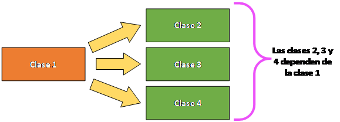
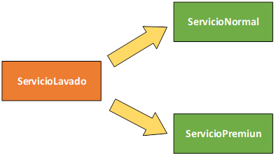

## Temas a tratar

En esta clase se abordarán las siguientes temáticas:

**Inversión de Control e Inyección de dependencias**
- Inversión de Control
- Tipos de Inyección de dependencia: Mediante Constructores y Mediante Setters
- @Autowired

<br>

---
---

<br>

## Inversión de Control

Un aspecto clave y muy característico de Spring como framework es la utilización de la inversión de control, o mejor conocida como IoC, por sus siglas en inglés: _Inversion Of Control._

La inversión de control es un concepto en el cual, en lugar de que el programador a través de la aplicación lleve el control del flujo de la misma, sea el framework quien lo haga. Tal como lo dice su nombre, los roles de control se invierten.


<br>

En la imagen podemos ver un flujo normal de trabajo, donde la app, a través de las líneas de código que especifique el programador, se encarga de llamar a las diferentes funcionalidades de un frvamework. Sin embargo, en la inversión de control, este proceso es diferente, en donde el framework se encarga de llamar a la aplicación.


<br>

Para implementar este concepto, el framework necesita comprender el funcionamiento de la aplicación y qué actividades realiza. Para lograr esto, solicita a la aplicación una serie de datos, que pueden estar representados de diversas maneras dependiendo del lenguaje de programación utilizado. Por ejemplo, en Java, esto se logra a través de las **Annotations**.

La **Inversión de Control (IoC)** aborda uno de los problemas principales, que es la creación innecesaria de objetos utilizando la sentencia '**new**'.

Con la **IoC**, el framework se encarga de crear los objetos (frecuentemente siguiendo el patrón de diseño _Singleton_, el cual establece el uso de una única instancia por clase) y los pone a disposición de la aplicación.

Este proceso se realiza mediante otro concepto crucial conocido como **Inyección de Dependencias**.

<br>

## Inyección de dependencias

La **Inyección de Dependencias**, conocida como **DI** (_Dependency Injection_ por sus siglas en inglés), representa un patrón de diseño centrado en la gestión de los objetos en una aplicación.

Su propósito fundamental radica en mantener las diferentes capas de una aplicación lo más independientes posible entre sí. Para lograr esta separación, la **Inyección de Dependencias** permite que cada parte del programa en desarrollo sea autónoma, comunicándose no a través de instancias directas, sino mediante **interfaces**.

En esencia, la **Inyección de Dependencias** busca minimizar la interconexión entre clases o capas.

Pero… ¿Qué implica realmente una dependencia? Se trata de una relación que puede existir entre una o varias clases, donde comúnmente una (o varias) depende(n) de otra de manera principal.




<br>

**¿Cómo se representa esto a nivel código?** Supongamos que tenemos el modelado de un lavadero de autos, donde existe una clase llamada **ServicioLavado** de la cual dependen otras dos clases, **ServicioNormal** y **ServicioPremiun**.





<br>

Esto a nivel código se vería de la siguiente manera:

```java
public class ServicioLavado {
    ServicioNormal servNormal; //se genera dependencia
    ServicioPremiun servPrem; //se genera dependencia
    
    public ServicioLavado() {
        servNormal = new ServicioNormal();
        servPrem = new ServicioPremiun();
    }
}
```

<br>

Como se puede ver, tanto **ServicioNormal** como **ServicioPremiun** dependen de **ServicioLavadado** y es él quien tiene la responsabilidad de inicializar a ambos servicios en su constructor; sin embargo, si aplicáramos **inyección de dependencias**, podríamos delegar esta responsabilidad que tiene **ServicioLavado** a otra clase, como por ejemplo, la clase main que tengamos en el proyecto.

<br>

## Formas de aplicar Inyección de dependencias

Existen diferentes maneras de aplicar a la inyección de dependencias, sin embargo hay 3 que son las más comunes:

- Mediante un constructor
- Mediante un setter
- Mediante la Annotation `@Autowired`

<br>

### Inyección mediante Constructor

En la inyección de dependencias mediante un constructor, es el propio constructor de una clase el encargado de inyectar la dependencia.

En la inyección de dependencias mediante un constructor, este únicamente recibirá como parámetros los objetos ya creados y los asignará según corresponda, no es él el encargado de crearlos.

```java
public class ServicioLavado {
    ServicioNormal servNormal;
    ServicioPremiun servPrem; 
    
    public ServicioLavado(ServicioNormal servNorm, ServicioPremiun servPrem) {
        this.servNormal = servNorm;
        this.servPrem = servPrem;
    }
}
```

<br>

### Inyección mediante un Setter

Los métodos _getter_ y _setter_ nos permiten obtener o setear valores a los atributos de los objetos que sean creados, de igual manera los métodos _set_ nos permiten inyectar dependencias, donde a partir de la recepción de un objeto como un parámetro este se asigna.

```java
public class ServicioLavado {
    ServicioNormal servNormal;
    ServicioPremiun servPrem; 
    
    public void setServNorm (ServicioNormal servNorm) {
        this.servNormal = servNorm;
    }
    
    public void setServPrem (ServicioPremiun servPrem) {
        this.servPrem = servPrem;
    }
}
```

<br>

### Inyección mediante @Autowired

Así como Java permite realizar inyección de dependencias de forma genérica mediante _setters_ o constructores, Spring como framework ofrece una _annotation_ para hacerlo. Ésta es conocida como `@Autowired`.

Esta anotación se emplea para automatizar el proceso de inyección de dependencias en clases, métodos o constructores, permitiendo que Spring maneje automáticamente la creación e inyección de objetos en tiempo de ejecución.

Cuando se utiliza `@Autowired`, Spring busca un _bean_ (un objeto gestionado por el contenedor de Spring) del tipo requerido y lo asigna a la variable anotada, logrando así la inyección de la dependencia sin necesidad de crear explícitamente el objeto mediante la palabra clave `new`.

<br>

#### Ejemplo

Supongamos que tenemos una página web que tiene distintas secciones y que guardamos cada una de estas utilizando una clase llamada **Seccion** en nuestra capa **model**:

```java
@Getter @Setter
@NoArgsConstructor
@AllArgsConstructor
public class Seccion {

    private Long id;
    private String nombreSeccion;
    private String descripcion
}
```

<br>

Ahora, siguiendo la arquitectura multicapas, en nuestra capa repository creamos una clase “**SeccionRepository**” que nos provea de una lista de secciones de ejemplo:

```java
@Repository
public class SeccionRepositpry {

    //este método utilizaremos para simular una base de datos lógica de secciones
    public List<Seccion> traerSecciones () {
        List<Seccion> listaSecciones = new ArrayList<Seccion>();
        listaSecciones.add(new Seccion(1L,"Inicio","Página principal de la web"));
        listaSecciones.add(new Seccion(2L,"Quienes somos","Página con información de la empresa"));
        listaSecciones.add(new Seccion(3L,"Contacto","Formas de contacto con la empresa"));
        return listaSecciones;
    }
    
}
```

<br>

Una vez hecho esto, supongamos que queremos utilizar a _repository_ en nuestro _controller_ para hacer uso del método _traerSecciones_. Anteriormente debíamos de forma obligatoria crear una instancia mediante _new_, ahora lo podemos hacer mediante `@Autowired` de la siguiente manera:

```java
@RestController
public class SeccionController{

    //el Autowired inyectará nuestra dependencia
    //sin que necesitemos crear una instancia
    @Autowired
    SeccionRepository repository;
    
    @GetMapping("/secciones")
    public List<Seccion> traerSecciones() {
        return repository.traerSecciones();
    }
}
```

<br>

Como podemos ver, tenemos bien divididas las 3 tareas:

- **Controller** se encarga de recibir nuestra solicitud

- Nuestra clase **Seccion**, es el model que necesitamos para trabajar con objetos de ese tipo

- **SeccionRepository** cumple como si fuese una "base de datos lógica" que nos ofrece los distintos posteos con los que contamos

<br>

Ahora, como podemos ver en el _controller_, ya no es esta capa la encargada de traer todas las secciones y devolverlas, sino que es el _repository_ quien lo hace... ¿Y cómo logramos esto? Creando un objeto de _SeccionRepository_ SIN INSTANCIARLO, sino que lo mapeamos mediante `@Autowired`.

<br>

### Autowired y Arquitectura Multicapas

Si bien vimos anteriormente como podemos inyectar nuestro acceso a _repository_ directamente en el _controller_, si respetamos la arquitectura multicapas primero sería necesario pasar por la capa de servicio antes de consultar al _repository_.

A partir de esto, la comunicación debería ser de la siguiente manera:


De esta manera, la inyección de dependencias que debe hacer el _Controller_ es hacia el _Service_, y el _Service_ hacia el _Repository_ respectivamente.

**¡Veamos un ejemplo de código sencillo!**

Supongamos una API que maneja usuarios:

<br>

**Controller**

```java
@RestController
public class UserController {

    //el autowired lo hacemos sobre la INTERFAZ del servicio
    @Autowired
    private final IUserService userService;
    
    @GetMapping("/users/{id}")
    public User getUserById(@PathVariable Long id) {
        return userService.getUserById(id);
    }
    
    // Otros endpoints y métodos del controlador
}
```

<br>

**Interface Service**

```java
// Interfaz UserService
public interface IUserService {
    
    User getUserById(Long id);
    
}
```

<br>

**Clase Service**

```java
@Service
public class UserService implements IUserService {

    //inyectamos el repository mediante autowired
    @Autowired
    private UserRepository userRepository;
    
    @Override
    public User getUserById(Long id) {
        return userRepository.findById(id).orElse(null);
    }
    
    // Implementación de otros métodos del servicio
}
```

<br>

**Clase Repository**

```java
@Repository
public class userRepository {

	//lo que tengamos como repositorio de usuarios

}
```

De esta manera podemos ver como el controlador inyecta dependencia mediante _Autowired_ con la capa _service_, y como la capa _service_ inyecta dependencia a la capa _repository_.

<br>

---
---
## Ejercicios Prácticos

Supongamos que estamos desarrollando un sistema para administrar equipos y jugadores de un torneo de fútbol. Tenemos dos clases principales:

- **Equipo**, con los atributos:
    - ID
    - Nombre
    - Ciudad

<br>

- **Jugador**, con los atributos:
    - ID
    - Nombre
    - Edad
    - Posición

<br>

Necesitamos crear un sistema que gestione estos datos y permita realizar las siguientes operaciones:

1. **Ver todos los equipos inscritos en el torneo.**    
    - Método HTTP: GET
    - URL del endpoint: `/equipos`
    - Ejemplo: `GET localhost:8080/equipos`
    
<br>
    
2. **Ver todos los jugadores registrados en el torneo.**
    - Método HTTP: GET
    - URL del endpoint: `/jugadores`
    - Ejemplo: `GET localhost:8080/jugadores`
        
<br>
        
3. **Mostrar información sobre un equipo en particular.**
    - Método HTTP: GET
    - URL del endpoint: `/equipos/{id}`
    - Ejemplo: `GET localhost:8080/equipos/1` (donde `1` es el ID del equipo)
        
<br>
        
4. **Mostrar todos los jugadores pertenecientes a un equipo en específico.**
    - Método HTTP: GET
    - URL del endpoint: `/equipos/{id}/jugadores`
    - Ejemplo: `GET localhost:8080/equipos/1/jugadores` (donde `1` es el ID del equipo)

<br>

Desarrollar una API que cumpla con los requerimientos solicitados y que cumpla correctamente la arquitectura multicapas y la inyección de dependencias mediante @Autowired.

---
[⬅️ Volver al índice](./README.md)
