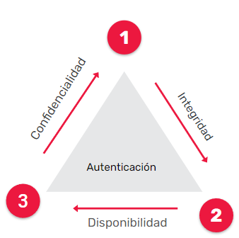
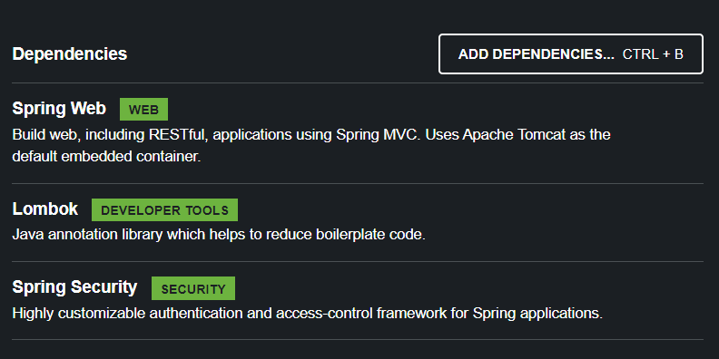
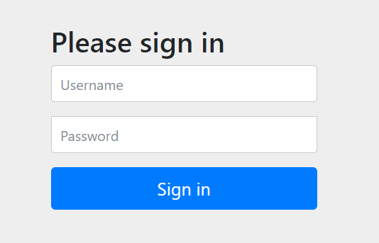
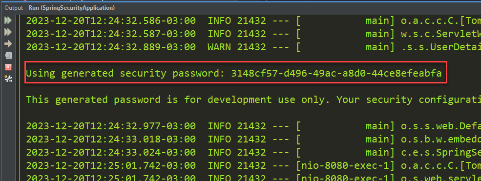
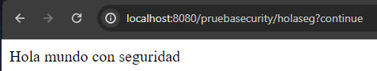
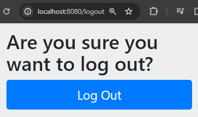
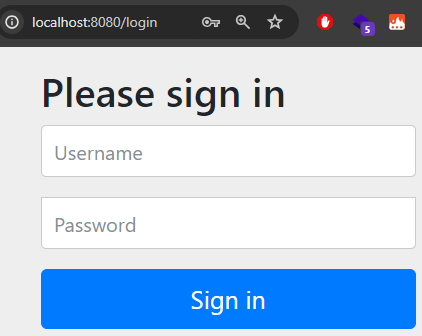
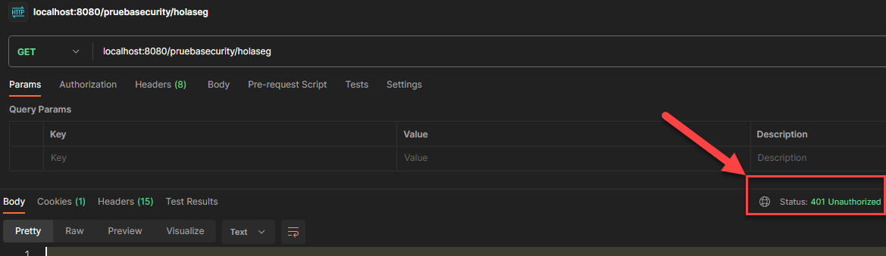
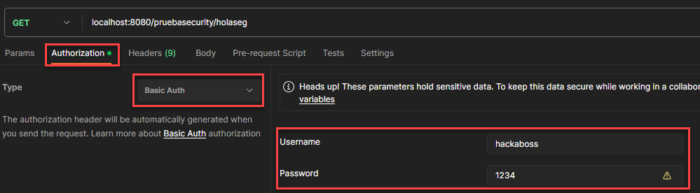
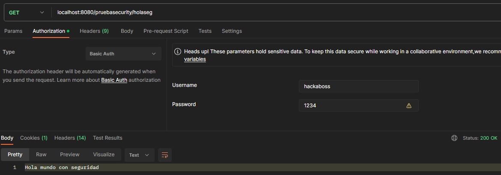

## Temas a tratar

En esta clase se abordarán las siguientes temáticas:

- Introducción a la Seguridad
- Autenticación vs Autorización
- Introducción a Spring Security
- Implementación de Spring Security
- Json Web Token (JWT)

---

## **Seguridad Informática**

Es el proceso de prevención y detección del uso no autorizado de un sistema informático. Implica proteger los recursos informáticos contra intrusos o la posibilidad de acceder a ellos por accidente. Contempla, como su principal fin, la protección de la propiedad intelectual y la información de las organizaciones y de las personas.


### Ejes fundamentales de la seguridad

La seguridad en las aplicaciones o desarrollos de software depende de ciertos ejes fundamentales:

- **Confidencialidad**: Sólo los usuarios autorizados pueden acceder a nuestros recursos, datos e información.
    
- **Integridad**: Sólo los usuarios autorizados  pueden modificar los datos
    
- **Disponibilidad**: Es  la condición donde los  recursos pueden ser accedidos por los usuarios en un tiempo determinado.
    
- **Autenticación:** proceso de comprobación que  comunica a las entidades.




### Riesgos en el desarrollo de software

Cuando hablamos de riesgos, hablamos de eventos o condiciones inciertas que, en caso de ocurrir, tienen un efecto generalmente negativo sobre los objetivos de un proyecto. En un proceso de desarrollo de software generalmente están presentes cuando confluyen dos elementos:

- **Amenazas:** Son posibles eventos o acciones maliciosas que buscan aprovechar las vulnerabilidades para comprometer la seguridad de un sistema. Pueden provenir de personas, malware, desastres naturales, errores humanos, entre otros. Las amenazas pueden aprovechar las vulnerabilidades para acceder, dañar o comprometer la integridad, confidencialidad o disponibilidad de los datos.
    
- **Vulnerabilidades:** Son debilidades o fallos en el diseño, implementación, configuración o uso de un sistema que pueden ser explotados por amenazas para comprometer la seguridad. Estas pueden ser errores de programación, configuraciones incorrectas, debilidades en la arquitectura o cualquier punto débil que pueda ser explotado.


#### **¿Qué podemos hacer los desarrolladores para prevenir esto?**

Para prevenir vulnerabilidades y amenazas en el desarrollo de software, un desarrollador puede tomar diversas medidas proactivas:

1. **Educar sobre seguridad:** Mantenerse actualizado con las mejores prácticas de seguridad en el desarrollo de software es fundamental. Asistir a cursos, leer documentación y estar al tanto de las últimas amenazas y soluciones es clave.
    
2. **Validación de entrada de datos:** Verificar y validar todas las entradas de datos del usuario para prevenir inyecciones de código (como _SQL injection_ o XSS) mediante la implementación de técnicas como la validación de formularios y el uso de parámetros seguros en las consultas a bases de datos.
    
3. **Actualización y parcheo:** Mantener todos los componentes del software actualizados. Esto incluye bibliotecas, _frameworks_ y sistemas operativos. Las actualizaciones suelen contener correcciones de seguridad importantes.
    
4. **Autenticación y autorización robustas:** Implementar sistemas de autenticación seguros y mecanismos de autorización adecuados para garantizar que solo los usuarios autorizados accedan a los recursos necesarios.
    
5. **Pruebas de seguridad:** Realizar pruebas de seguridad, como pruebas de penetración y análisis estático/dinámico del código, para identificar y solucionar vulnerabilidades antes de implementar en producción.
    
6. **Cifrado de datos:** Aplicar cifrado a datos sensibles, tanto en reposo como en tránsito, para proteger la confidencialidad y la integridad de la información.
    
7. **Implementación de principios de diseño seguro:** Utilizar patrones y prácticas de diseño seguro desde el inicio del desarrollo, como el principio de menor privilegio, separación de preocupaciones, etc.
    
8. **Gestión de vulnerabilidades:** Tener un plan de respuesta a incidentes que incluya cómo abordar y solucionar las vulnerabilidades cuando se descubran.
    
9. **Revisión de código:** Realizar revisiones de código por pares para identificar posibles vulnerabilidades y problemas de seguridad.
    

En el punto 4 vemos una de las cualidades más importantes que podemos implementar como desarrolladores para prevenir riesgos: Procesos de **autenticación** y **autorización** que sean **robustos**. Y es ahí donde entra en juego **Spring Security**, como capa de seguridad de nuestras aplicaciones.


### Autenticación vs Autorización

La autenticación y la autorización son aspectos fundamentales en el desarrollo de aplicaciones seguras. La autenticación asegura que los usuarios sean quienes dicen ser, mientras que la autorización controla qué acciones o recursos pueden acceder una vez autenticados.

La importancia de estos conceptos radica en la protección de los datos y recursos críticos de una aplicación. Una autenticación robusta garantiza que solo usuarios autorizados puedan acceder al sistema, mientras que la autorización define los límites y permisos de esos usuarios dentro de la aplicación.

Veamos más a fondo ambos conceptos:

- **Autenticación:** Es el proceso de verificar la identidad del usuario para asegurarse de que sea quien dice ser. Es el primer paso que permite a los usuarios acceder al sistema. La autenticación responde a la pregunta "¿Eres tú quien dices ser?" y puede incluir el uso de credenciales como nombre de usuario y contraseña, tokens, certificados, etc.
    
- **Autorización:** Ocurre después de la autenticación y se refiere al proceso de determinar si un usuario tiene permiso para realizar una acción o acceder a un recurso específico. La autorización define qué acciones o recursos puede utilizar un usuario autenticado. Responde a la pregunta "¿Tienes permiso para realizar esta acción?"
    

| Característica    | Autenticación                            | Autorización                               |
| ----------------- | ---------------------------------------- | ------------------------------------------ |
| Propósito         | Verificar la identidad del usuario.      | Controlar el acceso a recursos y datos.    |
| ¿Qué verifica?    | ¿Eres quien dices ser?                   | ¿Qué puedes hacer una vez autenticado?     |
| Ejemplo           | Iniciar sesión con usuario y contraseña. | Permitir o denegar acceso a una página     |
| Acciones          | Identificar al usuario.                  | Definir permisos y restricciones.          |
| Enfoque           | Verificar credenciales del usuario.      | Establecer roles y privilegios.            |
| Etapa del proceso | Primera etapa del proceso de seguridad.  | Segunda etapa después de la autenticación. |

---

## Spring Security

Spring Security es un marco de seguridad de nivel empresarial para aplicaciones Java. Se utiliza para autenticar y autorizar usuarios, proteger recursos y aplicar políticas de seguridad en aplicaciones web y servicios RESTful.


Su configuración puede ser declarativa mediante anotaciones o XML, permitiendo adaptarse a los requisitos específicos de cada aplicación.


### **Objetivos y Funcionalidades**

Dentro de su amplio espectro de funcionalidades, Spring Security abarca diversas áreas:

- **_Autenticación_**: Este marco ofrece mecanismos para verificar la identidad de los usuarios mediante múltiples fuentes de autenticación, desde credenciales tradicionales hasta tokens y certificados.
    
- **_Autorización_**: Define roles y asigna permisos para controlar el acceso a funcionalidades específicas, asegurando que los usuarios solo accedan a lo que les corresponde.
    
- **_Protección de Recursos_:** Se encarga de proteger recursos mediante la securización de URLs y métodos, además de prevenir ataques comunes como CSRF, XSS y inyecciones SQL.
   

### ¿En qué se basa Spring Security?

El marco se apoya en varios conceptos centrales:

- **_Filtros de Seguridad_:** Estos filtros interceptan las peticiones HTTP para realizar tareas de autenticación, autorización y seguridad.
    
- **_Proveedores de Autenticación_:** El AuthenticationManager y el UserDetailsService son esenciales para la gestión y autenticación de credenciales de usuario.
    
- **_Autorización_:** Aquí, el concepto de GrantedAuthority y el uso de Access Control Lists (ACLs) son fundamentales para definir permisos y controlar el acceso a recursos

---

## Implementación de Spring Security en un proyecto Spring Boot

Implementar los servicios básicos de Spring Security en una aplicación desarrollada con Spring Boot es relativamente sencillo. ¡Veamos el paso a paso de cómo hacerlo!


### Implementación básica

#### Paso 1: Dependencias

Vamos a crear un nuevo proyecto en Initializr incluyendo las dependencias de Spring Web y de Spring Security.



Puedes descargar el mismo proyecto haciendo [click aquí](https://start.spring.io/#!type=maven-project&language=java&platformVersion=3.2.0&packaging=jar&jvmVersion=17&groupId=com.ejercicios&artifactId=springSecurity&name=springSecurity&description=Demo%20project%20for%20Spring%20Boot&packageName=com.ejercicios.springSecurity&dependencies=web,lombok,security)


#### Paso 2

Levantamos el proyecto en nuestro IDE y crearemos dos endpoints clásicos de “Hello World”, uno que vamos a segurizar y otro que no estará segurizado (a futuro, en principio ambos lo estarán). Podemos diferenciar ambos endpoints con mensajes distintos.

```java
package com.ejercicios.springSecurity.controller;

import org.springframework.web.bind.annotation.GetMapping;
import org.springframework.web.bind.annotation.RequestMapping;
import org.springframework.web.bind.annotation.RestController;

@RestController
@RequestMapping("pruebasecurity")
public class HolaController {
    
    @GetMapping("/holaseg")
    public String holaMundoSeguro() {
        return "Hola mundo con seguridad";
    }
    
    @GetMapping("/holanoseg")
    public String holaMundoNoSeguro() {
        return "Hola mundo sin seguridad";
    }
    
}
```


#### Paso 3

Ejecutamos nuestra aplicación y si todo sale bien Spring Security nos va a redireccionar a una pantalla de login donde nos deberemos de autenticar para poder hacer uso de los endpoints en cuestión.



Por defecto, el usuario es “user” y la contraseña la encontramos en la consola de salida de nuestra aplicación:



Si completamos correctamente ambos valores, podremos acceder correctamente al endpoint que estemos intentando ingresar.



> ⚠️ Si intentamos acceder a cualquier endpoint, vamos a poder hacerlo. ¿Por qué esto? Porque ya generamos una “sesión”, es decir, Spring Security detecta que nos hemos autenticado correctamente mediante usuario y contraseña, por lo que tendremos acceso a TODOS los recursos, a menos que configuremos lo contrario (lo cual veremos más adelante 😉).


#### Paso Extra

Si deseas cerrar la sesión de usuario, simplemente colocas la url de tu aplicación y como path final agregas **/logout**



Al hacer esto, cerramos completamente la sesión y nuevamente no contamos con acceso a nuestros endpoints por estar segurizados.


### Personalizar usuario y contraseña

Para poder configurar un usuario principal y contraseña diferentes a los por defecto, debemos llevar a cabo una serie de configuraciones en nuestro archivo **application.properties**

```java
spring.security.user.name=hackaboss
spring.security.user.password=1234
```

Si volvemos a levantar nuestra aplicación, podemos acceder nuevamente sin problema alguno con nuestras nuevas credenciales.

> ⚠️ **ADVERTENCIA:** Colocar credenciales DIRECTAMENTE en un application.properties no es para nada una práctica segura. Para el ejemplo lo haremos de esta manera, sin embargo, en un caso real, esto se suele recuperar de una variable de entorno, de una base de datos o mediante valores encriptados. Es muy importante que siempre tengas presente esta información.


### Configurando Spring Security

Como Spring Security por defecto aplica seguridad a TODA la aplicación, nosotros podemos personalizar esto mediante una serie de configuraciones. Para ello, vamos a crear un nuevo paquete llamado config y dentro de el una clase llamada SecurityConfig que contenga lo siguiente:

```java
package com.ejercicios.springSecurity.config;

import org.springframework.context.annotation.Bean;
import org.springframework.context.annotation.Configuration;
import org.springframework.security.config.annotation.web.builders.HttpSecurity;
import org.springframework.security.config.annotation.web.configuration.EnableWebSecurity;
import org.springframework.security.web.SecurityFilterChain;

@Configuration
@EnableWebSecurity
public class SecurityConfig {
    
    @Bean
    public SecurityFilterChain filterChain (HttpSecurity httpSecurity) throws Exception {
            return httpSecurity
                    .authorizeHttpRequests()
                        .requestMatchers("/pruebasecurity/holanoseg").permitAll()
                        .anyRequest().authenticated()
                    .and()
                    .formLogin().permitAll()
                    .and()
                    .build();
    }
```

El método `filterChain` crea una cadena de filtros de seguridad que se aplicarán a las peticiones HTTP.

> 💡Un_ **_filtro de seguridad_** _en el contexto de aplicaciones web, particularmente en frameworks como Spring Security en Java, es un componente que intercepta las peticiones HTTP entrantes y salientes para aplicar lógica de seguridad específica. Estos filtros se utilizan para implementar medidas de seguridad, como autenticación, autorización, prevención de ataques, manipulación de sesiones, entre otros.

Veamos en detalle cada parte de este código:

1. `public SecurityFilterChain filterChain(HttpSecurity httpSecurity) throws Exception`: Este método recibe un objeto `HttpSecurity` como argumento y devuelve un objeto `SecurityFilterChain` (una cadena de filtros de seguridad que establezcamos). La excepción `Exception` se usa para manejar posibles errores.
    
2. `httpSecurity.authorizeHttpRequests()`: Comienza la configuración de la autorización para las peticiones HTTP.
    
3. `.requestMatchers("/pruebasecurity/holanoseg").permitAll()`: Define una regla de autorización específica para la ruta `/pruebasecurity/holanoseg`, permitiendo el acceso a esta ruta sin requerir autenticación. Es decir, cualquier solicitud a esta ruta será permitida para todos los usuarios.
    
4. `.anyRequest().authenticated()`: Para cualquier otra solicitud que no coincida con la ruta especificada arriba, se requiere autenticación. Esto significa que el acceso a cualquier otra ruta necesitará que el usuario esté autenticado para acceder.
    
5. `.and()`: Se utiliza para encadenar las configuraciones de seguridad.
    
6. `.formLogin().permitAll()`: Configura el formulario de inicio de sesión y permite que esta página de inicio de sesión sea accesible para todos, incluso para aquellos que aún no han iniciado sesión.
    
7. `.and()`: Encadena más configuraciones de seguridad.
    
8. `.build()`: Finaliza la configuración y construye la cadena de filtros de seguridad.
    

En resumen, este código configura la seguridad para permitir el acceso a la ruta `/pruebasecurity/holanoseg` sin requerir autenticación, pero para cualquier otra ruta, se requerirá autenticación (que es lo que planteamos al comienzo).

Si ejecutamos y probamos nuestra aplicación ahora obtendremos los siguientes resultados:

**Si intentamos acceder al endpoint no segurizado ([http://localhost:8080/pruebasecurity/holanoseg](http://localhost:8080/pruebasecurity/holanoseg))**


**Si intentamos acceder al endpoint segurizado (**[http://localhost:8080/pruebasecurity/holaseg](http://localhost:8080/pruebasecurity/holanoseg)**)**




### Agregando una autenticación básica

Con Spring Security podemos configurar que los datos de autenticación de nuestra aplicación pueden llegar mediante el header de una request.

Por supuesto, esta no es la forma más segura de llevar a cabo una autenticación ya que nuestra request podría ser interceptada y se podrían obtener nuestras credenciales, sin embargo, es una forma de autenticar muy útil para aplicaciones sencillas y que no demanden de demasiada seguridad.

Esto lo podemos configurar agregando lo siguiente a nuestra configuración:

```java
@Bean
    public SecurityFilterChain filterChain (HttpSecurity httpSecurity) throws Exception {
            return httpSecurity
                    .authorizeHttpRequests()
                        .requestMatchers("/pruebasecurity/holanoseg").permitAll()
                        .anyRequest().authenticated()
                    .and()
                    .formLogin().permitAll()
                    .and()
                    .httpBasic()
                    .and()
                    .build();
    }
```

Como podemos ver se agrega `.httpBasic()` . HTTP Basic es un esquema de autenticación simple que permite a los clientes enviar credenciales (nombre de usuario y contraseña) en cada solicitud HTTP. Cuando se utiliza HTTP Basic, el cliente codifica las credenciales en base64 y las incluye en la cabecera `Authorization` de la solicitud HTTP.

> ⚠️ HTTP Basic Authentication es útil debido a su simplicidad, pero tiene limitaciones en términos de seguridad, ya que las credenciales se envían en texto plano (aunque codificadas en base64, lo que no es encriptación) en cada solicitud, lo que las hace vulnerables a ataques de captura de texto y requiere una capa de seguridad adicional como HTTPS para cifrar la comunicación.

Para probar ahora, volveremos a ejecutar nuestra aplicación y simularemos el envío de credenciales en una request mediante Postman.

Si no enviamos las credenciales y realizamos el GET al endpoint segurizado obtendremos un **error 401 Unauthorized**



Por lo que ahora, en el apartado “**Authorization**” vamos a agregar las credenciales que creamos anteriormente (recuerda colocar **Basic Auth** como tipo de autenticación).



Si todo sale bien, estaremos autenticados y ahora si, recibiremos un **status code 200** de que todo está ok y la respuesta de nuestro endpoint:



---

## Ejercicios Prácticos

### Ejercicio Nº 1: Segurizando aplicaciones

Elige una de las APIs que hayas estado generando en clases anteriores. ¿Cómo harías para implementar seguridad mediante Spring Security? ¿Cómo implementarías controles de seguridad para algunos end-points y no para otros?.

Realiza las modificaciones necesarias en el código de tu proyecto para lograr responder a ambas preguntas.

