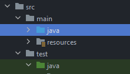
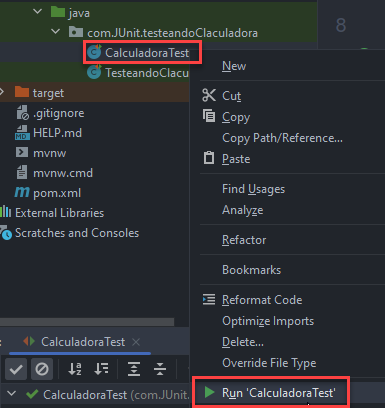
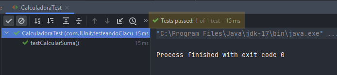

## Temas a tratar

En esta clase se abordarán las siguientes temáticas:

- Testing de Software
    - El Rol del Analista QA y el desarrollador
    - Testing Manual
    - Testing Automatizado

- Pruebas Unitarias    
    - Introducción a JUnit
    - @Test y aserciones de JUnit

---

## ¿Qué es el Testing de Software?

El **testing de software** es un proceso crucial en el desarrollo de programas para asegurar su calidad, identificar posibles errores y garantizar que cumplan con los requisitos establecidos. Consiste en evaluar el software en diferentes etapas de su desarrollo para detectar fallos y verificar que funcione según lo esperado.

En general existen dos principales tipos de testing: el manual (o también conocido como funcional) y el automatizado.


### ¿Por qué es importante testear?

Ya sabemos la importancia de tener un software y un código de calidad. Para esto, existen diferentes roles que tratan de asegurar la mayor calidad posible de nuestras aplicaciones mediante la implementación de diferentes tipos de testeo. Estos profesionales son llamados **Testers** o **Analistas QA.**

En un ambiente donde no esté delimitado el rol de un **Analista QA**, puede suceder que el mismo desarrollador sea el encargado de realizar las correspondientes pruebas tanto manuales como automatizadas.

Para entender un poco más sobre estos roles y la importancia de los mismos o como tu puedes llevar a cabo uno de ellos en caso de que te toque en tu ambiente laboral, te recomendamos el siguiente webinar en video:

[](https://youtu.be/c0Hk1thK5Wk)

### Testing Manual

Es el proceso de testeo o de ejecución de pruebas por parte de un ser humano, donde un tester sigue procedimientos predefinidos para evaluar el software simulando como sería la interacción de un usuario real sobre el sistema.


#### Características del testing manual

- Requiere la intervención humana para ejecutar pruebas, observar resultados y registrar hallazgos.
- Se centra en la evaluación de la experiencia del usuario, la usabilidad y el comportamiento funcional del software.
- Tiene flexibilidad para identificar problemas que podrían pasar desapercibidos en pruebas automatizadas.
    

#### Ventanas y desventajas del testing manual

**Ventajas**

- Útil para pruebas exploratorias, donde se buscan errores no contemplados en casos de prueba predefinidos.
- Ideal para pruebas de usabilidad, interfaces de usuario y situaciones complejas difíciles de automatizar.
    

**Desventajas**

- Es más lento y propenso a errores humanos.
- No es escalable ni repetible en comparación con pruebas automatizadas.
    

### Testing Automatizado

Es el proceso de testeo o de ejecución de pruebas que implica el uso de herramientas y scripts para llevar a cabo las mismas de forma automatizada, sin intervención humana directa.

#### Características del testing automatizado

- Utiliza scripts y herramientas específicas para ejecutar pruebas de manera eficiente y repetible.
- Ideal para pruebas de regresión, rendimiento, carga y repetición de escenarios complejos.
    

#### Ventajas y desventajas del testing automatizado

**Ventajas:**

- Mayor velocidad y eficiencia en la ejecución de pruebas.
- Repetibilidad y escalabilidad para manejar pruebas en un gran número de casos.
    

**Desventajas:**

- Difícil de aplicar en pruebas que requieren interpretación humana o análisis subjetivos.
- Requiere inversión inicial en la creación y mantenimiento de scripts de prueba.
    

### Tipos de tests automatizados

Dentro del testing automatizado, existen varios tipos de pruebas que se utilizan para evaluar diferentes aspectos del software. Algunos de los tipos más comunes de pruebas automatizadas incluyen:

#### **Pruebas Unitarias:**

- Evalúan componentes individuales o unidades de código, como funciones o métodos, para verificar su funcionamiento aislado.
    

#### **Pruebas de Integración:**

- Verifican la interacción entre diferentes componentes o módulos del software para asegurar que funcionen correctamente en conjunto.
    

#### **Pruebas Funcionales:**

- Comprueban que el software cumpla con los requisitos funcionales esperados por el usuario.
    

#### **Pruebas de Regresión:**

- Aseguran que las nuevas actualizaciones o cambios en el código no introduzcan errores en áreas previamente funcionales.
    

#### **Pruebas de Aceptación:**

- Validan si el software cumple con los criterios de aceptación establecidos por el cliente o usuario final.
    

#### **Pruebas de Carga:**

- Evalúan el rendimiento del software bajo diferentes niveles de carga para verificar su estabilidad y capacidad de manejar picos de uso.
    

#### **Pruebas de Estrés:**

- Someten al software a condiciones extremas para evaluar su comportamiento y capacidad de recuperación en situaciones límite.
    

#### **Pruebas de Seguridad:**

- Evalúan la resistencia del software ante posibles amenazas y vulnerabilidades de seguridad.
    

Si bien existen gran cantidad de formas de testear una aplicación, en esta ocasión vamos a centrarnos en las **PRUEBAS UNITARIAS**.

---

## Pruebas Unitarias

Las pruebas unitarias son un tipo de prueba en el desarrollo de software que evalúa unidades individuales de código, como funciones, métodos o clases, de manera aislada. Se centran en validar el comportamiento esperado de cada unidad de manera independiente y exhaustiva.


### **Proceso de Creación de Pruebas Unitarias**

Para poder llevar a cabo la planificación y correcta ejecución de nuestras pruebas unitarias debemos llevar a cabo los siguientes pasos:

1. **Definición de Casos de Prueba:**
    - Se crean casos de prueba para cada función o método, cubriendo diferentes escenarios posibles.
        
2. **Desarrollo de las Pruebas:**
    - Se escriben scripts o código para ejecutar los casos de prueba, verificando que el comportamiento sea el esperado.
        
3. **Ejecución y Análisis de Resultados:**
    - Se ejecutan las pruebas y se analizan los resultados para identificar fallos o comportamientos inesperados.
        

---

### 📝Actividad Práctica

A partir del siguiente código:

```java
public class Calculadora {

	public Double calcularSuma (int num1, int num2) {
		return (double) num1+num2;
	}

		public Double calcularMenor (int num1, int num2) {
			if (num1<=num2) {
				return (double) num1;
			}
			else {
				return (double) num2;
			}
	}

}
```

💡 Realiza el análisis correspondiente y determina:
- ¿Cuántos tests unitarios crees que podrían haber?
- ¿Cuáles serían estos tests unitarios?
    

#### Resolución

- El método calcularSuma sin dudas puede ser testeado unitariamente, ya que cumple una sola funcionalidad, que es sumar dos números y otorga un solo resultado.
    
- El método CalcularMenor puede tener dos tests unitarios diferentes:
    - Uno que valide el caso en que num1 sea mayor a num2
    - Otro que valide el caso en que num2 sea mayor a num1
        
- Incluso podríamos agregar un tercer test unitario si quisiéramos para analizar el caso de que sean iguales.
   

### ¿Qué herramientas podemos utilizar para llevar a cabo pruebas unitarias?

Si bien podemos realizar los tests de forma manual, existen diferentes herramientas que nos facilitan la creación de tests unitarios. Algunas de las más conocidas para Java son:

- JUnit
- TestNG
- Mockito
    

### Implementando JUnit

JUnit es un marco de pruebas unitarias para Java que permite la creación, ejecución y verificación de pruebas de manera automatizada. Es una herramienta ampliamente utilizada en el desarrollo de software Java para asegurar la calidad del código.

¡Veamos cómo implementaríamos JUnit en un proyecto con Spring Boot!

#### Paso 1: Dependencias

Por defecto si creamos un proyecto con Spring Boot mediante initializr veremos que se nos incluye de forma automática la siguiente dependencia en nuestro pom.xml

```xml
<dependency>
			<groupId>org.springframework.boot</groupId>
			<artifactId>spring-boot-starter-test</artifactId>
			<scope>test</scope>
</dependency>
```

`spring-boot-starter-test` incluye automáticamente **JUnit 5 (JUnit Jupiter)** y otras bibliotecas/librerías útiles para pruebas en proyectos de Spring Boot.


#### Paso 2: Utilización de paquetes

Los tests en Java suelen ubicarse en un paquete separado del código fuente principal para mantener una estructura organizada y distinguir claramente las pruebas del código de producción. Una convención común es tener un directorio o paquete paralelo al código fuente principal, con una estructura similar.

Por defecto, cualquier proyecto que creemos con Spring Boot mediante Initializr ya incluirá ésta estructura:




#### Paso 3: Creación de Tests + annotation @Test

Creamos una clase llamada **CalculadoraTest** (haciendo referencia a que son los tests de nuestra clase **Calculadora**) dentro del paquete principal de tests que tenemos generado.

Crearemos nuestro primer TestUnitario y lo marcaremos mediante la annotation `@Test`

```java
package com.JUnit.testeandoClaculadora;
import com.JUnit.testeandoClaculadora.model.Calculadora;
import org.junit.jupiter.api.Test;
import static org.junit.jupiter.api.Assertions.assertEquals;

public class CalculadoraTest {

    @Test
    public void testCalcularSuma() {
        Calculadora calculadora = new Calculadora();
        Double resultado = calculadora.calcularSuma(3, 5);
        assertEquals(8.0, resultado); // Verifica que la suma sea correcta (3 + 5 = 8)
    }
}
```

>💡`@Test` es una anotación fundamental en JUnit. Se utiliza para marcar un método como un caso de prueba. Al aplicar `@Test` sobre un método en una clase de prueba, se indica a JUnit que este método debe ejecutarse como una prueba unitaria cuando se realice la suite de pruebas.

>💡La anotación `@Test` pertenece al paquete `org.junit.jupiter.api`, que es parte de JUnit 5. En versiones anteriores de JUnit, como JUnit 4, la anotación `@Test` estaba en un paquete diferente (`org.junit.Test`).

Como podemos ver, en este primer test se utiliza uno de los métodos de `Assertions` de JUnit: `assertEquals`, para verificar si el resultado devuelto por el método calcularSuma es correcto (más adelante especificamos los más utilizados de ellos).

Es importante notar que se instancia la clase `Calculadora` y se llama a cada método con diferentes valores de entrada para validar su funcionamiento.

Una vez programado nuestro test, hacemos click derecho sobre el y luego “**Run CalculadoraTest**” para ver si pasa la prueba solicitada:



Si todo sale bien y nuestra prueba es correcta, obtendremos el siguiente mensaje en consola:



Y ¡Listo! Con esto aprendimos a crear nuestra primera prueba unitaria.

Te dejamos el código para que puedas descargar este ejemplo de referencia en el siguiente [link de descarga](./resources/9_testeandoCalculadora.zip)


### Aserciones de JUnit

En JUnit, las aserciones son métodos que se utilizan para verificar el comportamiento esperado de los resultados de las pruebas unitarias. Aquí tienes algunas de las aserciones más comunes en JUnit y sus principales usos:

`assertEquals`:

- Compara si dos valores son iguales.
- Uso común para verificar resultados numéricos, cadenas de texto, objetos, etc.

```java
assertEquals(5, myNumber); // Verifica si myNumber es igual a 5
assertEquals("Hola", myString); // Verifica si myString es igual a "Hola"
```


`assertTrue` / `assertFalse`:

- Verifica si una condición es verdadera o falsa, respectivamente.
- Útil para validar condiciones booleanas.

```java
assertTrue(result > 0); // Verifica si result es mayor que 0
assertFalse(isEmpty); // Verifica si isEmpty es falso
```


`assertNull` / `assertNotNull`:

- Verifica si un valor es nulo o no nulo, respectivamente.
- Se emplean para validar si un objeto o referencia es null o no.

```java
assertNull(myObject); // Verifica si myObject es null
assertNotNull(myObject); // Verifica si myObject no es null
```


`assertSame` / `assertNotSame`:

- Comprueba si dos referencias apuntan al mismo objeto o no, respectivamente.
- Utilizado para verificar la igualdad de referencias de objetos.

```java
assertSame(expected, actual); // Verifica si expected y actual son la misma referencia
assertNotSame(expected, actual); // Verifica si expected y actual son referencias diferentes
```


`assertThrows`:

- Verifica si un método lanza una excepción específica.
- Útil para probar métodos que deben lanzar excepciones en ciertos casos.

```java
assertThrows(NullPointerException.class, () -> { myObject.method(null); }); // Verifica si se lanza una NullPointerException
```

Estas aserciones son fundamentales para definir las expectativas y validar los resultados esperados en las pruebas unitarias. Ayudan a asegurar que el comportamiento del código bajo prueba sea el correcto y se ajuste a lo esperado.

---

## 📝 Ejercicios Prácticos

💡Recuerda que los siguientes ejercicios prácticos los llevarás a cabo en clase, por lo que contarás con la ayuda del profesor/a y tus compañeros para validar las resoluciones haciendo _live coding_ y puestas en común de resultados 😉


### Ejercicio Nº 1: Pruebas Unitarias

Complementar al proyecto Calculadora con las pruebas unitarias que creas conveniente. Agregar una para el caso de que num1 sea mayor a num2 y otra para el caso contrario.

¿Qué resultados se obtienen al ejecutar los 3 tests? ¿Pasan todos correctamente?


### Ejercicio Nº 2: SonarQube

A partir de la aplicación de calculadora que acabamos de desarrollar con sus correspondientes test unitarios:

- Ejecutar SonarQube y crear un nuevo proyecto local llamado Calculadora
- Realizar las configuraciones necesarias y ejecutar SonarQube en el proyecto calculadora finalizado.
- Analizar los resultados obtenidos en SonarQube… ¿Qué porcentaje de cobertura se obtiene? ¿Es necesario algún test Unitario adicional?

